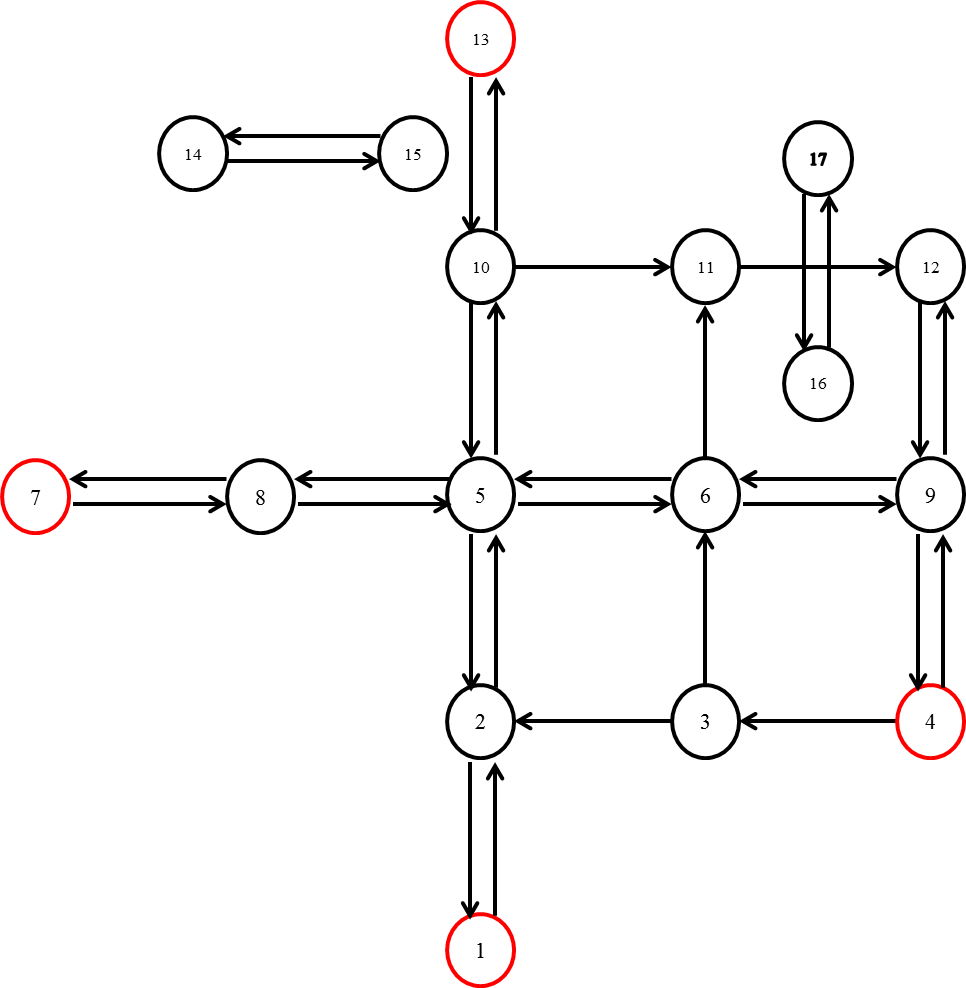
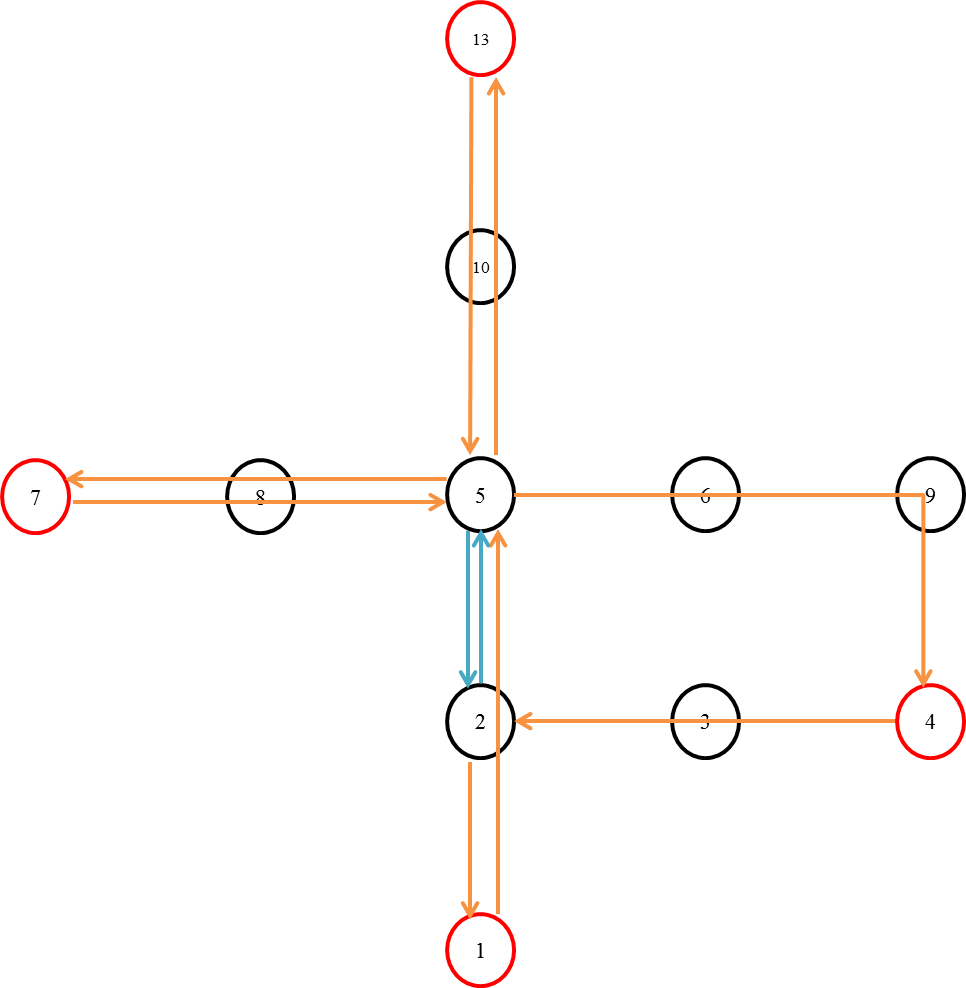
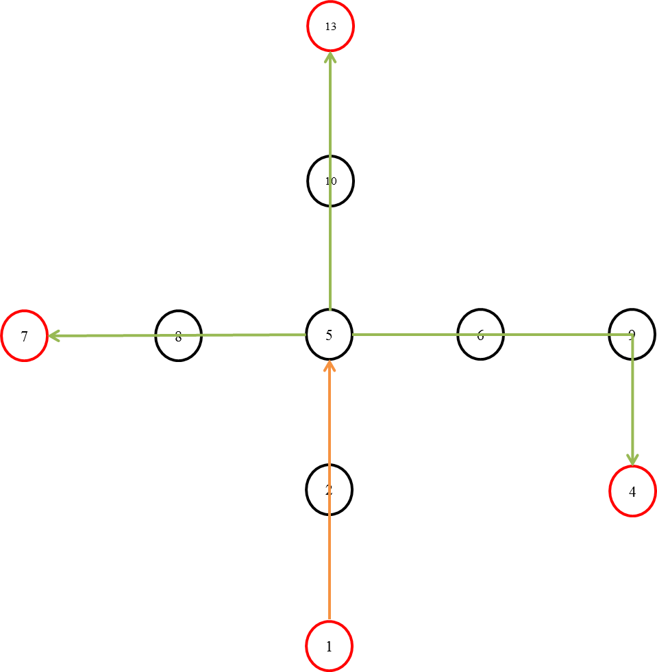
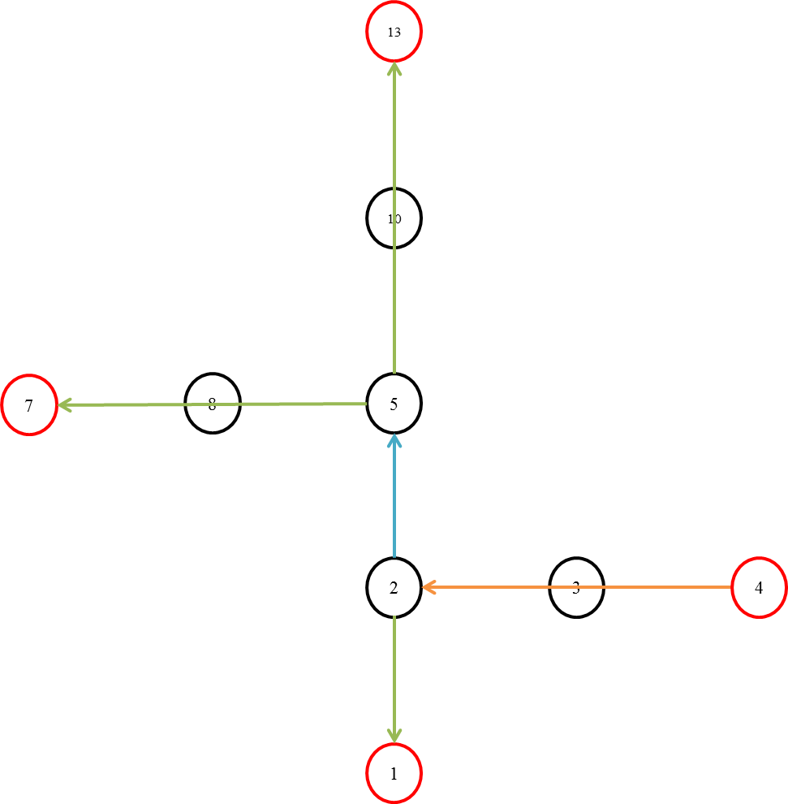
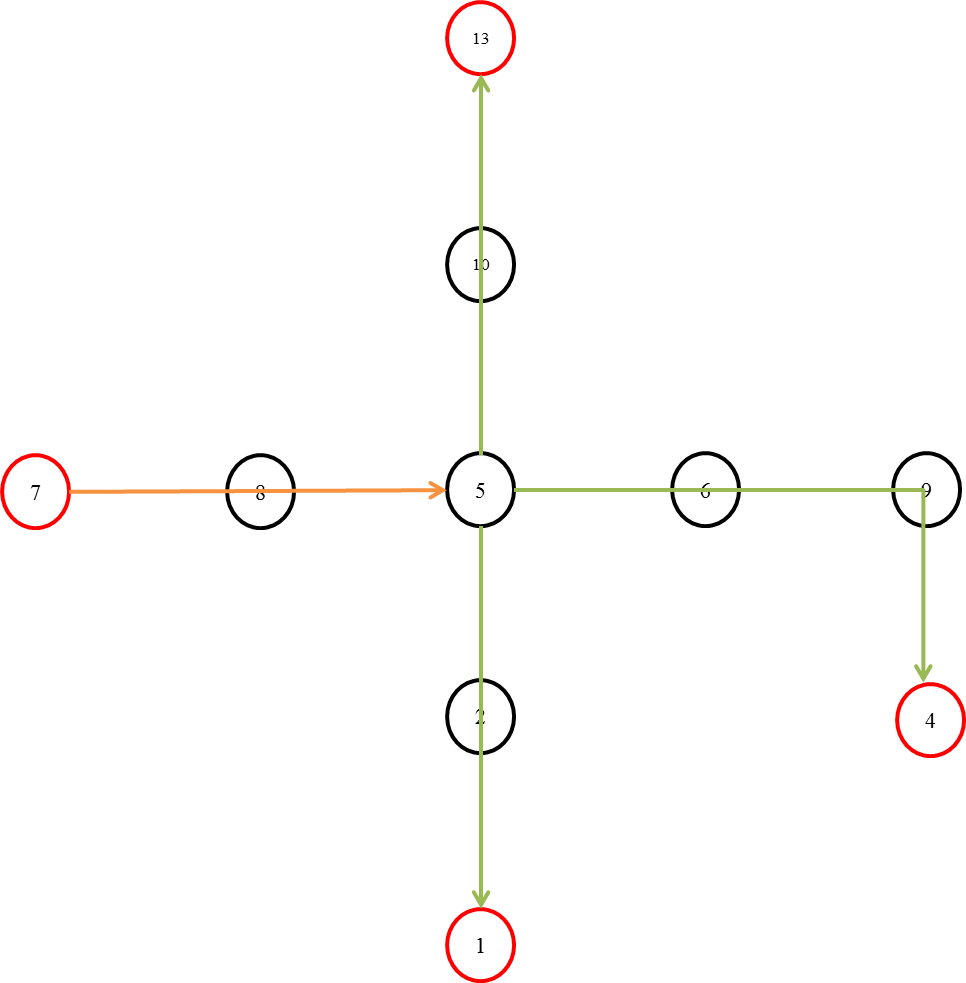
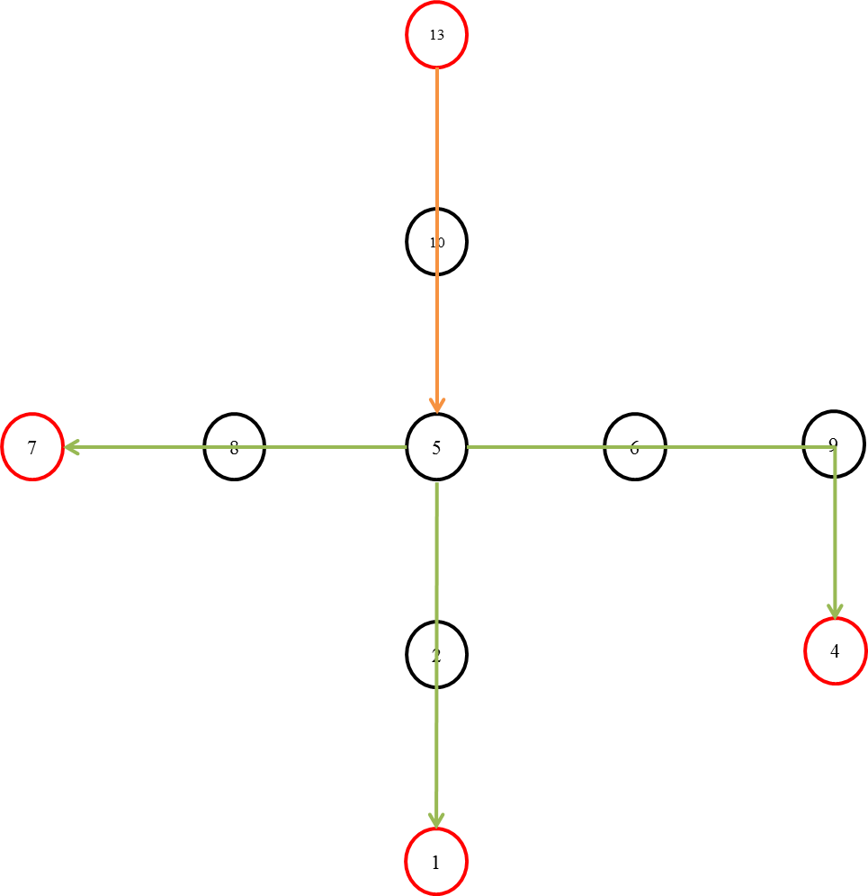

..
   ****************************************************************************
    pgRouting Manual
    Copyright(c) pgRouting Contributors

    This documentation is licensed under a Creative Commons Attribution-Share
    Alike 3.0 License: http://creativecommons.org/licenses/by-sa/3.0/
   ****************************************************************************

.. _areaContraction:

Area Contraction
===============================================================================

.. include:: proposed.rst
   :start-after: begin-warn-expr
   :end-before: end-warn-expr

:ref:`pgr_areaContraction`

.. toctree::
    :hidden:

    pgr_areaContraction

Introduction
-------------

To understand area contraction it is essential to understand area. An area is a set of vertices and
edges connecting them, some of the vertices from the set of vertices are defined as the border
vertices. These border vertices connect an area to its exterior.
Area contraction produces a contracted graph of an area such that the graph reduces to set of
shortest path from each border vertex to every other border vertex keeping the border vertex as
prohibited vertices.

The border vertices of a graph are specified by the user. The approach followed to calculate the
contracted graph is as follows:

 - Calculate the shortest path between each border vertex by using many to many routing
   functions
 - Create a graph by taking the union of all the paths
 - Categorize each subpath of the graph by keeping the count of individual paths shared by
   the resultant subpath
 - Output the contracted graph

Contracting Sample Data
-------------------------------------------------------------

In this section, building and using a contracted graph will be shown by example.

- The :ref:`sampledata` for a directed graph is used

The original graph:

After doing a area contraction operation:

The original image shows the sample data graph. The set of border vertices taken here is [1,4,7,13].
The border vertices have been shown in red in the figure.

According to the size of the border vertices array we need to calculate one to many shortest paths
from each border vertex to every other border vertex. In our exaple data the border vertices array is
[1,4,7,13]. Thus the following cases for one to many shortest path calculation occur.

- **Case 1**: Shortest paths from 1 to [4,7,13]
- **Case 2**: Shortest paths from 4 to [1,7,13]
- **Case 3**: Shortest paths from 7 to [1,4,13]
- **Case 4**: Shortest paths from 13 to [1,4,7]

Queries and images for One to Many Shortest path calculations
-------------------------------------------------------------

- **Case 1**:

//include dijkstra queries for 1 -> 4,7,13

- **Case 2**:

//include dijkstra queries for 4 -> 1,7,13

- **Case 3**:

//include dijkstra queries for 7 -> 1,4,13

- **Case 4**:

//include dijkstra queries for 13 -> 1,4,7

