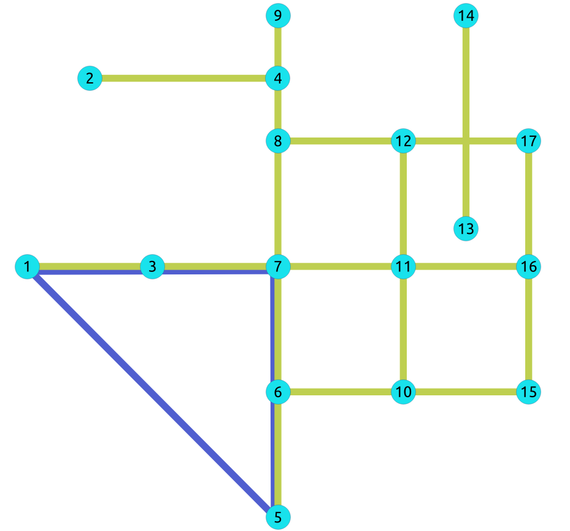

..
   ****************************************************************************
    pgRouting Manual
    Copyright(c) pgRouting Contributors

    This documentation is licensed under a Creative Commons Attribution-Share
    Alike 3.0 License: http://creativecommons.org/licenses/by-sa/3.0/
   ****************************************************************************

|

pgr_bipartite -Experimental
===============================================================================

``pgr_bipartite`` — Disjoint sets of vertices such that no two vertices within
the same set are adjacent.

.. figure:: images/boost-inside.jpeg
   :target: https://www.boost.org/libs/graph/doc/is_bipartite.html

   Boost Graph Inside

.. include:: experimental.rst
   :start-after: begin-warn-expr
   :end-before: end-warn-expr

.. rubric:: Availability

* Version 3.2.0

  * New **experimental** signature

Description
-------------------------------------------------------------------------------
A bipartite graph is a graph with two sets of vertices which are connected to
each other, but not within themselves. A bipartite graph is possible if the
graph coloring is possible using two colors such that vertices in a set are
colored with the same color.

**The main Characteristics are:**

- The algorithm works in undirected graph only.
- The returned values are not ordered.
- The algorithm checks graph is bipartite or not. If it is bipartite then it
  returns the node along with two    colors `0` and `1` which represents two
  different sets.
- If graph is not bipartite then algorithm returns empty set.
- Running time: :math:`O(V + E)`

Signatures
-------------------------------------------------------------------------------

.. index::
    single: bipartite - Experimental on v3.2

.. admonition:: \ \
   :class: signatures

   | pgr_bipartite(`Edges SQL`_)

   | RETURNS SET OF |result-node-color|
   | OR EMPTY SET

:Example: When the graph is bipartite

.. literalinclude:: doc-bipartite.queries
   :start-after: --q1
   :end-before: --q2

Parameters
-------------------------------------------------------------------------------

.. include:: pgRouting-concepts.rst
   :start-after: only_edge_param_start
   :end-before: only_edge_param_end

Inner Queries
-------------------------------------------------------------------------------

Edges SQL
...............................................................................

.. include:: pgRouting-concepts.rst
   :start-after: basic_edges_sql_start
   :end-before: basic_edges_sql_end

Result Columns
-------------------------------------------------------------------------------

.. include:: coloring-family.rst
    :start-after: result columns start
    :end-before: result columns end

Additional Example
--------------------------------------------------------------------------------

:Example: The odd length cyclic graph can not be bipartite.

The edge :math:`5 \rightarrow 1` will make subgraph with vertices :math:`\{1, 3,
7, 6, 5\}` an odd length cyclic graph, as the cycle has 5 vertices.

.. literalinclude:: doc-bipartite.queries
   :start-after: --q2
   :end-before: --q3

Edges in blue represent odd length cycle subgraph.

.. literalinclude:: doc-bipartite.queries
    :start-after: --q3
    :end-before: --q4

See Also
-------------------------------------------------------------------------------

.. see also start

* `Boost: is_bipartite
  <https://www.boost.org/libs/graph/doc/is_bipartite.html>`__
* `Wikipedia: bipartite graph
  <https://en.wikipedia.org/wiki/Bipartite_graph>`__

.. see also end

* :doc:`sampledata` network.

.. rubric:: Indices and tables

* :ref:`genindex`
* :ref:`search`
