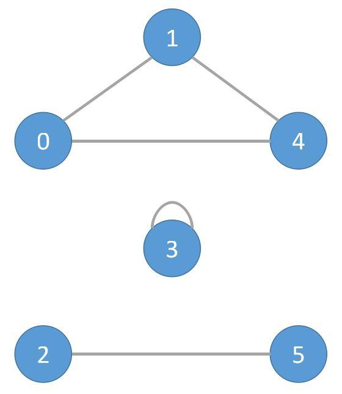

..
   ****************************************************************************
    pgRouting Manual
    Copyright(c) pgRouting Contributors

    This documentation is licensed under a Creative Commons Attribution-Share
    Alike 3.0 License: http://creativecommons.org/licenses/by-sa/3.0/
   ****************************************************************************

Components - Family of functions (Experimental)
===============================================================================

.. include:: proposed.rst
   :start-after: begin-warn-expr
   :end-before: end-warn-expr

.. index from here

* :doc:`pgr_connectedComponents` - Return the connected components of an undirected graph.
* :doc:`pgr_strongComponents` - Return the strongly connected components of a directed graph.
* :doc:`pgr_biconnectedComponents` - Return the biconnected components of an undirected graph.
* :doc:`pgr_articulationPoints` - Return the articulation points of an undirected graph.
* :doc:`pgr_bridges` - Return the bridges of an undirected graph.

.. index to here

.. toctree::
    :hidden:

    pgr_connectedComponents
    pgr_strongComponents
    pgr_biconnectedComponents
    pgr_articulationPoints
    pgr_bridges

The problem definition
-----------------------------------------------

.. rubric:: Connected components

A connected component of an undirected graph is a set of vertices that are all reachable
from each other.

**Notice**: This problem defines on an undirected graph.

Given the following query:

pgr_connectedComponentsV(:math:`sql`)

where  :math:`sql = \{(id_i, source_i, target_i, cost_i, reverse\_cost_i)\}`

and

- :math:`source = \bigcup source_i`,
- :math:`target = \bigcup target_i`,

The graphs are defined as follows:

The weighted undirected graph, :math:`G(V,E)`, is definied by:

* the set of vertices  :math:`V`

  - :math:`V = source \cup target`

* the set of edges :math:`E`

  - :math:`E = \begin{cases}
    \text{ }  \{(source_i, target_i, cost_i) \text{ when } cost >=0 \}  & \quad \text{ } \\
    \cup      \{(target_i, source_i, cost_i) \text{ when } cost >=0 \}  & \quad \text{ if } reverse\_cost = \varnothing \\
    \text{ }  \text{ }  & \text{ } \\
    \text{ }  \{(source_i, target_i, cost_i) \text{ when } cost >=0 \} & \text{ } \\
    \cup  \{(target_i, source_i, cost_i) \text{ when } cost >=0 \} & \text{ } \\
    \cup  \{(target_i, source_i, reverse\_cost_i) \text{ when } reverse\_cost_i >=0)\} & \text{ } \\
    \cup  \{(source_i, target_i, reverse\_cost_i) \text{ when } reverse\_cost_i >=0)\} & \quad \text{ if } reverse\_cost \neq \varnothing \\
    \end{cases}`

Given:

- :math:`G(V,E)`

Then:

.. math::`pgr_connectedComponentsV(sql) =
  \begin{cases}
  \text{all connected components } \boldsymbol{\pi} \text{ in } G(V,E) &\quad \text{if } \exists  \boldsymbol{\pi}  \\
  \varnothing &\quad \text{otherwise} \\
  \end{cases}`

:math:`\boldsymbol{\pi} = \{(component_i, n\_seq_i, node_i)\}`

where:
  - :math:`component_i = \min \{node_j | node_j \in component_i\}`
  - :math:`n\_seq_i` is a sequential value starting from **1** in a component.
  - :math:`node_i \in component_i`
  - The returned values are ordered:

    - `component` ascending
    - `node` ascending

Example:
  - The first component is composed of nodes ``0``, ``1`` and ``4``.
  - The second component is composed of node ``3``.
  - The third component is composed of nodes ``2`` and ``5``.

.. rubric:: Strongly connected components

A strongly connected component of a directed graph is a set of vertices that are all reachable
from each other.

**Notice**: This problem defines on a directed graph.

Given the following query:

pgr_strongComponentsV(:math:`sql`)

where  :math:`sql = \{(id_i, source_i, target_i, cost_i, reverse\_cost_i)\}`

and

- :math:`source = \bigcup source_i`,
- :math:`target = \bigcup target_i`,

The graphs are defined as follows:

The weighted directed graph, :math:`G_d(V,E)`, is definied by:

* the set of vertices  :math:`V`

  - :math:`V = source \cup target \cup {start_{vid}} \cup  {end_{vid}}`

* the set of edges :math:`E`

  - :math:`E = \begin{cases}
    \text{ }  \{(source_i, target_i, cost_i) \text{ when } cost >=0 \}  & \quad \text{ if } reverse\_cost = \varnothing \\
    \text{ }  \text{ }  & \text{ } \\
    \text{ }  \{(source_i, target_i, cost_i) \text{ when } cost >=0 \} & \text{ } \\
    \cup  \{(target_i, source_i, reverse\_cost_i) \text{ when } reverse\_cost_i >=0)\} & \quad \text{ if } reverse\_cost \neq \varnothing \\
    \end{cases}`

Given:

- :math:`G(V,E)`

Then:

.. math::`\text{pgr_strongComponentsV}(sql) =
  \begin{cases}
  \text{all strongly connected components } \boldsymbol{\pi} \text{ in } G(V,E) &\quad \text{if } \exists  \boldsymbol{\pi}  \\
  \varnothing &\quad \text{otherwise} \\
  \end{cases}`

:math:`\boldsymbol{\pi} = \{(component_i, n\_seq_i, node_i)\}`

where:
  - :math:`component_i = \min {node_j | node_j \in component_i}`
  - :math:`n\_seq_i` is a sequential value starting from **1** in a component.
  - :math:`node_i \in component_i`
  - The returned values are ordered:

    - `component` ascending
    - `node` ascending

Example:
  - The first component is composed of nodes ``1``, ``2`` and ``4``.
  - The second component is composed of node ``0``.
  - The third component is composed of node ``3``.
  - The fourth component is composed of node ``5``.
  - The fifth component is composed of node ``6``.

.. image:: images/strong_components.jpeg
   :width: 270px
   :height: 323px

.. rubric:: Biconnected components

The biconnected components of an undirected graph are the maximal subsets of vertices such that the removal of a vertex from
particular component will not disconnect the component. Unlike connected components, vertices may belong to multiple biconnected
components. Vertices can be present in multiple biconnected components, but each edge can only be contained in a single biconnected
component. So, the output only has edge version.

**Notice**: This problem defines on an undirected graph.

Given the following query:

pgr_biconnectedComponents(:math:`sql`)

where  :math:`sql = \{(id_i, source_i, target_i, cost_i, reverse\_cost_i)\}`

and

- :math:`source = \bigcup source_i`,
- :math:`target = \bigcup target_i`,

The graphs are defined as follows:

The weighted undirected graph, :math:`G(V,E)`, is definied by:

* the set of vertices  :math:`V`

  - :math:`V = source \cup target`

* the set of edges :math:`E`

  - :math:`E = \begin{cases}
    \text{ }  \{(source_i, target_i, cost_i) \text{ when } cost >=0 \}  & \quad \text{ } \\
    \cup      \{(target_i, source_i, cost_i) \text{ when } cost >=0 \}  & \quad \text{ if } reverse\_cost = \varnothing \\
    \text{ }  \text{ }  & \text{ } \\
    \text{ }  \{(source_i, target_i, cost_i) \text{ when } cost >=0 \} & \text{ } \\
    \cup  \{(target_i, source_i, cost_i) \text{ when } cost >=0 \} & \text{ } \\
    \cup  \{(target_i, source_i, reverse\_cost_i) \text{ when } reverse\_cost_i >=0)\} & \text{ } \\
    \cup  \{(source_i, target_i, reverse\_cost_i) \text{ when } reverse\_cost_i >=0)\} & \quad \text{ if } reverse\_cost \neq \varnothing \\
    \end{cases}`

Given:

- :math:`G(V,E)`

Then:

.. math::`\text{pgr_biconnectedComponents}(sql) =
  \begin{cases}
  \text{all biconnected components } \boldsymbol{\pi} \text{ in } G(V,E) &\quad \text{if } \exists  \boldsymbol{\pi}  \\
  \varnothing &\quad \text{otherwise} \\
  \end{cases}`

:math:`\boldsymbol{\pi} = \{(component_i, n\_seq_i, node_i)\}`

where:
  - :math:`component_i = \min {node_j | node_j \in component_i}`
  - :math:`n\_seq_i` is a sequential value starting from **1** in a component.
  - :math:`edge_i \in component_i`
  - The returned values are ordered:

    - `component` ascending
    - `edge` ascending

Example:
  - The first component is composed of edges ``1 - 2``, ``0 - 1`` and ``0 - 2``.
  - The second component is composed of edges ``2 - 4``, ``2 - 3`` and ``3 - 4``.
  - The third component is composed of edge ``5 - 6``.
  - The fourth component is composed of edge ``6 - 7``.
  - The fifth component is composed of edges ``8 - 9``, ``9 - 10`` and ``8 - 10``.

.. image:: images/biconnected_components.jpeg
   :width: 210px
   :height: 325px

.. rubric:: Articulation Points

Those vertices that belong to more than one biconnected component are called
articulation points or, equivalently, cut vertices. Articulation points are
vertices whose removal would increase the number of connected components in
the graph.

**Notice**: This problem defines on an undirected graph.

Given the following query:

pgr_articulationPoints(:math:`sql`)

where  :math:`sql = \{(id_i, source_i, target_i, cost_i, reverse\_cost_i)\}`

and

- :math:`source = \bigcup source_i`,
- :math:`target = \bigcup target_i`,

The graphs are defined as follows:

The weighted undirected graph, :math:`G(V,E)`, is definied by:

* the set of vertices  :math:`V`

  - :math:`V = source \cup target`

* the set of edges :math:`E`

  - :math:`E = \begin{cases}
    \text{ }  \{(source_i, target_i, cost_i) \text{ when } cost >=0 \}  & \quad \text{ } \\
    \cup      \{(target_i, source_i, cost_i) \text{ when } cost >=0 \}  & \quad \text{ if } reverse\_cost = \varnothing \\
    \text{ }  \text{ }  & \text{ } \\
    \text{ }  \{(source_i, target_i, cost_i) \text{ when } cost >=0 \} & \text{ } \\
    \cup  \{(target_i, source_i, cost_i) \text{ when } cost >=0 \} & \text{ } \\
    \cup  \{(target_i, source_i, reverse\_cost_i) \text{ when } reverse\_cost_i >=0)\} & \text{ } \\
    \cup  \{(source_i, target_i, reverse\_cost_i) \text{ when } reverse\_cost_i >=0)\} & \quad \text{ if } reverse\_cost \neq \varnothing \\
    \end{cases}`

Given:

- :math:`G(V,E)`

Then:

.. math::`\text{pgr_articulationPoints}(sql) =
  \begin{cases}
  \text{all articulation points } \boldsymbol{\pi} \text{ in } G(V,E) &\quad \text{if } \exists  \boldsymbol{\pi}  \\
  \varnothing &\quad \text{otherwise} \\
  \end{cases}`

:math:`\boldsymbol{\pi} = \{node_i\}`

where:
  - :math:`node_i` is an articulation point.
  - The returned values are ordered:

    - `node` ascending

Example:
  - Articulation points are nodes ``2`` and ``6``.

.. image:: images/biconnected_components.jpeg
   :width: 210px
   :height: 325px

.. rubric:: Bridges

A bridge is an edge of an undirected graph whose deletion increases its number
of connected components.

**Notice**: This problem defines on an undirected graph.

Given the following query:

pgr_bridges(:math:`sql`)

where  :math:`sql = \{(id_i, source_i, target_i, cost_i, reverse\_cost_i)\}`

and

- :math:`source = \bigcup source_i`,
- :math:`target = \bigcup target_i`,

The graphs are defined as follows:

The weighted undirected graph, :math:`G(V,E)`, is definied by:

* the set of vertices  :math:`V`

  - :math:`V = source \cup target`

* the set of edges :math:`E`

  - :math:`E = \begin{cases}
    \text{ }  \{(source_i, target_i, cost_i) \text{ when } cost >=0 \}  & \quad \text{ } \\
    \cup      \{(target_i, source_i, cost_i) \text{ when } cost >=0 \}  & \quad \text{ if } reverse\_cost = \varnothing \\
    \text{ }  \text{ }  & \text{ } \\
    \text{ }  \{(source_i, target_i, cost_i) \text{ when } cost >=0 \} & \text{ } \\
    \cup  \{(target_i, source_i, cost_i) \text{ when } cost >=0 \} & \text{ } \\
    \cup  \{(target_i, source_i, reverse\_cost_i) \text{ when } reverse\_cost_i >=0)\} & \text{ } \\
    \cup  \{(source_i, target_i, reverse\_cost_i) \text{ when } reverse\_cost_i >=0)\} & \quad \text{ if } reverse\_cost \neq \varnothing \\
    \end{cases}`

Given:

- :math:`G(V,E)`

Then:

.. math::`\text{pgr_bridges}(sql) =
  \begin{cases}
  \text{all bridges } \boldsymbol{\pi} \text{ in } G(V,E) &\quad \text{if } \exists  \boldsymbol{\pi}  \\
  \varnothing &\quad \text{otherwise} \\
  \end{cases}`

:math:`\boldsymbol{\pi} = \{edge_i\}`

where:
  - :math:`edge_i` is an edge.
  - The returned values are ordered:

    - `edge` ascending

Example:
  - Bridges are edges ``5 <--> 6`` and ``6 <--> 7``.

.. image:: images/biconnected_components.jpeg
   :width: 210px
   :height: 325px

.. components_edges_sql_start

Parameters
-------------------------------------------------------------------------------

.. components_parameters_start

=================== ====================== ========= =========================================
Parameter           Type                   Default   Description
=================== ====================== ========= =========================================
**edges_sql**       ``TEXT``                         SQL query as described bellow.
=================== ====================== ========= =========================================

.. components_parameters_end

Inner query
-------------------------------------------------------------------------------

.. include:: pgRouting-concepts.rst
    :start-after: basic_edges_sql_start
    :end-before: basic_edges_sql_end

Result Columns
-------------------------------------------------------------------------------

pgr_connectedComponents & pgr_strongComponents
...............................................................................

.. include:: pgr_connectedComponents.rst
    :start-after: return_componentsV_start
    :end-before: return_componentsV_end

pgr_biconnectedComponents
...............................................................................

.. include:: pgr_biconnectedComponents.rst
    :start-after: return_componentsE_start
    :end-before: return_componentsE_end

pgr_articulationPoints
...............................................................................

.. include:: pgr_articulationPoints.rst
    :start-after: return_articulation_start
    :end-before: return_articulation_end

pgr_bridges
...............................................................................

.. include:: pgr_bridges.rst
    :start-after: return_bridges_start
    :end-before: return_bridges_end

See Also
-------------------------------------------------------------------------------

.. rubric:: Indices and tables

* :ref:`genindex`
* :ref:`search`
