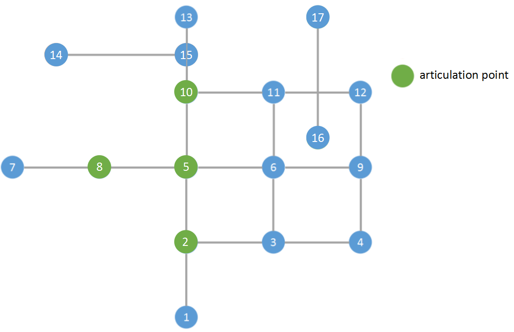

..
   ****************************************************************************
    pgRouting Manual
    Copyright(c) pgRouting Contributors

    This documentation is licensed under a Creative Commons Attribution-Share
    Alike 3.0 License: http://creativecommons.org/licenses/by-sa/3.0/
   ****************************************************************************

.. _pgr_articulationPoints:

pgr_articulationPoints - Experimental
===============================================================================

``pgr_articulationPoints`` - Return the articulation points of an undirected graph.
In particular, the algorithm implemented by Boost.Graph.

.. figure:: images/boost-inside.jpeg
   :target: http://www.boost.org/libs/graph/doc/connected_components.html

   Boost Graph Inside

.. include:: proposed.rst
   :start-after: begin-warn-expr
   :end-before: end-warn-expr

Synopsis
-------------------------------------------------------------------------------

Those vertices that belong to more than one biconnected component are called
articulation points or, equivalently, cut vertices. Articulation points are
vertices whose removal would increase the number of connected components in
the graph.
This implementation can only be used with an undirected graph.

Characteristics
-------------------------------------------------------------------------------

The main Characteristics are:

  - The returned values are ordered:

    - `node` ascending

  - Running time: :math:`O(V + E)`

Signatures
-------------------------------------------------------------------------------

.. index::
    single: articulationPoints

.. code-block:: none

    pgr_articulationPoints(edges_sql)

    RETURNS SET OF (seq, node)
        OR EMPTY SET

The signature is for a **undirected** graph.

:Example:

.. literalinclude:: doc-pgr_articulationPoints.queries
   :start-after: -- q1
   :end-before: -- q2

Description of the Signatures
-------------------------------------------------------------------------------

.. include:: components-family.rst
    :start-after: components_edges_sql_start
    :end-before: components_edges_sql_end

.. include:: components-family.rst
    :start-after: components_parameters_start
    :end-before: components_parameters_end

.. include:: components-family.rst
    :start-after: return_cutvertices_start
    :end-before: return_cutvertices_end

See Also
-------------------------------------------------------------------------------

* http://en.wikipedia.org/wiki/Biconnected_component
* The queries use the :doc:`sampledata` network.

.. rubric:: Indices and tables

* :ref:`genindex`
* :ref:`search`

