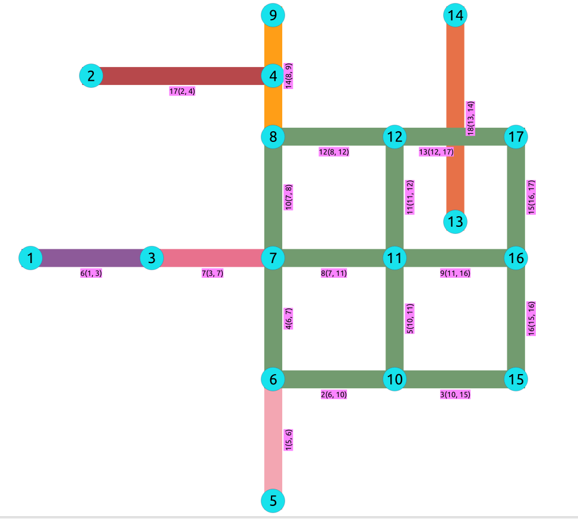

..
   ****************************************************************************
    pgRouting Manual
    Copyright(c) pgRouting Contributors

    This documentation is licensed under a Creative Commons Attribution-Share
    Alike 3.0 License: http://creativecommons.org/licenses/by-sa/3.0/
   ****************************************************************************

.. _pgr_biconnectedComponents:

pgr_biconnectedComponents - Experimental
===============================================================================

``pgr_biconnectedComponents`` — Return the biconnected components of an undirected graph.
In particular, the algorithm implemented by Boost.Graph.

.. figure:: images/boost-inside.jpeg
   :target: http://www.boost.org/libs/graph/doc/biconnected_components.html

   Boost Graph Inside

.. include:: proposed.rst
   :start-after: begin-warn-expr
   :end-before: end-warn-expr

Synopsis
-------------------------------------------------------------------------------

The biconnected components of an undirected graph are the maximal subsets of vertices such that the removal of a vertex from
particular component will not disconnect the component. Unlike connected components, vertices may belong to multiple biconnected
components. Vertices can be present in multiple biconnected components, but each edge can only be contained in a single biconnected
component. So, the output only has edge version.

This implementation can only be used with an undirected graph.

Characteristics
-------------------------------------------------------------------------------

The main Characteristics are:

  - Components are described by edges

  - The returned values are ordered:

    - `component` ascending
    - `edge` ascending

  - Running time: :math:`O(V + E)`

Signatures
-------------------------------------------------------------------------------

.. index::
    single: biconnectedComponents

.. code-block:: none

    pgr_biconnectedComponents(edges_sql)

    RETURNS SET OF (seq, component, n_seq, edge)
        OR EMPTY SET

The signature is for a **undirected** graph.

:Example:

.. literalinclude:: doc-pgr_biconnectedComponents.queries
   :start-after: -- q1
   :end-before: -- q2

Description of the Signatures
-------------------------------------------------------------------------------

.. include:: components-family.rst
    :start-after: components_edges_sql_start
    :end-before: components_edges_sql_end

.. include:: components-family.rst
    :start-after: components_parameters_start
    :end-before: components_parameters_end

.. include:: components-family.rst
    :start-after: return_componentsE_start
    :end-before: return_componentsE_end

See Also
-------------------------------------------------------------------------------

* http://en.wikipedia.org/wiki/Biconnected_component
* The queries use the :doc:`sampledata` network.

.. rubric:: Indices and tables

* :ref:`genindex`
* :ref:`search`

