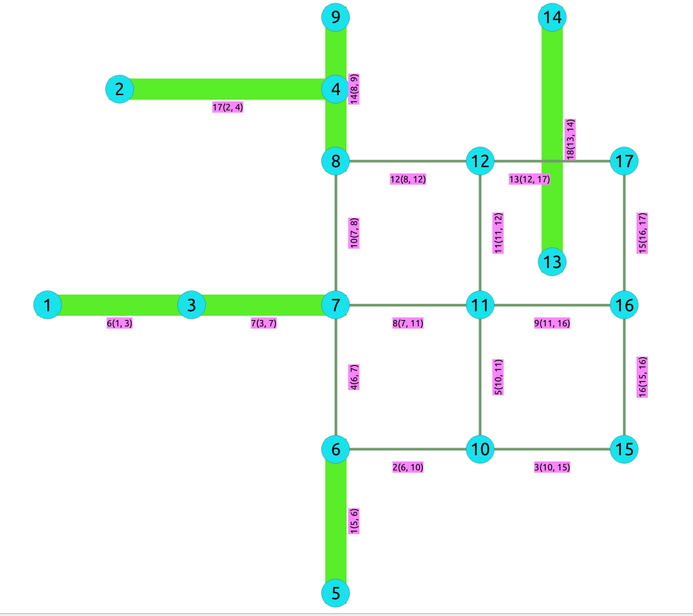

..
   ****************************************************************************
    pgRouting Manual
    Copyright(c) pgRouting Contributors

    This documentation is licensed under a Creative Commons Attribution-Share
    Alike 3.0 License: http://creativecommons.org/licenses/by-sa/3.0/
   ****************************************************************************

.. _pgr_Bridges:

pgr_bridges - Experimental
===============================================================================

``pgr_bridges`` - Return the bridges of an undirected graph.

.. figure:: images/boost-inside.jpeg
   :target: http://www.boost.org/libs/graph/doc/connected_components.html

   Boost Graph Inside

.. include:: proposed.rst
   :start-after: begin-warn-expr
   :end-before: end-warn-expr

Synopsis
-------------------------------------------------------------------------------

A bridge is an edge of an undirected graph whose deletion increases its number
of connected components.
This implementation can only be used with an undirected graph.

Characteristics
-------------------------------------------------------------------------------

The main Characteristics are:

  - The returned values are ordered:

    - `edge` ascending

  - Running time: :math:`O(E * (V + E))`

Signatures
-------------------------------------------------------------------------------

.. index::
    single: bridges

.. code-block:: none

    pgr_bridges(edges_sql)

    RETURNS SET OF (seq, node)
        OR EMPTY SET

The signature is for a **undirected** graph.

:Example:

.. literalinclude:: doc-pgr_bridges.queries
   :start-after: -- q1
   :end-before: -- q2

Description of the Signatures
-------------------------------------------------------------------------------

.. include:: components-family.rst
    :start-after: components_edges_sql_start
    :end-before: components_edges_sql_end

.. include:: components-family.rst
    :start-after: components_parameters_start
    :end-before: components_parameters_end

.. include:: components-family.rst
    :start-after: return_bridges_start
    :end-before: return_bridges_end

See Also
-------------------------------------------------------------------------------

* http://en.wikipedia.org/wiki/Bridge_%28graph_theory%29
* The queries use the :doc:`sampledata` network.

.. rubric:: Indices and tables

* :ref:`genindex`
* :ref:`search`

