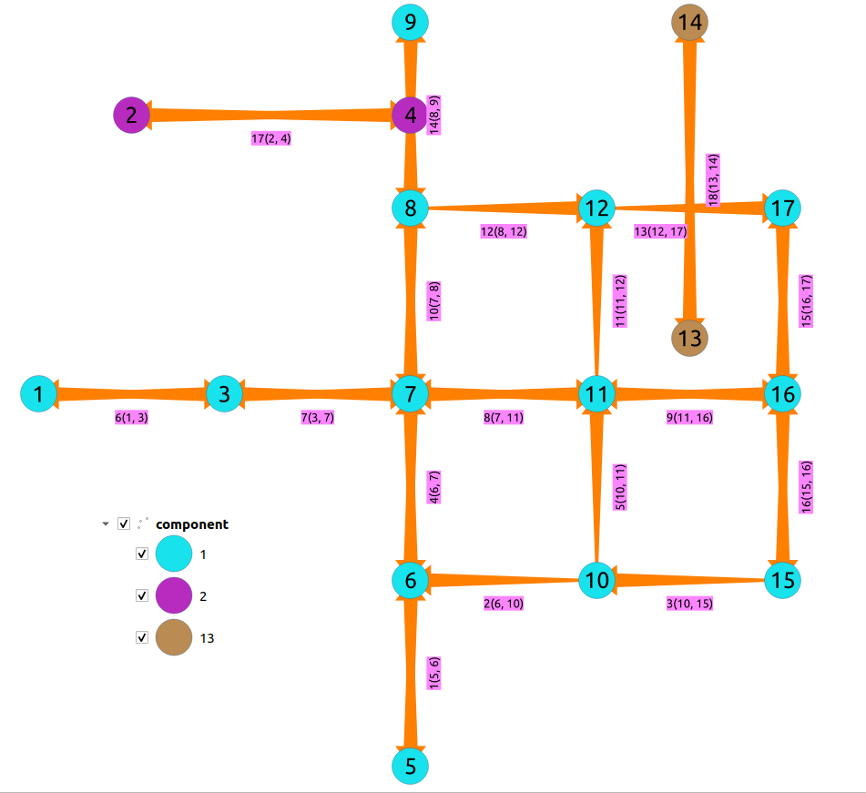

..
   ****************************************************************************
    pgRouting Manual
    Copyright(c) pgRouting Contributors

    This documentation is licensed under a Creative Commons Attribution-Share
    Alike 3.0 License: http://creativecommons.org/licenses/by-sa/3.0/
   ****************************************************************************

.. _pgr_strongComponents:

pgr_strongComponents - Experimental
===============================================================================

``pgr_strongComponents`` — Return the strongly connected components of a directed graph using Tarjan's algorithm based on DFS.
In particular, the algorithm implemented by Boost.Graph.

.. figure:: images/boost-inside.jpeg
   :target: http://www.boost.org/libs/graph/doc/strong_components.html

   Boost Graph Inside

.. include:: proposed.rst
   :start-after: begin-warn-expr
   :end-before: end-warn-expr

Synopsis
-------------------------------------------------------------------------------

A strongly connected component of a directed graph is a set of vertices that are all reachable
from each other.
This implementation can only be used with a directed graph.

Characteristics
-------------------------------------------------------------------------------

The main Characteristics are:

  - Components are described by vertices

  - The returned values are ordered:

    - `component` ascending
    - `node` ascending

  - Running time: :math:`O(V + E)`

Signatures
-------------------------------------------------------------------------------

.. index::
    single: strongComponents

.. code-block:: none

    pgr_strongComponents(edges_sql)

    RETURNS SET OF (seq, component, n_seq, node)
        OR EMPTY SET

The signature is for a **directed** graph.

:Example:

.. literalinclude:: doc-pgr_strongComponents.queries
   :start-after: -- q1
   :end-before: -- q2

Description of the Signatures
-------------------------------------------------------------------------------

.. include:: components-family.rst
    :start-after: components_edges_sql_start
    :end-before: components_edges_sql_end

.. include:: components-family.rst
    :start-after: components_parameters_start
    :end-before: components_parameters_end

.. include:: components-family.rst
    :start-after: return_componentsV_start
    :end-before: return_componentsV_end

See Also
-------------------------------------------------------------------------------

* http://en.wikipedia.org/wiki/Strongly_connected_component
* The queries use the :doc:`sampledata` network.

.. rubric:: Indices and tables

* :ref:`genindex`
* :ref:`search`

