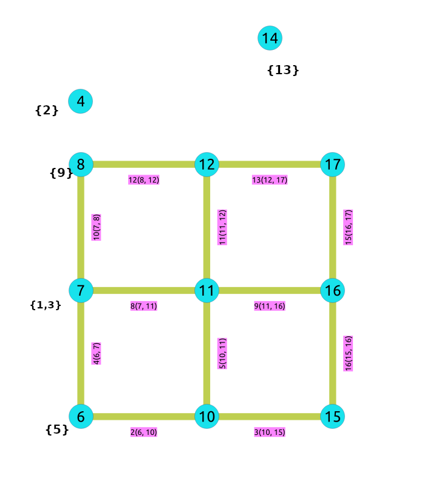
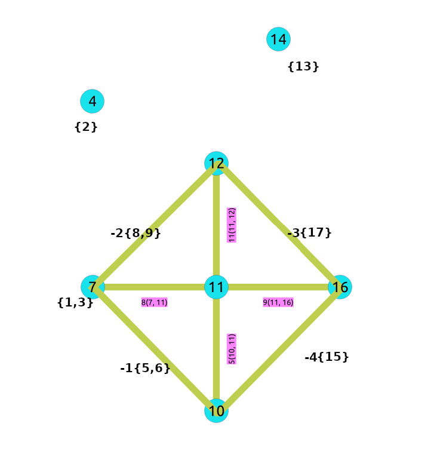

..
   ****************************************************************************
    pgRouting Manual
    Copyright(c) pgRouting Contributors

    This documentation is licensed under a Creative Commons Attribution-Share
    Alike 3.0 License: http://creativecommons.org/licenses/by-sa/3.0/
   ****************************************************************************

.. _contraction:

Contraction - Family of functions
===============================================================================

.. include:: proposed.rst
   :start-after: begin-warn-expr
   :end-before: end-warn-expr

:ref:`pgr_contractGraph`

.. toctree::
    :hidden:

    pgr_contractGraph

Introduction
-------------

In big graphs, like the road graphs, or electric networks, graph contraction can be used to speed up some graph algorithms. Contraction reduces the size of the graph by removing some of the vertices and edges and, for example, might add edges that represent a sequence of original edges decreasing the total time and space used in graph algorithms.

This implementation gives a flexible framework for adding contraction algorithms in the future, currently, it supports two algorithms:

 1. Dead end contraction
 2. Linear contraction

Allowing the user to:

  - Forbid contraction on a set of nodes.
  - Decide the order of the contraction algorithms and set the maximum number of times they are to be executed.

.. note:: UNDER DISCUSSION:  Forbid contraction on a set of edges

Dead end contraction
-------------------------------------------------------------------------------
In the algorithm, dead end contraction is represented by 1.

Dead end nodes
......................

The definition of a dead end node is different for a directed and an undirected graph.

In case of a undirected graph, a node is considered a dead end node if

 - The number of adjacent vertices is 1.

In case of an directed graph, a node is considered a dead end node if

 - There are no outgoing edges and has at least one incoming edge.
 - There is one incoming and one outgoing edge with the same identifier.

.. rubric:: Examples

- The green node ``B`` represents a dead end node
- The node ``A`` is the only node connecting to ``B``.
- Node ``A`` is part of the rest of the graph and has an unlimited number of incoming and outgoing edges.
- Directed graph

.. graphviz::

    digraph G {
        A [style=filled;color=deepskyblue];
        B [style=filled; color=green];
        "G" [shape=tripleoctagon;
        style=filled;color=deepskyblue;
        label = "Rest of the Graph"];

        rankdir=LR;
        G -> A [dir=none, weight=1, penwidth=3];
        A -> B;
    }

Operation: Dead End Contraction
.....................................

The dead end contraction will stop until there are no more dead end nodes.
For example from the following graph:

- Node ``A`` is connected to the rest of the graph by an unlimited number of edges.
- Node ``B`` is connected to the rest of the graph with one incoming edge.
- Node ``B`` is the only node connecting to ``C``.
- The green node ``C`` represents a `Dead End` node

.. graphviz::

    digraph G {
        A [style=filled;color=deepskyblue];
        B [style=filled; color=deepskyblue];
        C [style=filled; color=green];
        "G" [shape=tripleoctagon;
        style=filled;color=deepskyblue;
        label = "Rest of the Graph"];

        rankdir=LR;
        G -> A [dir=none, weight=1, penwidth=3];
        A -> B;
        B -> C;
    }

After contracting ``C``, node ``B`` is now a `Dead End` node and is contracted:

.. graphviz::

    digraph G {
        A [style=filled;color=deepskyblue];
        B [style=filled; color=green;label="B {C}";];
        "G" [shape=tripleoctagon;
        style=filled;color=deepskyblue;
        label = "Rest of the Graph"];

        rankdir=LR;
        G -> A [dir=none, weight=1, penwidth=3];
        A -> B;
    }

Node ``B`` gets contracted

.. graphviz::

    digraph G {
        A [style=filled;color=deepskyblue;label="A {B, C}";];
        "G" [shape=tripleoctagon;
        style=filled;color=deepskyblue;
        label = "Rest of the Graph"];

        rankdir=LR;
        G -> A [dir=none, weight=1, penwidth=3];
    }

Nodes ``B`` and ``C`` belong to node ``A``.

Not Dead End nodes
......................

In this graph ``B`` is not a `dead end` node.

.. graphviz::

    digraph G {
        A [style=filled;color=deepskyblue];
        B [style=filled; color=red];
        "G" [shape=tripleoctagon;
        style=filled;color=deepskyblue;
        label = "Rest of the Graph"];

        G -> A [dir=none, weight=1, penwidth=3];
        B -> A;
    }

Linear contraction
-------------------------------------------------------------------------------
In the algorithm, linear contraction is represented by 2.

Linear nodes
......................

A node is considered a linear node if satisfies the following:

- The number of adjacent vertices are 2.
- Should have at least one incoming edge and one outgoing edge.

.. rubric:: Examples

- The green node ``B`` represents a linear node
- The nodes ``A`` and ``C`` are the only nodes connecting to ``B``.
- Node ``A`` is part of the rest of the graph and has an unlimited number of incoming and outgoing edges.
- Node ``C`` is part of the rest of the graph and has an unlimited number of incoming and outgoing edges.
- Directed graph

.. graphviz::

    digraph G {
        A [style=filled;color=deepskyblue];
        B [style=filled; color=green];
        C [style=filled;color=deepskyblue];
        "G" [shape=tripleoctagon;
        style=filled;color=deepskyblue;
        label = "Rest of the Graph"];

        rankdir=LR;
        G -> A [dir=none, weight=1, penwidth=3];
        G -> C [dir=none, weight=1, penwidth=3];
        A -> B;
        B -> C;
    }

Operation: Linear Contraction
.....................................

The linear contraction will stop until there are no more linear nodes.
For example from the following graph:

- Node ``A`` is connected to the rest of the graph by an unlimited number of edges.
- Node ``B`` is connected to the rest of the graph with one incoming edge and one outgoing edge.
- Node ``C`` is connected to the rest of the graph with one incoming edge and one outgoing edge.
- Node ``D`` is connected to the rest of the graph by an unlimited number of edges.
- The green nodes ``B`` and ``C`` represents `Linear` nodes.

.. graphviz::

    digraph G {
        A [style=filled;color=deepskyblue];
        B [style=filled; color=green];
        C [style=filled; color=green];
        D [style=filled; color=deepskyblue];
        "G" [shape=tripleoctagon;
        style=filled;color=deepskyblue;
        label = "Rest of the Graph"];

        rankdir=LR;
        G -> A [dir=none, weight=1, penwidth=3];
        G -> D [dir=none, weight=1, penwidth=3];
        A -> B;
        B -> C;
        C -> D;

    }

After contracting ``B``, a new edge gets inserted between ``A`` and ``C`` which is represented by red color.

.. graphviz::

    digraph G {
        A [style=filled;color=deepskyblue];
        C [style=filled; color=green];
        D [style=filled; color=deepskyblue];
        "G" [shape=tripleoctagon;
        style=filled;color=deepskyblue;
        label = "Rest of the Graph"];

        rankdir=LR;
        G -> A [dir=none, weight=1, penwidth=3];
        G -> D [dir=none, weight=1, penwidth=3];
        A -> C [label="{B}";color=red]
        C -> D;

    }

Node ``C`` is `linear node` and gets contracted.

.. graphviz::

    digraph G {
        A [style=filled;color=deepskyblue];
        D [style=filled; color=deepskyblue];
        "G" [shape=tripleoctagon;
        style=filled;color=deepskyblue;
        label = "Rest of the Graph"];

        rankdir=LR;
        G -> A [dir=none, weight=1, penwidth=3];
        G -> D [dir=none, weight=1, penwidth=3];
        A -> D [label="{B, C}";color=red];

    }

Nodes ``B`` and ``C`` belong to edge connecting ``A`` and ``D`` which is represented by red color.

Not Linear nodes
......................

In this graph ``B`` is not a `linear` node.

.. graphviz::

    digraph G {
        A [style=filled;color=deepskyblue];
        B [style=filled; color=red];
        C [style=filled;color=deepskyblue];
        "G" [shape=tripleoctagon;
        style=filled;color=deepskyblue;
        label = "Rest of the Graph"];

        rankdir=LR;
        G -> A [dir=none, weight=1, penwidth=3];
        G -> C [dir=none, weight=1, penwidth=3];
        A -> B;
        C -> B;
    }

The cycle
---------

Contracting a graph, can be done with more than one operation. The order of the operations affect the resulting contracted graph, after applying one operation, the set of vertices that can be contracted by another operation changes.

This implementation, cycles ``max_cycles`` times through ``operations_order`` .

.. code-block:: none

    <input>
    do max_cycles times {
        for (operation in operations_order)
         { do operation }
    }
    <output>

Contracting Sample Data
-------------------------------------------------------------

In this section, building and using a contracted graph will be shown by example.

- The :doc:`sampledata` for an undirected graph is used
- a dead end operation first followed by a linear operation.

The original graph:

.. image:: images/undirected_sampledata_a.png

After doing a dead end contraction operation:

Doing a linear contraction operation to the graph above

There are five cases, in this documentation, which arise when calculating the shortest path between a given source and target.
In this examples, ``pgr_dijkstra`` is used.

- **Case 1**: Both source and target belong to the contracted graph.
- **Case 2**: Source belongs to a contracted graph, while target belongs to a edge subgraph.
- **Case 3**: Source belongs to a vertex subgraph, while target belongs to an edge subgraph.
- **Case 4**: Source belongs to a contracted graph, while target belongs to an vertex subgraph.
- **Case 5**: The path contains a new edge added by the contraction algorithm.

Construction of the graph in the database
..........................................

.. rubric:: Original Data

The following query shows the original data involved in the contraction operation.

.. literalinclude:: doc-contraction.queries
   :start-after: -- q00
   :end-before: -- q01

.. rubric:: Contraction Results

.. literalinclude:: doc-contraction.queries
   :start-after: -- q2
   :end-before: -- q3

The above results do not represent the contracted graph. They represent the changes done to the graph after applying the contraction algorithm. We can see that vertices like 6 and 11 do not appear in the contraction results because they were not affected by the contraction algorithm.

.. rubric:: step 1

Adding extra columns to the ``edge_table`` and ``edge_table_vertices_pgr`` tables:

=======================  ==================================================
Column                    Description
=======================  ==================================================
**contracted_vertices**    The vertices set belonging to the vertex/edge
**is_contracted**          On a `vertex` table: when ``true`` the vertex is contracted, so is not part of the contracted graph.
**is_contracted**          On an `edge` table: when ``true`` the edge was generated by the contraction algorithm.
=======================  ==================================================

Using the following queries:

.. literalinclude:: doc-contraction.queries
   :start-after: -- q1
   :end-before: -- q2

.. rubric:: step 2

For simplicity, in this documentation, store the results of the call to pgr_contractGraph in a temporary table

.. literalinclude:: doc-contraction.queries
   :start-after: -- q3
   :end-before: -- q4

.. rubric:: step 3

Update the `vertex` and `edge` tables using the results of the call to pgr_contraction

- In `edge_table_vertices_pgr.is_contracted` indicate the vertices that are contracted.

.. literalinclude:: doc-contraction.queries
   :start-after: -- q4
   :end-before: -- q5

- Add to `edge_table_vertices_pgr.contracted_vertices`  the contracted vertices belonging to the vertices.

.. literalinclude:: doc-contraction.queries
   :start-after: -- q6
   :end-before: -- q7

- Insert the new edges generated by  pgr_contractGraph.

.. literalinclude:: doc-contraction.queries
   :start-after: -- q8
   :end-before: -- q9

.. rubric:: step 3.1

Verify visually the updates.

- On the `edge_table_vertices_pgr`

.. literalinclude:: doc-contraction.queries
   :start-after: -- q7
   :end-before: -- q8

- On the `edge_table`

.. literalinclude:: doc-contraction.queries
   :start-after: -- q9
   :end-before: -- q10

- vertices that belong to the contracted graph are the non contracted vertices

.. literalinclude:: doc-contraction.queries
   :start-after: -- q10
   :end-before: -- case1

.. rubric:: case 1: Both source and target belong to the contracted graph.

Inspecting the contracted graph above, vertex 3 and vertex 11 are part of the contracted graph. In the following query:

 - vertices_in_graph hold the vertices that belong to the contracted graph.
 - when selecting the edges, only edges that have the source and the target in that set are the edges belonging to the contracted graph, that is done in the WHERE clause.

Visually, looking at the original graph, going from 3 to 11: 3 -> 6 -> 11, and in the contracted graph, it is also 3 -> 6 -> 11.
The results, on the contracted graph match the results as if it was done on the original graph.

.. literalinclude:: doc-contraction.queries
   :start-after: -- case1
   :end-before: -- case2

.. rubric:: case 2: Source belongs to the contracted graph, while target belongs to a edge subgraph.

Inspecting the contracted graph above, vertex 3 is part of the contracted graph and vertex 1 belongs to the contracted subgraph of edge 19. In the following query:
  - expand1 holds the contracted vertices of the edge where vertex 1 belongs. (belongs to edge 19).
  - vertices_in_graph hold the vertices that belong to the contracted graph and also the contracted vertices of edge 19.
  - when selecting the edges, only edges that have the source and the target in that set are the edges belonging to the contracted graph, that is done in the WHERE clause.

Visually, looking at the original graph, going from 3 to 1: 3 -> 2 -> 1, and in the contracted graph, it is also 3 -> 2 -> 1.
The results, on the contracted graph match the results as if it was done on the original graph.

.. literalinclude:: doc-contraction.queries
   :start-after: -- case2
   :end-before: -- case3

.. rubric:: case 3: Source belongs to a vertex subgraph, while target belongs to an edge subgraph.

Inspecting the contracted graph above, vertex 7 belongs to the contracted subgraph of vertex 5 and vertex 13 belongs to the contracted subgraph of edge 21. In the following query:

 - expand7 holds the contracted vertices of vertex where vertex 7 belongs. (belongs to vertex 5)
 - expand13 holds the contracted vertices of edge where vertex 13 belongs. (belongs to edge 21)
 - vertices_in_graph hold the vertices that belong to the contracted graph, contracted vertices of vertex 5 and contracted vertices of edge 21.
 - when selecting the edges, only edges that have the source and the target in that set are the edges belonging to the contracted graph, that is done in the WHERE clause.

Visually, looking at the original graph, going from 7 to 13: 7 -> 8 -> 5 -> 10 -> 13, and in the contracted graph, it is also 7 -> 8 -> 5 -> 10 -> 13.
The results, on the contracted graph match the results as if it was done on the original graph.

.. literalinclude:: doc-contraction.queries
   :start-after: -- case3
   :end-before: -- case4

.. rubric:: case 4: Source belongs to the contracted graph, while target belongs to an vertex subgraph.

Inspecting the contracted graph above, vertex 3 is part of the contracted graph and vertex 7 belongs to the contracted subgraph of vertex 5. In the following query:

 - expand7 holds the contracted vertices of vertex where vertex 7 belongs. (belongs to vertex 5)
 - vertices_in_graph hold the vertices that belong to the contracted graph and the contracted vertices of vertex 5.
 - when selecting the edges, only edges that have the source and the target in that set are the edges belonging to the contracted graph, that is done in the WHERE clause.

Visually, looking at the original graph, going from 3 to 7: 3 -> 2 -> 5 -> 8 -> 7, but in the contracted graph, it is 3 -> 5 -> 8 -> 7.
The results, on the contracted graph do not match the results as if it was done on the original graph. This is because the path contains edge 19 which is added by the contraction algorithm.

.. literalinclude:: doc-contraction.queries
   :start-after: -- case4
   :end-before: -- case5q1

.. rubric:: case 5: The path contains an edge added by the contraction algorithm.

In the previous example we can see that the path from vertex 3 to vertex 7 contains an edge which is added by the contraction algorithm.

.. literalinclude:: doc-contraction.queries
   :start-after: -- case5q1
   :end-before: -- case5q2

Inspecting the contracted graph above, edge 19 should be expanded. In the following query:

 - first_dijkstra holds the results of the dijkstra query.
 - edges_to_expand holds the edges added by the contraction algorithm and included in the path.
 - vertices_in_graph hold the vertices that belong to the contracted graph, vertices of the contracted solution and the contracted vertices of the edges added by the contraction algorithm and included in the contracted solution.
 - when selecting the edges, only edges that have the source and the target in that set are the edges belonging to the contracted graph, that is done in the WHERE clause.

Visually, looking at the original graph, going from 3 to 7: 3 -> 2 -> 5 -> 8 -> 7, and in the contracted graph, it is also 3 -> 2 -> 5 -> 8 -> 7.
The results, on the contracted graph match the results as if it was done on the original graph.

.. literalinclude:: doc-contraction.queries
   :start-after: -- case5q2
   :end-before: -- end

See Also
-------------

* http://www.cs.cmu.edu/afs/cs/academic/class/15210-f12/www/lectures/lecture16.pdf
* http://algo2.iti.kit.edu/documents/routeplanning/geisberger_dipl.pdf
* The queries use :ref:`pgr_contractGraph` function and the :doc:`sampledata` network.

.. rubric:: Indices and tables

* :ref:`genindex`
* :ref:`search`

