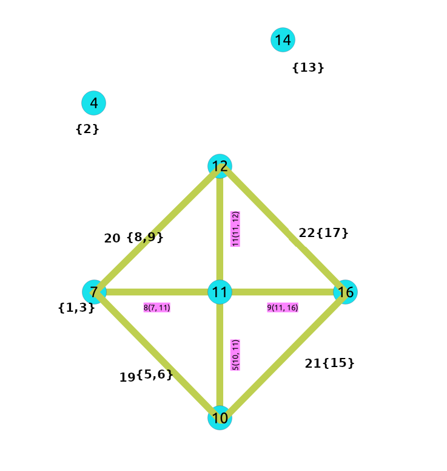

..
   ****************************************************************************
    pgRouting Manual
    Copyright(c) pgRouting Contributors

    This documentation is licensed under a Creative Commons Attribution-Share
    Alike 3.0 License: https://creativecommons.org/licenses/by-sa/3.0/
   ****************************************************************************

.. index::
   single: Contraction Family ; pgr_contraction
   single: contraction

|

``pgr_contraction``
===============================================================================

``pgr_contraction`` — Performs graph contraction and returns the contracted
vertices and edges.

.. rubric:: Availability

.. rubric:: Version 4.0.0

* Breaking change, signatures no longer available:

  * pgr_contraction(text,bigint[],integer,bigint[],boolean)

.. rubric:: Version 3.8.0

* New signature:

  * Previously compulsory parameter **Contraction order** is now optional with
    name ``methods``.
  * New name and order of optional parameters.

* Deprecated signature pgr_contraction(text,bigint[],integer,bigint[],boolean)

.. rubric:: Version 3.0.0

* Result columns change: ``seq`` is removed
* Name change from ``pgr_contractGraph``
* Bug fixes
* Function promoted to official.

.. rubric:: Version 2.3.0

* New experimental function.

Description
-------------------------------------------------------------------------------

.. characteristics_start

Contraction reduces the size of the graph by removing some of the vertices and
edges and, for example, might add edges that represent a sequence of original
edges decreasing the total time and space used in graph algorithms.

The main Characteristics are:

- Process is done only on edges with positive costs.
- Does not return the full contracted graph.

  - Only changes on the graph are returned.

- The returned values include:

  - The new edges generated by linear contraction.
  - The modified vertices generated by dead end contraction.

- The returned values are ordered as follows:

  - column ``id`` ascending when its a modified vertex.
  - column ``id`` with negative numbers descending when its a new edge.

.. characteristics_end

- Currently there are two types of contraction methods included in this
  function:

  - Dead End Contraction. See :doc:`pgr_contractionDeadEnd`.
  - Linear Contraction. See :doc:`pgr_contractionLinear`.

|Boost| Boost Graph Inside

Signatures
-------------------------------------------------------------------------------

.. admonition:: \ \
   :class: signatures

   | pgr_contraction(`Edges SQL`_, [**options**])

   | **options:** ``[directed, methods, cycles, forbidden]``
   | Returns set of |result-contract|

:Example: Dead end and linear contraction in that order on an undirected graph.

.. literalinclude:: contraction.queries
   :start-after: -- q1
   :end-before: -- q2

Parameters
-------------------------------------------------------------------------------

.. list-table::
   :width: 81
   :widths: auto
   :header-rows: 1

   * - Parameter
     - Type
     - Description
   * - `Edges SQL`_
     - ``TEXT``
     - `Edges SQL`_ as described below.

Optional parameters
...............................................................................

.. include:: dijkstra-family.rst
    :start-after: dijkstra_optionals_start
    :end-before: dijkstra_optionals_end

Contraction optional parameters
...............................................................................

.. list-table::
   :width: 81
   :widths: auto
   :header-rows: 1

   * - Column
     - Type
     - Default
     - Description
   * - ``methods``
     - ``INTEGER[]``
     - ``ARRAY[1,2]``
     - Ordered contraction operations.

       - 1 = Dead end contraction
       - 2 = Linear contraction

   * - ``cycles``
     - ``INTEGER``
     - :math:`1`
     - Number of times the contraction methods will be performed.
   * - ``forbidden``
     - ``BIGINT[]``
     - ``ARRAY[]::BIGINT[]``
     - Identifiers of vertices forbidden for contraction.

Inner Queries
-------------------------------------------------------------------------------

Edges SQL
...............................................................................

.. include:: pgRouting-concepts.rst
    :start-after: basic_edges_sql_start
    :end-before: basic_edges_sql_end

Result columns
-------------------------------------------------------------------------------

Returns set of |result-contract|

The function returns a single row. The columns of the row are:

.. list-table::
   :width: 81
   :widths: auto
   :header-rows: 1

   * - Column
     - Type
     - Description
   * - ``type``
     - ``TEXT``
     - Type of the row.

       * ``v`` when the row is a vertex.

         * Column ``id`` has a positive value.
       * ``e`` when the row is an edge.

         * Column ``id`` has a negative value.
   * - ``id``
     - ``BIGINT``
     - All numbers on this column are ``DISTINCT``

       * When ``type`` = **'v'**.

         * Identifier of the modified vertex.

       * When ``type`` = **'e'**.

         * Decreasing sequence starting from **-1**.
         * Representing a pseudo `id` as is not incorporated in the set of
           original edges.
   * - ``contracted_vertices``
     - ``ARRAY[BIGINT]``
     - Array of contracted vertex identifiers.
   * - ``source``
     - ``BIGINT``
     - * When ``type`` = **'v'**: :math:`-1`
       * When ``type`` = **'e'**: Identifier of the source vertex of the current
         edge (``source``, ``target``).
   * - ``target``
     - ``BIGINT``
     - * When ``type`` = **'v'**: :math:`-1`
       * When ``type`` = **'e'**: Identifier of the target vertex of the current
         edge (``source``, ``target``).
   * - ``cost``
     - ``FLOAT``
     - * When ``type`` = **'v'**: :math:`-1`
       * When ``type`` = **'e'**: Weight of the current edge (``source``,
         ``target``).

Additional Examples
-------------------------------------------------------------------------------

.. contents::
   :local:

Only dead end contraction
................................................................................

.. literalinclude:: contraction.queries
   :start-after: -- q2
   :end-before: -- q3

Only linear contraction
................................................................................

.. literalinclude:: contraction.queries
   :start-after: -- q3
   :end-before: -- q4

The cycle
................................................................................

Contracting a graph can be done with more than one operation.
The order of the operations affect the resulting contracted graph, after
applying one operation, the set of vertices that can be contracted
by another operation changes.

This implementation cycles ``cycles`` times through the ``methods`` .

.. parsed-literal::

    <input>
    do max_cycles times {
        for (operation in operations_order)
         { do operation }
    }
    <output>

Contracting sample data
-------------------------------------------------------------------------------

In this section, building and using a contracted graph will be shown by example.

- The :doc:`sampledata` for an undirected graph is used
- a dead end operation first followed by a linear operation.

.. contents::
   :local:

Construction of the graph in the database
...............................................................................

The original graph:

.. image:: /images/Fig6-undirected.png
   :scale: 25%

The results do not represent the contracted graph.
They represent the changes that need to be done to the graph after applying the
contraction methods.

Observe that vertices, for example, :math:`6` do not appear in the results
because it was not affected by the contraction algorithm.

.. literalinclude:: contraction.queries
   :start-after: -- cg2
   :end-before: -- cg3

After doing the dead end contraction operation:

.. image:: images/undirected_sampledata_b.png
   :scale: 25%

After doing the linear contraction operation to the graph above:

.. image:: images/undirected_sampledata_c.png
   :scale: 25%

The process to create the contraction graph on the database:
-------------------------------------------------------------------------------

.. contents::
   :local:

Add additional columns
...............................................................................

Adding extra columns to the edges and vertices tables.
In this documentation the following will be used:

.. list-table::
   :width: 80
   :widths: auto
   :header-rows: 1

   * - Column.
     - Description
   * - ``contracted_vertices``
     - The vertices set belonging to the vertex/edge
   * - ``is_contracted``
     - On the vertex table

       * when ``true`` the vertex is contracted, its not part of the contracted
         graph.
       * when ``false`` the vertex is not contracted, its part of the contracted
         graph.
   * - ``is_new``
     - On the edge table

       * when ``true`` the edge was generated by the contraction algorithm. its
         part of the contracted graph.
       * when ``false`` the edge is an original edge, might be or not part of
         the contracted graph.

.. literalinclude:: contraction.queries
   :start-after: -- cg1
   :end-before: -- cg2

Store contraction information
...............................................................................

Store the contraction results in a table.

.. literalinclude:: contraction.queries
   :start-after: -- cg3
   :end-before: -- cg4

Update the edges and vertices tables
...............................................................................

Use ``is_contracted`` column to indicate the vertices that are contracted.

.. literalinclude:: contraction.queries
   :start-after: -- cg4
   :end-before: -- cg5

Fill ``contracted_vertices`` with the information from the results that belong
to the vertices.

.. literalinclude:: contraction.queries
   :start-after: -- cg6
   :end-before: -- cg7

Insert the new edges generated by pgr_contraction.

.. literalinclude:: contraction.queries
   :start-after: -- cg7
   :end-before: -- cg8

The contracted graph
...............................................................................

Vertices that belong to the contracted graph.

.. literalinclude:: contraction.queries
   :start-after: -- cg8
   :end-before: -- cg9

Edges that belong to the contracted graph.

.. literalinclude:: contraction.queries
   :start-after: -- cg9
   :end-before: -- cg10

Visually:

Using the contracted graph
-------------------------------------------------------------------------------

Depending on the final application the graph is to be prepared.
In this example the final application will be to calculate the cost from two
vertices in the original graph by using the contracted graph with ``pgr_dijkstraCost``

There are three cases when calculating the shortest path between a given source
and target in a contracted graph:

- Case 1: Both source and target belong to the contracted graph.
- Case 2: Source and/or target belong to an edge subgraph.
- Case 3: Source and/or target belong to a vertex.

The final application should consider all of those cases.

Create a view (or table) of the contracted graph:

.. literalinclude:: contraction.queries
   :start-after: -- cg10
   :end-before: -- cg11

Create the function that will use the contracted graph.

.. literalinclude:: contraction.queries
   :start-after: -- cg11
   :end-before: -- cg12

Case 1: Both source and target belong to the contracted graph.

.. literalinclude:: contraction.queries
   :start-after: -- cg12
   :end-before: -- cg13

Case 2: Source and/or target belong to an edge that has contracted vertices.

.. literalinclude:: contraction.queries
   :start-after: -- cg13
   :end-before: -- cg14

Case 3: Source and/or target belong to a vertex that has been contracted.

.. literalinclude:: contraction.queries
   :start-after: -- cg14
   :end-before: -- cg15

See Also
-------------------------------------------------------------------------------

* :doc:`contraction-family`

.. rubric:: Indices and tables

* :ref:`genindex`
* :ref:`search`

