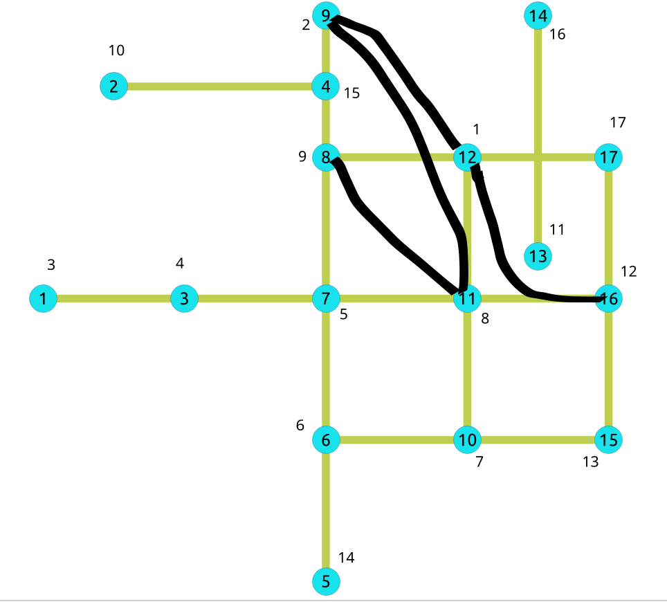

..
   ****************************************************************************
    pgRouting Manual
    Copyright(c) pgRouting Contributors

    This documentation is licensed under a Creative Commons Attribution-Share
    Alike 3.0 License: https://creativecommons.org/licenses/by-sa/3.0/
   ****************************************************************************

|

.. index::
   single: Contraction Family ; pgr_contractionHierarchies - Experimental
   single: contractionHierarchies - Experimental

``pgr_contractionHierarchies``
===============================================================================

``pgr_contractionHierarchies`` — Performs graph contraction according to 
the contraction hierarchies method and returns the contracted vertices and 
shortcut edges created.

.. rubric:: Availability

* Version 3.8.0

  * New **experimental** function

Description
-------------------------------------------------------------------------------

The contraction hierarchies method builds, from an initial order of the vertices,
a hierarchical order, giving priority to some vertices during the processing of
label fixing of shortest paths algorithms. Furthermore, the contraction 
hierarchies algorithm adds shortcut edges in the graph, that helps the shortest 
paths algorithm to follow the created hierarchical graph structure.

The idea of the hierarchy is to put at a high priority level vertices that 
belong to the long distance network (highways for example in a road network)
and to a low level of priority nodes that belong to the short distance network 
(arterials or secondary roads for example in road networks).

The contraction hierarchies algorithm makes the assumption that there is already 
a valuable vertices order that is used to initialize the contraction process. 
As in most cases there is no valuable initial node ordering, we use the order 
given by vertices ID. Then, the contraction process is made on the basis of this
first order to give the final hierarchy.

The basic idea is to keep the vertices in a priority queue sorted by some
estimate of how attractive is their contraction. The implemented case uses
the metric called *edge difference*, which corresponds to the difference between
the number of shortcuts produced by a vertex contraction and the number of incident
edges in the graph before contraction (``#shortcuts - #incident edges``). 

Finally, the aim is to reduce the explored part of the graph, when using a 
bidirectional Dijkstra-like algorithm. The vertices order is used to feed the
oriented search. The search is made without loosing optimality.

Finding an optimal vertices ordering for contraction is a difficult problem.
Nevertheless, very simple local heuristics work quite well, according to Geisberger
et al. [2]. The principle here is to a priori estimate the value of the
*edge difference* and to contract the node at the top of the queue only if the 
new value of the metric keeps it at the top of the queue. Otherwise, it is 
reinserted in the queue, at its right place corresponding to the new metric value.

The process is done on graphs having only edges with positive costs. 

It is necessary to remember that there are no deleted vertices with this function.
At the end, the graph keeps every vertex it had, but has some added edges,
corresponding to shortcuts. The vertices which have been contracted, to build 
the shortcut edges, are kept and hierarchically ordered.

As for the other contraction methods, it does not return the full
contracted graph, only the changes. They are here of two types:  

* added shortcut edges, with negative identifiers;  
* contracted nodes with an order.

|Boost| Boost Graph Inside

Signatures
-------------------------------------------------------------------------------

.. rubric:: Summary

The ``pgr_contractionHierarchies`` function has the following signature:

.. admonition:: \ \
   :class: signatures

   | pgr_contractionHierarchies(`Edges SQL`_, [**options**])

   | **options:** ``[ forbidden_vertices, directed]``
   | Returns set of |result-contraction-hierarchies|

Parameters
-------------------------------------------------------------------------------

.. list-table::
   :width: 81
   :widths: auto
   :header-rows: 1

   * - Parameter
     - Type
     - Description
   * - `Edges SQL`_
     - ``TEXT``
     - `Edges SQL`_ as described below.

Optional parameters
...............................................................................

.. include:: dijkstra-family.rst
    :start-after: dijkstra_optionals_start
    :end-before: dijkstra_optionals_end

Contraction hierarchies optional parameters
...............................................................................

.. list-table::
   :width: 81
   :widths: 19 22 7 40
   :header-rows: 1

   * - Column
     - Type
     - Default
     - Description
   * - ``forbidden_vertices``
     - ``ARRAY[`` **ANY-INTEGER** ``]``
     - **Empty**
     - Identifiers of vertices forbidden for contraction.
   * - ``directed``
     - ``BOOLEAN``
     - :math:`1`
     - True if the graph is directed, False otherwise.

Inner Queries
-------------------------------------------------------------------------------

Edges SQL
...............................................................................

.. include:: pgRouting-concepts.rst
    :start-after: basic_edges_sql_start
    :end-before: basic_edges_sql_end

Result columns
-------------------------------------------------------------------------------

Returns set of |result-contraction-hierarchies|

The function returns many rows (one per vertex and one per shortcut edge created).
The columns of the rows are:

.. list-table::
   :width: 81
   :widths: auto
   :header-rows: 1

   * - Column
     - Type
     - Description
   * - ``type``
     - ``TEXT``
     - Type of the ``id``.

       * ``v`` when the row is a vertex.

         * Column ``id`` has a positive value
       * ``e`` when the row is an edge.

         * Column ``id`` has a negative value
   * - ``id``
     - ``BIGINT``
     - All numbers on this column are ``DISTINCT``

       * When ``type`` = **'v'**.

         * Identifier of the modified vertex.

       * When ``type`` = **'e'**.

         * Decreasing sequence starting from **-1**.
         * Representing a pseudo `id` as is not incorporated in the set of
           original edges.
   * - ``contracted_vertices``
     - ``ARRAY[BIGINT]``
     - Array of contracted vertex identifiers.
   * - ``source``
     - ``BIGINT``
     - * When ``type`` = **'v'**: :math:`-1`
       * When ``type`` = **'e'**: Identifier of the source vertex of the current
         edge (``source``, ``target``).
   * - ``target``
     - ``BIGINT``
     - * When ``type`` = **'v'**: :math:`-1`
       * When ``type`` = **'e'**: Identifier of the target vertex of the current
         edge (``source``, ``target``).
   * - ``cost``
     - ``FLOAT``
     - * When ``type`` = **'v'**: :math:`-1`
       * When ``type`` = **'e'**: Weight of the current edge (``source``,
         ``target``).
   * - ``metric``
     - ``BIGINT``
     - * When ``type`` = **'v'**: :math:`-1`
       * When ``type`` = **'e'**: Weight of the current edge (``source``,
         ``target``).
   * - ``vertex_order``
     - ``BIGINT``
     - * When ``type`` = **'v'**: :math:`-1`
       * When ``type`` = **'e'**: Weight of the current edge (``source``,
         ``target``).

Examples
-------------------------------------------------------------------------------

On an undirected graph 
...............................................................................

The following query shows the original data involved in the contraction
operation on an undirected graph.

.. literalinclude:: contractionHierarchies.queries
   :start-after: -- q0
   :end-before: -- q1

The original graph:

.. image:: /images/sample_graph.png
   :scale: 25%

:Example: building contraction hierarchies on the whole graph

.. literalinclude:: contractionHierarchies.queries
   :start-after: -- q1
   :end-before: -- q2

The results do not represent the contracted graph. They represent the changes
done to the graph after applying the contraction algorithm and give the vertex
order built by the algorithm, by ordering vertices according to the *edge difference*
metric. As a consequence, vertices are all represented in the result
(except of course forbidden ones). Only shortcut built by the algorithm are
represented in the result.

After computing the contraction hierarchies, an order is now given to the vertices,
 in order to be used with a specific Dijkstra algorithm (implementation coming
 in a future version), which speeds up the search.

We obtain the contracted graph above:

We can see without surprise that the vertices belonging to the shortcuts have a 
tendancy to have a high priority level in the resulting vertices order.

On an undirected graph with forbidden vertices
...............................................................................

:Example: building contraction with a set of forbidden vertices

.. literalinclude:: contractionHierarchies.queries
   :start-after: -- q2
   :end-before: -- q3

Contraction process steps details
-------------------------------------------------------------------------------

Shortcut building process
...............................................................................

A vertex ``v`` is contracted by adding shortcuts replacing former paths of
the form ``(u, v, w)`` by an edge ``(u, w)``. The shortcut ``(u, w)`` is only
needed when ``(u, v, w)`` is the only shortest path between ``u`` and ``w``.

When all shortcuts have been added for a given vertex ``v``, the incident edges
of ``v`` are removed and another vertex is contracted with the remaining graph.

The procedure is destructive for the graph and a copy is made to be able
to manipulate it again as a whole. The contraction process adds all discovered 
shortcuts to the edge set ``E`` and attributes a metric to each contracted 
vertex. This metric is giving what is called the *contraction hierarchy*.

Initialize the queue with a first vertices order
...............................................................................

For each vertex ``v`` of the graph, a contraction of ``v`` is built:

.. graphviz::

    graph G {
        p, r, u, w [shape=circle;style=filled;width=.4;color=deepskyblue];
        v [style=filled; color=green];

        rankdir=LR;
        v -- p [dir=both, weight=10, arrowhead=vee, arrowtail=vee, label="  10"];
        v -- r [dir=both, weight=3, arrowhead=vee, arrowtail=vee, label="  3"];
        v -- u [dir=both, weight=6, arrowhead=vee, arrowtail=vee, label="  6"];
        p -- u [dir=both, weight=16, arrowhead=vee, arrowtail=vee, label="  12"];
        r -- w [dir=both, weight=5, arrowhead=vee, arrowtail=vee, label="  5"];
        u -- w [dir=both, weight=5, arrowhead=vee, arrowtail=vee, label="  5"];
        p -- r [dir=both, weight=13, arrowhead=vee, arrowtail=vee, label="  13", style="invis"];
        u -- r [dir=both, weight=9, arrowhead=vee, arrowtail=vee, label="  9", style="invis"];
    }

.. list-table::
   :width: 80
   :widths: auto
   :header-rows: 1

   * - Node
     - Adjecent nodes
   * - :math:`v`
     - :math:`\{p, r, u\}`
   * - :math:`p`
     - :math:`\{u, v\}`
   * - :math:`u`
     - :math:`\{p, v, w\}`
   * - :math:`r`
     - :math:`\{v, w\}`
   * - :math:`w`
     - :math:`\{r, u\}`

Adjacent edges are removed.

.. graphviz::

    graph G {
        p, r, u, w [shape=circle;style=filled;width=.4;color=deepskyblue];
        v [style=filled; color=green];

        rankdir=LR;
        v -- p [dir=both, weight=10, arrowhead=vee, arrowtail=vee, label="  10", style="invis"];
        v -- r [dir=both, weight=3, arrowhead=vee, arrowtail=vee, label="  3", style="invis"];
        v -- u [dir=both, weight=6, arrowhead=vee, arrowtail=vee, label="  6", style="invis"];
        p -- r [dir=both, weight=13, arrowhead=vee, arrowtail=vee, label="  13", color=red, style="invis"];
        u -- r [dir=both, weight=9, arrowhead=vee, arrowtail=vee, label="  9", color=red, style="invis"];
        p -- u [dir=both, weight=16, arrowhead=vee, arrowtail=vee, label="  12"];
        r -- w [dir=both, weight=5, arrowhead=vee, arrowtail=vee, label="  5"];
        u -- w [dir=both, weight=5, arrowhead=vee, arrowtail=vee, label="  5"];
    }

Shortcuts are built from predecessors of ``v`` to successors of ``v`` if and only if the path through ``v``
corresponds to the only shortest path between the predecessor and the successor of ``v`` in the graph.
The *edge difference* metric here takes the value of -2.

.. graphviz::

    graph G {
        p, r, u, w [shape=circle;style=filled;width=.4;color=deepskyblue];
        v [style=filled; color=green];

        rankdir=LR;
        v -- p [dir=both, weight=10, arrowhead=vee, arrowtail=vee, label="  10", style="invis"];
        v -- r [dir=both, weight=3, arrowhead=vee, arrowtail=vee, label="  3", style="invis"];
        v -- u [dir=both, weight=6, arrowhead=vee, arrowtail=vee, label="  6", style="invis"];
        p -- r [dir=both, weight=13, arrowhead=vee, arrowtail=vee, label="  13", color=red];
        u -- r [dir=both, weight=9, arrowhead=vee, arrowtail=vee, label="  9", color=red];
        p -- u [dir=both, weight=16, arrowhead=vee, arrowtail=vee, label="  12"];
        r -- w [dir=both, weight=5, arrowhead=vee, arrowtail=vee, label="  5"];
        u -- w [dir=both, weight=5, arrowhead=vee, arrowtail=vee, label="  5"];
    }

Then the following vertex is contracted. The process goes on until each node of the graph has been contracted.
At the end, there are no more edges in the graph, which has been destroyed by the process.

This first contraction will give a vertices order, given by ordering them in ascending order on
the metric (edge difference). A total vertices order is built. If ``u < v``, then ``u`` 
is less important than ``v``. The algorithm keeps the vertices into a queue in this order.

A hierarchy will now be constructed by contracting again the vertices in this order.

Build the final vertex order
...............................................................................

Once the first order built, the algorithm uses it to browse the graph once again. 
For each vertex taken in the queue, the algorithm simulates contraction and calculates 
its edge difference. If the computed value is greater than the one of the next vertex to be 
contracted, then the algorithm puts it back in the queue (heuristic approach). 
Otherwise it contracts it permanently.

Add shortcuts to the initial graph
...............................................................................

At the end, the algorithm takes the initial graph (before edges deletions) and adds the shortcut 
edges to it. It gives you the contracted graph, ready to use with a specialized Dijkstra algorithm,
which takes into account the order of the nodes in the hierarchy.

Use the contraction
-------------------------------------------------------------------------------

Build the contraction 
...............................................................................

.. literalinclude:: contractionHierarchies.queries
   :start-after: -- q5
   :end-before: -- q6

Add shortcuts and hierarchy in the existing tables
...............................................................................

Add new columns in the `vertices` and `edges` tables to store the results:

.. literalinclude:: contractionHierarchies.queries
   :start-after: -- q3
   :end-before: -- q4

.. literalinclude:: contractionHierarchies.queries
   :start-after: -- q4
   :end-before: -- q5

Update and insert the results in the two tables.

.. literalinclude:: contractionHierarchies.queries
   :start-after: -- q6
   :end-before: -- q7

.. literalinclude:: contractionHierarchies.queries
   :start-after: -- q7
   :end-before: -- q8

Use a Dijkstra shortest path algorithm on it
...............................................................................

Then you can use any Dijkstra-like algorithm, waiting for the adapted one which
will take into account the built vertices hierarchy. For example:

.. literalinclude:: contractionHierarchies.queries
   :start-after: -- q8
   :end-before: -- q9

See Also
-------------------------------------------------------------------------------

* :doc:`contraction-family`

.. rubric:: Indices and tables

* :ref:`genindex`
* :ref:`search`

