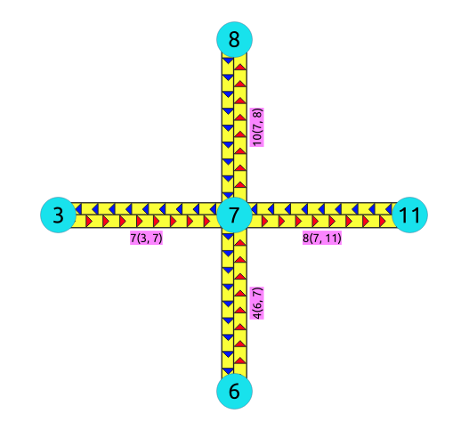
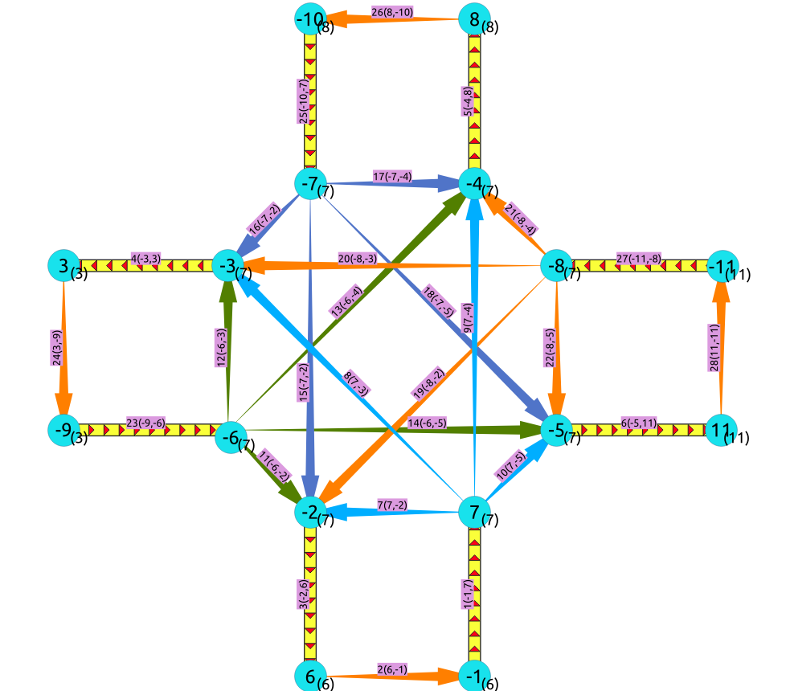

..
   ****************************************************************************
    pgRouting Manual
    Copyright(c) pgRouting Contributors

    This documentation is licensed under a Creative Commons Attribution-Share
    Alike 3.0 License: http://creativecommons.org/licenses/by-sa/3.0/
   ****************************************************************************

.. _pgr_linegraphfull:

pgr_lineGraphFull - Experimental
===============================================================================

``pgr_lineGraphFull`` — Transforms a given graph into a new graph where all of the vertices from the original graph are converted to line graphs.

.. include:: proposed.rst
   :start-after: begin-warn-expr
   :end-before: end-warn-expr

Synopsis
-------------------------------------------------------------------------------
pgr_lineGraphFull, converts original directed graph to a directed line graph by converting each vertex to a complete graph and keeping all the original edges. The new connecting edges have a cost 0 and go between the adjacent original edges, respecting the directionality.

A possible application of the resulting graph is "routing with two edge restrictions":
  - Setting a cost of using the vertex when routing between edges on the connecting edge
  - Forbid the routing between two edges by removing the connecting edge

This is possible because each of the intersections (vertices) in the original graph are now complete graphs that have a new edge for each possible turn across that intersection.

Characteristics
-------------------------------------------------------------------------------

The main characteristics are:
  - This function is for directed graphs.
  - Results are undefined when a negative vertex id is used in the input graph.
  - Results are undefined when a duplicated edge id is used in the input graph.
  - Running time: TBD

Signature Summary
-----------------

.. code-block:: none

    pgr_lineGraphFull(edges_sql)
    RETURNS SET OF (seq, source, target, cost, edge) 
        OR EMPTY SET

Signatures
------------------------------------------------------------------------------

.. index::
    single: lineGraphFull(Only signature)

Minimal signature
-----------------------------------------------

.. code-block:: none

    pgr_lineGraphFull(TEXT edges_sql)
    RETURNS SET OF (seq, source, target, cost, edge) OR EMPTY SET

:Example:

.. literalinclude:: doc-pgr_lineGraphFull.queries
   :start-after: -- q1
   :end-before: -- q2

Description of the Signatures
-------------------------------------------------------------------------------

.. include:: pgRouting-concepts.rst
    :start-after: basic_edges_sql_start
    :end-before: basic_edges_sql_end

.. pgr_lineGraphFull_parameters_start

Description of the parameters of the signatures
...............................................................................

============== ================== ======== =================================================
Column         Type               Default     Description
============== ================== ======== =================================================
**sql**        ``TEXT``                    SQL query as described above.
============== ================== ======== =================================================

.. pgr_lineGraphFull_parameters_end

Additional Examples
-------------------------------------------------------------------------------

The examples of this section are based on the :doc:`sampledata` network.

The examples include the subgraph including edges 4, 7, 8, and 10 with reverse_cost.

Example for generating the LineGraphFull
-------------------------------------------------------------------------------

This example displays how this graph transformation works to create additional edges for each possible turn in a graph.

.. code-block:: none

    SELECT id, source, target, cost, reverse_cost
      FROM edge_table
      WHERE id IN (4,7,8,10);

| |first|

.. code-block:: none

    SELECT * FROM pgr_lineGraphFull('SELECT id, 
                                            source, 
                                            target, 
                                            cost, 
                                            reverse_cost 
                                       FROM edge_table 
                                         WHERE id IN (4,7,8,10)');

| |second|

In the transformed graph, all of the edges from the original graph are still present (yellow), but we now have additional edges for every turn that could be made across vertex 6 (orange).

Example for creating table that identifies transformed vertices
-----------------------------------------------------------------------------
 
The vertices in the transformed graph are each created by splitting up the vertices in the original graph. Unless a vertex in the original graph is a leaf vertex, it will generate more than one vertex in the transformed graph. One of the newly created vertices in the transformed graph will be given the same vertex-id as the vertex that it was created from in the original graph, but the rest of the newly created vertices will have negative vertex ids. Following is an example of how to generate a table that maps the ids of the newly created vertices with the original vertex that they were created from

The first step is to store your results graph into a table and then create the vertex mapping table with one row for each distinct vertex id in the results graph.

.. literalinclude:: doc-pgr_lineGraphFull.queries
   :start-after: -- q2
   :end-before: -- q3

Next, we set the original_id of all of the vertices in the results graph that were given the same vertex id as the vertex that it was created from in the original graph.

.. literalinclude:: doc-pgr_lineGraphFull.queries
   :start-after: -- q3
   :end-before: -- q4

Then, we cross reference all of the other newly created vertices that do not have the same original_id and set their original_id values. 

.. literalinclude:: doc-pgr_lineGraphFull.queries
   :start-after: -- q4
   :end-before: -- q5

The only vertices left that have not been mapped are a few of the leaf vertices from the original graph. The following sql completes the mapping for these leaf vertices (in the case of this example graph there are no leaf vertices but this is necessary for larger graphs).

.. literalinclude:: doc-pgr_lineGraphFull.queries
   :start-after: -- q5
   :end-before: -- q6

Now our vertex mapping table is complete:

.. literalinclude:: doc-pgr_lineGraphFull.queries
   :start-after: -- q6
   :end-before: -- q7

Example for running a dijkstra's shortest path with turn penalties
-----------------------------------------------------------------------------

One use case for this graph transformation is to be able to run a shortest path search that takes into account the cost or limitation of turning. Below is an example of running a dijkstra's shortest path from vertex 2 to vertex 8 in the original graph, while adding a turn penalty cost of 100 to the turn from edge 4 to edge -7.

First we must increase set the cost of making the turn to 100:

.. literalinclude:: doc-pgr_lineGraphFull.queries
   :start-after: -- q7
   :end-before: -- q8

Then we must run a dijkstra's shortest path search using all of the vertices in the new graph that were created from vertex 2 as the starting point, and all of the vertices in the new graph that were created from vertex 8 as the ending point.

.. literalinclude:: doc-pgr_lineGraphFull.queries
   :start-after: -- q8
   :end-before: -- q9

Normally the shortest path from vertex 2 to vertex 8 would have an aggregate cost of 2, but since there is a large penalty for making the turn needed to get this cost, the route goes through vertex 6 to avoid this turn.

If you cross reference the node column in the dijkstra results with the vertex id mapping table, this will show you that the path goes from v2 -> v5 -> v6 -> v5 -> v8 in the original graph.

See Also
-----------------------------------------------------------------------------

* http://en.wikipedia.org/wiki/Line_graph
* http://en.wikipedia.org/wiki/Complete_graph

.. rubric:: Indices and tables

* :ref:`genindex`
* :ref:`search`

