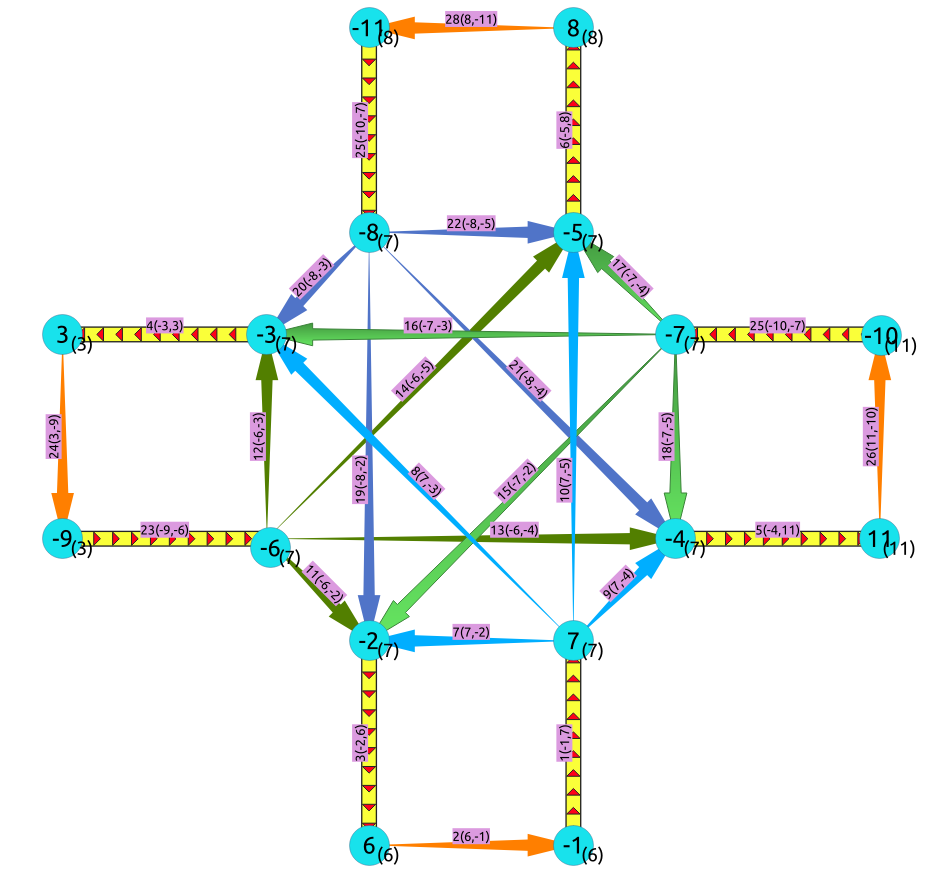

..
   ****************************************************************************
    pgRouting Manual
    Copyright(c) pgRouting Contributors

    This documentation is licensed under a Creative Commons Attribution-Share
    Alike 3.0 License: http://creativecommons.org/licenses/by-sa/3.0/
   ****************************************************************************

.. _pgr_linegraphfull:

pgr_lineGraphFull - Experimental
===============================================================================

``pgr_lineGraphFull`` — Transforms a given graph into a new graph where all of the vertices from the original graph are converted to line graphs.

.. include:: proposed.rst
   :start-after: begin-warn-expr
   :end-before: end-warn-expr

Synopsis
-------------------------------------------------------------------------------

This graph transformation algorithm generates a new graph that contains all of the same edges of the original graph except every vertex has been converted to a line graph. 

One application for this type of graph transformation is to allow for the addition of a cost to turning in shortest path calcuations for routing traffic. This can be done because each of the intersections (vertices) in the original graph are now line graphs that have a new edge for each possible turn across that intersection.

Characteristics
-------------------------------------------------------------------------------

- This function is intended for directed graphs.
- This function will currently give incorrect results if negative vertex ids are used in the input.
- This function will currently give incorrect results if duplicated edge ids are used in the input.

Signature Summary
-----------------

.. code-block:: none 

    pgr_lineGraphFull(edges_sql)

    RETURNS SET OF (seq, 
                    source, 
                    target, 
                    cost, 
                    edge) OR EMPTY SET

Example Usage
-------------------------------------------------------------------------------

This example displays how this graph transformation works to create additional edges for each possible turn in a graph.

.. code-block:: none 

    SELECT id, source, target, cost, reverse_cost FROM edge_table WHERE id IN (5, 8, 9, 11);

| |first|

.. |first| image:: images/original.png
   :align: middle

.. code-block:: none 

    SELECT * FROM pgr_lineGraphFull('SELECT id, 
                                            source, 
                                            target, 
                                            cost, 
                                            reverse_cost 
                                       FROM edge_table 
                                         WHERE id IN (5, 8, 9, 11)');

| |second|

In the transformed graph, all of the edges from the original graph are still present (yellow), but we now have additional edges for every turn that could be made across vertex 6 (orange).

Sample Data Results
-------------------------------------------------------------------------------

.. literalinclude:: doc-pgr_lineGraphFull.queries
   :start-after: -- q1
   :end-before: -- q2

.. rubric:: Indices and tables

* :ref:`genindex`
* :ref:`search`

