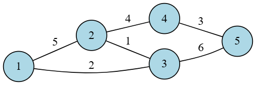
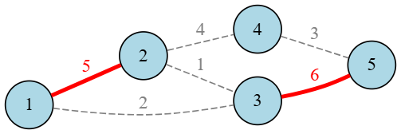

:file: This file is part of the pgRouting project.
:copyright: Copyright (c) 2020-2026 pgRouting developers
:license: Creative Commons Attribution-Share Alike 3.0 https://creativecommons.org/licenses/by-sa/3.0

.. index::
   single: Flow Family ; pgr_maxWeightedMatching - Experimental
   single: maxWeightedMatching - Experimental on v4.1

|

``pgr_maxWeightedMatching`` - Experimental
===============================================================================

``pgr_maxWeightedMatching`` — Calculates a maximum weighted matching in a graph.

.. include:: experimental.rst
   :start-after: warning-begin
   :end-before: end-warning

.. rubric:: Availability

.. rubric:: Version 4.1.0

* New experimental function.

Description
-------------------------------------------------------------------------------

A **maximum weighted matching** in a graph is a matching where the sum of the
weights of selected edges is maximized.

A matching or independent edge set in a graph is a set of edges without common
vertices.

The main characteristics are:

- Works for **undirected** graphs.
- Each vertex is matched with at most one other vertex.
- Maximizes the total edge weight sum.
- There may be many maximum weighted matchings.

  - Calculates one possible maximum weighted matching in a graph.

- Returns the matched pairs of vertices in the form of a set of
  `(start_vid, end_vid, agg_cost)`.

  - `start_vid` and `end_vid` are the endpoints of the matched edge.
  - `agg_cost` is the weight of the matched edge.

- For the undirected graph, the results are symmetric.

  - The `agg_cost` of `(u, v)` is the same as for `(v, u)`.

- Running time: :math:`O(n^3)` where :math:`n` is the number of vertices.

|Boost| Boost Graph Inside

Signatures
-------------------------------------------------------------------------------

.. rubric:: Summary

.. admonition:: \ \
   :class: signatures

   | pgr_maxWeightedMatching(`Edges SQL`_, ``directed``)

   | Returns set of |matrix-result|
   | OR EMPTY SET

:Example: Using all edges.

.. literalinclude:: maxWeightedMatching.queries
   :start-after: -- q1
   :end-before: -- q2

Parameters
-------------------------------------------------------------------------------

.. include:: allpairs-family.rst
    :start-after: edges_start
    :end-before: edges_end

Optional parameters
...............................................................................

.. list-table::
   :width: 81
   :widths: auto
   :header-rows: 1

   * - Column
     - Type
     - Default
     - Description
   * - ``directed``
     - ``BOOLEAN``
     - ``false``
     - Ignored. The matching algorithm always works on **undirected** graphs.

Inner Queries
-------------------------------------------------------------------------------

Edges SQL
...............................................................................

.. include:: pgRouting-concepts.rst
    :start-after: basic_edges_sql_start
    :end-before: basic_edges_sql_end

Result columns
-------------------------------------------------------------------------------

Set of |matrix-result|

.. list-table::
   :width: 81
   :widths: 12 14 60
   :header-rows: 1

   * - Column
     - Type
     - Description
   * - ``start_vid``
     - ``BIGINT``
     - Identifier of the first end point vertex of the matched edge.
   * - ``end_vid``
     - ``BIGINT``
     - Identifier of the second end point vertex of the matched edge.
   * - ``agg_cost``
     - ``FLOAT``
     - Weight of the matched edge.

Additional Examples
-------------------------------------------------------------------------------

.. raw:: html

   <table style="width:100%; border:none; border-collapse:collapse;">
     <tr>
       <td style="width:50%; text-align:center; padding:8px; border:none;">
         <strong>Before Matching</strong> 
         
         
<em>Sample graph with 5 vertices and 6 weighted edges before matching.</em>

       </td>
       <td style="width:50%; text-align:center; padding:8px; border:none;">
         <strong>After Matching</strong> 
         
         
<em>Graph after maximum weighted matching: selected edges are highlighted.</em>

       </td>
     </tr>
   </table>

:Example: Maximum weighted matching on a custom 5-vertex graph.

.. literalinclude:: maxWeightedMatching.queries
   :start-after: -- q2
   :end-before: -- q4

See Also
-------------------------------------------------------------------------------

* :doc:`flow-family`
* :doc:`sampledata`
* `Boost: maximum_weighted_matching
  <https://www.boost.org/doc/libs/latest/libs/graph/doc/maximum_weighted_matching.html>`__

.. rubric:: Indices and tables

* :ref:`genindex`
* :ref:`search`
