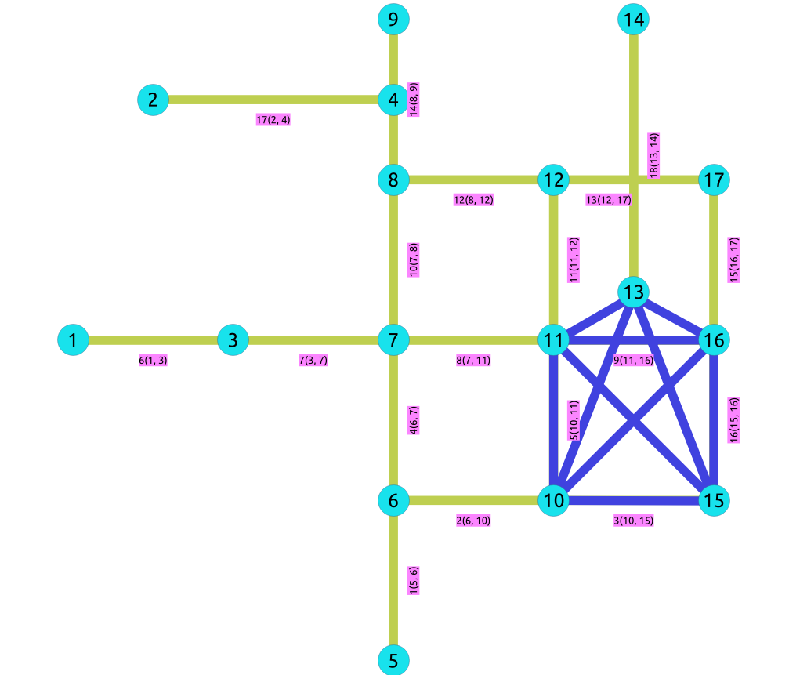

..
   ****************************************************************************
    pgRouting Manual
    Copyright(c) pgRouting Contributors

    This documentation is licensed under a Creative Commons Attribution-Share
    Alike 3.0 License: http://creativecommons.org/licenses/by-sa/3.0/
   ****************************************************************************

|

* **Supported versions:**
  `Latest <https://docs.pgrouting.org/latest/en/pgr_isPlanar.html>`__
  (`3.6 <https://docs.pgrouting.org/3.6/en/pgr_isPlanar.html>`__)
  `3.5 <https://docs.pgrouting.org/3.5/en/pgr_isPlanar.html>`__
  `3.4 <https://docs.pgrouting.org/3.4/en/pgr_isPlanar.html>`__
  `3.3 <https://docs.pgrouting.org/3.3/en/pgr_isPlanar.html>`__
  `3.2 <https://docs.pgrouting.org/3.2/en/pgr_isPlanar.html>`__

``pgr_isPlanar`` - Experimental
===============================================================================

``pgr_isPlanar`` — Returns a boolean depending upon the planarity of the graph.

.. figure:: images/boost-inside.jpeg
   :target: https://www.boost.org/libs/graph/doc/boyer_myrvold.html

   Boost Graph Inside

.. include:: experimental.rst
   :start-after: begin-warn-expr
   :end-before: end-warn-expr

.. rubric:: Availability

* Version 3.2.0

  * New **experimental** function

Description
-------------------------------------------------------------------------------

A graph is planar if it can be drawn in two-dimensional space with no two of its
edges crossing. Such a drawing of a planar graph is called a plane drawing.
Every planar graph also admits a straight-line drawing, which is a plane drawing
where each edge is represented by a line segment. When a graph has :math:`K_5`
or :math:`K_{3, 3}` as subgraph then the
graph is not planar.

The main characteristics are:

* This implementation use the Boyer-Myrvold Planarity Testing.
* It will return a boolean value depending upon the planarity of the graph.
* Applicable only for **undirected** graphs.
* The algorithm does not considers traversal costs in the calculations.
* Running time: :math:`O(|V|)`

Signatures
-------------------------------------------------------------------------------

.. rubric:: Summary

.. index::
   single: isPlanar - Experimental on v3.2

.. admonition:: \ \
   :class: signatures

   | pgr_isPlanar(`Edges SQL`)

   | RETURNS ``BOOLEAN``

.. literalinclude:: doc-pgr_isPlanar.queries
   :start-after: -- q1
   :end-before: -- q2

Parameters
-------------------------------------------------------------------------------

.. include:: pgRouting-concepts.rst
   :start-after: only_edge_param_start
   :end-before: only_edge_param_end

Inner Queries
-------------------------------------------------------------------------------

Edges SQL
...............................................................................

.. include:: pgRouting-concepts.rst
    :start-after: basic_edges_sql_start
    :end-before: basic_edges_sql_end

Result Columns
-------------------------------------------------------------------------------

Returns a boolean ``(pgr_isplanar)``

=================  =========== ==========================================
Column             Type        Description
=================  =========== ==========================================
``pgr_isplanar``   ``BOOLEAN`` - `true` when the graph is planar.
                               - `false` when the graph is not planar.
=================  =========== ==========================================

Additional Examples
-------------------------------------------------------------------------------

The following edges will make the subgraph with vertices {10, 15, 11, 16, 13} a
:math:`K_1` graph.

.. literalinclude:: doc-pgr_isPlanar.queries
   :start-after: -- q2
   :end-before: -- q3

The new graph is not planar because it has a :math:`K_5` subgraph. Edges in blue
represent :math:`K_5` subgraph.

.. TODO fix the image

.. literalinclude:: doc-pgr_isPlanar.queries
   :start-after: -- q3
   :end-before: -- q4

See Also
-------------------------------------------------------------------------------

* :doc:`sampledata`
* https://www.boost.org/libs/graph/doc/boyer_myrvold.html

.. rubric:: Indices and tables

* :ref:`genindex`
* :ref:`search`
