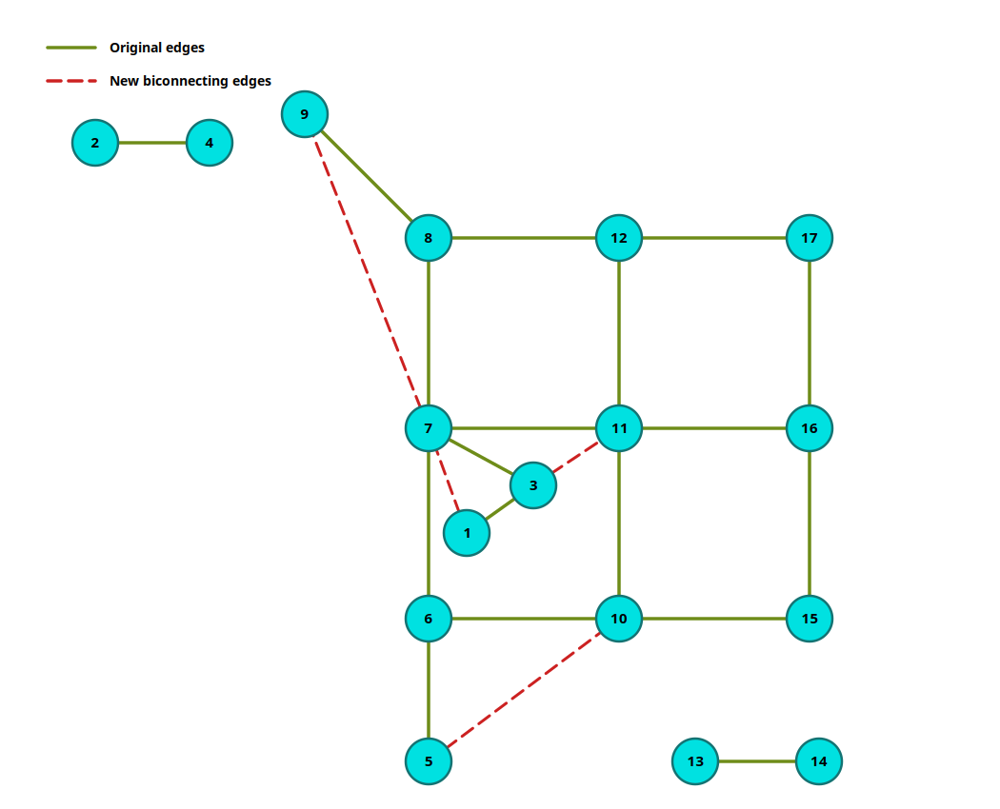
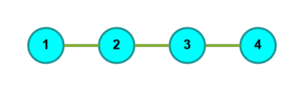
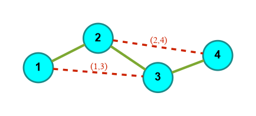

:file: This file is part of the pgRouting project.
:copyright: Copyright (c) 2020-2026 pgRouting developers
:license: Creative Commons Attribution-Share Alike 3.0 https://creativecommons.org/licenses/by-sa/3.0

.. index::
   single: Planar Family ; pgr_makeBiconnectedPlanar - Experimental
   single: makeBiconnectedPlanar - Experimental on v4.1

|

``pgr_makeBiconnectedPlanar`` - Experimental
===============================================================================

``pgr_makeBiconnectedPlanar`` — Returns the set of edges needed to make each connected component of a planar graph biconnected.

.. include:: experimental.rst
   :start-after: warning-begin
   :end-before: end-warning

.. rubric:: Availability

.. rubric:: Version 4.1.0

* New experimental function.

Description
-------------------------------------------------------------------------------

``pgr_makeBiconnectedPlanar`` identifies the missing edges that need to be added to each
connected component of an existing planar graph to make those components biconnected,
while ensuring the graph remains planar.

A graph is considered **biconnected** if it is connected and cannot be broken into
disconnected pieces by deleting any single vertex (it has no articulation points).
A planar graph is one that can be drawn in two-dimensional space with no two of
its edges crossing.

The main characteristics are:

* Works for **undirected** graphs.
* Works for **planar** graphs only.
* If any component of the input graph is not planar, no added edges are returned for that component.
* Returns a list of all new edges needed to make each connected component of the graph biconnected.
* The algorithm does not consider traversal costs in the calculations.
* The algorithm does not consider geometric topology in the calculations.
* Running time: :math:`O(|V_G| + |E_G| + R \log R)` where :math:`G(V_G, E_G)` is the input graph and :math:`R` is the number of returned edges.

|Boost| Boost Graph Inside

Signatures
-------------------------------------------------------------------------------

.. admonition:: \ \
   :class: signatures

   | pgr_makeBiconnectedPlanar(`Edges SQL`_)

   | Returns set of |result-component-make|
   | OR EMPTY SET

:Example: List of edges that are needed to make the graph biconnected planar.

**Sample graph before:**

.. figure:: /images/Fig6-undirected.png
   :scale: 50%

   Sample graph before

**Output:**

.. literalinclude:: makeBiconnectedPlanar.queries
   :start-after: -- q1
   :end-before: -- q2

**Sample graph after adding biconnecting edges:**

   Sample graph after adding biconnecting edges (olive = original edges, red dashed = 4 new biconnecting edges).
   Note: When a graph contains multiple disconnected components, each component is processed independently. Components (2,4) and (13,14) are already biconnected (0 articulation points) and require no new edges.

Parameters
-------------------------------------------------------------------------------

.. include:: pgRouting-concepts.rst
   :start-after: only_edge_param_start
   :end-before: only_edge_param_end

Inner Queries
-------------------------------------------------------------------------------

Edges SQL
...............................................................................

.. include:: pgRouting-concepts.rst
    :start-after: basic_edges_sql_start
    :end-before: basic_edges_sql_end

Result columns
-------------------------------------------------------------------------------

Returns set of |result-component-make|

.. list-table::
   :width: 81
   :widths: auto
   :header-rows: 1

   * - Column
     - Type
     - Description
   * - ``seq``
     - ``BIGINT``
     - Sequential value starting from **1**.
   * - ``start_vid``
     - ``BIGINT``
     - Identifier of the first end point vertex of the edge.
   * - ``end_vid``
     - ``BIGINT``
     - Identifier of the second end point vertex of the edge.

Additional Examples
-------------------------------------------------------------------------------

:Example: Biconnecting a simple 4-vertex line graph (path graph).

.. literalinclude:: makeBiconnectedPlanar.queries
   :start-after: -- q2
   :end-before: -- q3

**Sample graph before:**

   Sample 4-vertex line graph before biconnecting (vertices 2 and 3 are articulation points).

**Output:**

.. literalinclude:: makeBiconnectedPlanar.queries
   :start-after: -- q3
   :end-before: -- q4

**Sample graph after adding biconnecting edges:**

   Biconnected planar graph after adding new edges to eliminate articulation points without crossing.

See Also
-------------------------------------------------------------------------------

* `Boost: make_biconnected_planar
  <https://www.boost.org/doc/libs/latest/libs/graph/doc/html/graph/algorithms/planar/make_biconnected_planar.html>`__
* :doc:`sampledata`

.. rubric:: Indices and tables

* :ref:`genindex`
* :ref:`search`
