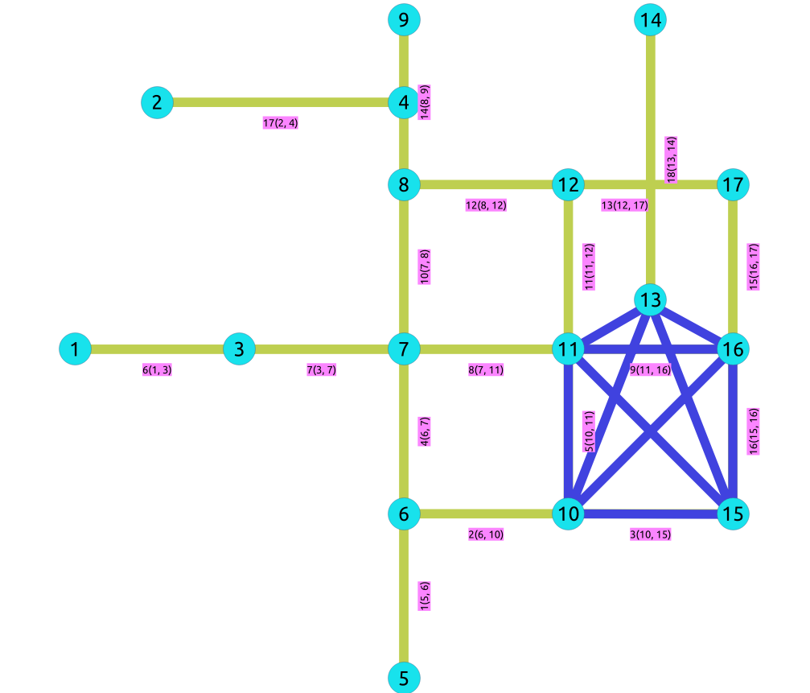

:file: This file is part of the pgRouting project.
:copyright: Copyright (c) 2026-2026 pgRouting developers
:license: Creative Commons Attribution-Share Alike 3.0 https://creativecommons.org/licenses/by-sa/3.0

.. index::
   single: Planar Family ; pgr_planarFaces - Experimental
   single: planarFaces - Experimental on v4.1

|

``pgr_planarFaces`` - Experimental
===============================================================================

``pgr_planarFaces`` - Identifies the faces of a planar embedding and lists every
edge-face incidence for an undirected graph.

.. include:: experimental.rst
   :start-after: warning-begin
   :end-before: end-warning

.. rubric:: Availability

.. rubric:: Version 4.1.0

* New experimental function.

Description
-------------------------------------------------------------------------------

In a **planar embedding**, the graph is drawn in the plane so that edges meet only
at vertices. A **face** is a maximal connected region of the plane bounded by
edges: on a street network, the city blocks between the roads. Every bounded face
is a cycle of edges enclosing an interior region. The **exterior face**, also
called the unbounded face, is the region outside the outermost cycle.

Once an embedding is fixed, each undirected edge has a **left** and a **right**
side when walked in the direction the embedding assigns around each vertex.
In a connected planar graph, each edge separates exactly two faces, so it
contributes one row on the left and one on the right. ``pgr_planarFaces`` returns
those incidences: ``face_id`` names the face, ``edge_id`` is the border edge, and
``side`` is ``1`` (left) or ``2`` (right) relative to the embedding.

The function first computes a planar embedding with the Boyer-Myrvold planarity
test, then walks faces with Boost ``planar_face_traversal``. Only **undirected**
structure matters: ``cost`` and ``reverse_cost`` are ignored. The input must be
**planar**; otherwise the call raises ``ERROR: Graph is not planar``. When
planarity is unknown, run :doc:`pgr_isPlanar` first. The result has one row per
edge-side pair, so a graph with :math:`|E|` edges yields :math:`2|E|` rows when
extraction succeeds. Face identifiers come from the traversal; one is the
exterior face. An empty edge SQL emits a notice and returns no rows. Running
time is :math:`O(|V| + |E|)`.

The number of faces obeys **Euler's formula**. On a connected planar graph
:math:`|V| - |E| + |F| = 2`. The traversal walks the outer face of every
connected component separately, so on a graph with :math:`C` components the
relation generalises to :math:`|V| - |E| + |F| = 2C`. On the
:doc:`sampledata` network, which has :math:`3` components,
:math:`17 - 18 + 7 = 6 = 2 \times 3`.

|Boost| Boost Graph Inside

.. rubric:: References

* Boyer, J. M. and Myrvold, W. J. (2004). On the Cutting Edge: Simplified O(n)
  Planarity Algorithms by Edge Addition. Journal of Graph Algorithms and
  Applications, 8(3), 241-273.

* Boost Graph Library: `Planar Face Traversal
  <https://www.boost.org/libs/graph/doc/planar_face_traversal.html>`__

Signatures
-------------------------------------------------------------------------------

.. rubric:: Summary

.. admonition:: \ \
   :class: signatures

   | pgr_planarFaces(`Edges SQL`_)

   | Returns set of ``(seq, face_id, edge_id, side)``

:Example: Faces of the full :doc:`sampledata` graph

.. literalinclude:: planarFaces.queries
   :start-after: -- q1
   :end-before: -- q2

.. rubric:: Explanation

* The query returns **36 rows**, twice the **18** edges in ``edges``, consistent
  with :math:`2|E|`.
* ``face_id`` runs from **1** through **7** on this network; each id is one face
  of the embedding, including the unbounded **exterior face** (here ``face_id = 1``
  borders the outer layout of the city block).
* Every ``edge_id`` appears **twice**, once with ``side = 1`` and once with
  ``side = 2``.
* Rows follow the counterclockwise walk of each face in the computed embedding.

The diagram below sketches the full sample graph. Face boundaries are not drawn
to scale; run example 6) to count how many edge incidences belong to each
``face_id``.

.. graphviz::

    graph G {
        node [shape=circle;style=filled;width=.5;fixedsize=true;fontsize=8];
        1,2,3,4,5,6,7,8,9,10,11,12,13,14,15,16,17 [color=lightgray];
        5  [pos="0,0!";label="5"];
        6  [pos="1,0!";label="6"];
        10 [pos="2,0!";label="10"];
        15 [pos="3,0!";label="15"];
        7  [pos="1,1!";label="7"];
        11 [pos="2,1!";label="11"];
        14 [pos="3,1!";label="14"];
        1  [pos="0,2!";label="1"];
        3  [pos="1,2!";label="3"];
        2  [pos="2,2!";label="2"];
        16 [pos="3,2!";label="16"];
        9  [pos="0,3!";label="9"];
        12 [pos="1,3!";label="12"];
        13 [pos="2,3!";label="13"];
        17 [pos="3,3!";label="17"];
        8  [pos="1,4!";label="8"];
        4  [pos="3,4!";label="4"];
        5 -- 6 [label="1"];
        6 -- 10 [label="2"];
        10 -- 15 [label="3"];
        6 -- 7 [label="4"];
        10 -- 11 [label="5"];
        1 -- 3 [label="6"];
        3 -- 7 [label="7"];
        7 -- 11 [label="8"];
        11 -- 16 [label="9"];
        7 -- 8 [label="10"];
        11 -- 12 [label="11"];
        8 -- 12 [label="12"];
        12 -- 17 [label="13"];
        8 -- 9 [label="14"];
        16 -- 17 [label="15"];
        15 -- 16 [label="16"];
        2 -- 4 [label="17"];
        13 -- 14 [label="18"];
    }

A **triangle** has one bounded interior face and the exterior face. Each of the
three edges appears on both sides (six rows total).

.. graphviz::

    graph G {
        node [shape=circle;style=filled;width=.5;fixedsize=true;fontsize=8];
        1,2,3 [color=lightblue];
        1 -- 2 [label="1"];
        2 -- 3 [label="2"];
        3 -- 1 [label="3"];
    }

A **single edge** separates two regions of the plane; face extraction still
returns two rows (left and right of edge ``1``).

.. graphviz::

    graph G {
        node [shape=circle;style=filled;width=.5;fixedsize=true;fontsize=8];
        5,6 [color=lightblue];
        5 -- 6 [label="1"];
    }

Parameters
-------------------------------------------------------------------------------

.. include:: pgRouting-concepts.rst
   :start-after: only_edge_param_start
   :end-before: only_edge_param_end

Inner Queries
-------------------------------------------------------------------------------

Edges SQL
...............................................................................

.. include:: pgRouting-concepts.rst
    :start-after: basic_edges_sql_start
    :end-before: basic_edges_sql_end

Result columns
-------------------------------------------------------------------------------

.. list-table::
	:width: 81
	:widths: auto
	:header-rows: 1

	* - Column
	  - Type
	  - Description
	* - ``seq``
	  - ``BIGINT``
	  - Sequential value starting from 1.
	* - ``face_id``
	  - ``BIGINT``
	  - Identifier of the face in the computed embedding.
	* - ``edge_id``
	  - ``BIGINT``
	  - Identifier of the edge that borders the face.
	* - ``side``
	  - ``INTEGER``
	  - | ``1`` when the edge borders the face on the left side.
	    | ``2`` when the edge borders the face on the right side.

Additional Examples
-------------------------------------------------------------------------------

The examples of this section are based on the :doc:`sampledata` network unless
noted otherwise.

Sample network overview
...............................................................................

.. figure:: /images/Fig1-originalData.png
   :scale: 50%

   Directed sample network. ``pgr_planarFaces`` treats every edge as undirected,
   so ``cost`` and ``reverse_cost`` do not affect face extraction.

Non-planar graphs
...............................................................................

Face extraction requires a planar graph. Subgraphs containing a :math:`K_5` or
:math:`K_{3,3}` minor cannot be embedded without crossings; ``pgr_planarFaces``
raises ``ERROR: Graph is not planar`` in that case. The :doc:`pgr_isPlanar`
documentation shows a non-planar subgraph of ``sampledata`` (edges highlighted in
blue in the figure).

   A non-planar subgraph of ``sampledata``. Test with ``pgr_isPlanar`` before
   calling ``pgr_planarFaces``.

1) Check planarity of the full graph
+++++++++++++++++++++++++++++++++++++++++++++++++++++++++++++++++++++++++++++++

.. literalinclude:: planarFaces.queries
   :start-after: -- q2
   :end-before: -- q3

.. rubric:: Explanation

* ``pgr_isPlanar`` returns ``true`` for the full ``edges`` table, so face
  extraction in the main example is valid.
* When the result is ``false``, do not call ``pgr_planarFaces`` on the same edge
  set unless the graph is edited to remove crossings.

2) Triangle graph built in SQL
+++++++++++++++++++++++++++++++++++++++++++++++++++++++++++++++++++++++++++++++

Example 3 creates a three-edge table ``tri_edges`` and extracts its faces.

.. graphviz::

    graph G {
        node [shape=circle;style=filled;width=.5;fixedsize=true;fontsize=8];
        1,2,3 [color=lightblue];
        1 -- 2 [label="1"];
        2 -- 3 [label="2"];
        3 -- 1 [label="3"];
    }

.. literalinclude:: planarFaces.queries
   :start-after: -- q3
   :end-before: -- q4

.. rubric:: Explanation

* Six rows are returned: :math:`2 \times 3` edges.
* ``face_id`` **1** is the interior triangle; ``face_id`` **2** is the exterior
  face.
* Each edge lists ``1`` on one face and ``2`` on the other.

3) Single edge from ``sampledata``
+++++++++++++++++++++++++++++++++++++++++++++++++++++++++++++++++++++++++++++++

Edge ``1`` connects vertices :math:`5` and :math:`6`.

.. literalinclude:: planarFaces.queries
   :start-after: -- q4
   :end-before: -- q5

.. rubric:: Explanation

* Two rows are returned for the single edge (:math:`2|E|` with :math:`|E| = 1`).
* Both incidences use ``face_id = 1`` in this degenerate one-edge graph; the left
  and right sides still differ (``1`` vs ``2``).

4) Row count on three ``sampledata`` edges
+++++++++++++++++++++++++++++++++++++++++++++++++++++++++++++++++++++++++++++++

Edges :math:`8`, :math:`10`, and :math:`12` connect vertices
:math:`\{7, 8, 11, 12\}` (see :doc:`sampledata`).

.. graphviz::

    graph G {
        node [shape=circle;style=filled;width=.5;fixedsize=true;fontsize=8];
        7,8,11,12 [color=lightblue];
        7 -- 11 [label="8"];
        7 -- 8 [label="10"];
        8 -- 12 [label="12"];
    }

.. literalinclude:: planarFaces.queries
   :start-after: -- q5
   :end-before: -- q6

.. rubric:: Explanation

* The count is **6** (:math:`2 \times 3` edges).
* Three edges on four vertices still yield two faces in the embedding (compare
  the six rows in example 2)).

5) Row count on a larger subgraph
+++++++++++++++++++++++++++++++++++++++++++++++++++++++++++++++++++++++++++++++

Edges with ``id < 10`` are the same subgraph used in several metrics-module
examples.

.. figure:: /images/Fig6-undirected.png
   :scale: 50%

   Undirected view of the sample network (subgraph with ``id < 10`` highlighted
   in related documentation).

.. graphviz::

    graph G {
        node [shape=circle;style=filled;width=.5;fixedsize=true;fontsize=8];
        1,3,5,6,7,10,11,15,16 [color=lightgray];
        5 [pos="0,0!";label="5"];
        6 [pos="1,0!";label="6"];
        10 [pos="2,0!";label="10"];
        15 [pos="3,0!";label="15"];
        7 [pos="1,1!";label="7"];
        11 [pos="2,1!";label="11"];
        16 [pos="3,2!";label="16"];
        1 [pos="0,2!";label="1"];
        3 [pos="1,2!";label="3"];
        5 -- 6 [label="1"];
        6 -- 10 [label="2"];
        10 -- 15 [label="3"];
        6 -- 7 [label="4"];
        10 -- 11 [label="5"];
        1 -- 3 [label="6"];
        3 -- 7 [label="7"];
        7 -- 11 [label="8"];
        11 -- 16 [label="9"];
    }

.. literalinclude:: planarFaces.queries
   :start-after: -- q6
   :end-before: -- q7

.. rubric:: Explanation

* **18** rows means **9** edges in this subgraph (:math:`2 \times 9`).
* The subgraph is planar, so extraction succeeds even though the full network
  adds more faces when all edges are included.

6) Count edge incidences per face
+++++++++++++++++++++++++++++++++++++++++++++++++++++++++++++++++++++++++++++++

Aggregate the main example result by ``face_id``.

.. literalinclude:: planarFaces.queries
   :start-after: -- q7
   :end-before: -- q8

.. rubric:: Explanation

* Seven distinct ``face_id`` values appear on the full graph.
* ``edge_count`` is the number of result rows for that ``face_id`` (each physical
  edge can contribute up to two rows, one per side).
* ``face_id = 1`` has the largest count because it includes the exterior face
  wrapping the drawing.

Face-walk illustration (subgraph ``id < 10``)
...............................................................................

The following sketch shows how a face traversal cycles through directed
half-edges. Labels are ``edge_id`` values from ``sampledata``.

.. graphviz::

    graph G {
        node [shape=circle;style=filled;width=.5;fixedsize=true;fontsize=8];
        6,7,10,11 [color=lightyellow];
        6 -- 7 [label="4"];
        7 -- 11 [label="8"];
        11 -- 10 [label="5"];
        10 -- 6 [label="2"];
    }

7) Empty edge set
+++++++++++++++++++++++++++++++++++++++++++++++++++++++++++++++++++++++++++++++

.. literalinclude:: planarFaces.queries
   :start-after: -- q8
   :end-before: -- q9

.. rubric:: Explanation

* When the inner query returns no edges, a notice is emitted and the result is
  empty.
* No exception is raised.

8) Each edge borders exactly two faces
+++++++++++++++++++++++++++++++++++++++++++++++++++++++++++++++++++++++++++++++

Every undirected edge must appear once with ``side = 1`` and once with
``side = 2``. The query below lists edges that violate this rule (none on the
full sample graph).

.. literalinclude:: planarFaces.queries
   :start-after: -- q9
   :end-before: -- q10

.. rubric:: Explanation

* An empty result confirms each ``edge_id`` appears exactly twice in the output.
* This is the same property verified in ``pgtap/planar/planarFaces/edge_cases.pg``.

9) Face row count on edges ``id < 10``
+++++++++++++++++++++++++++++++++++++++++++++++++++++++++++++++++++++++++++++++

.. literalinclude:: planarFaces.queries
   :start-after: -- q10
   :end-before: -- q11

.. rubric:: Explanation

* The count **18** matches example 5): the same subgraph yields the same
  :math:`2|E|` row count.
* Together with example 1), this confirms the :math:`2|E|` row rule on a
  nine-edge subgraph.
* Confirm planarity with :doc:`pgr_isPlanar` before calling ``pgr_planarFaces`` on
  the same ``Edges SQL``.

See Also
-------------------------------------------------------------------------------

* :doc:`pgr_isPlanar`
* :doc:`sampledata`
* `Boost: Planar Face Traversal
  <https://www.boost.org/libs/graph/doc/planar_face_traversal.html>`__
* `Boost: Boyer Myrvold planarity
  <https://www.boost.org/libs/graph/doc/boyer_myrvold.html>`__
* Wikipedia: `Planar graph
  <https://en.wikipedia.org/wiki/Planar_graph>`__

.. rubric:: Indices and tables

* :ref:`genindex`
* :ref:`search`

