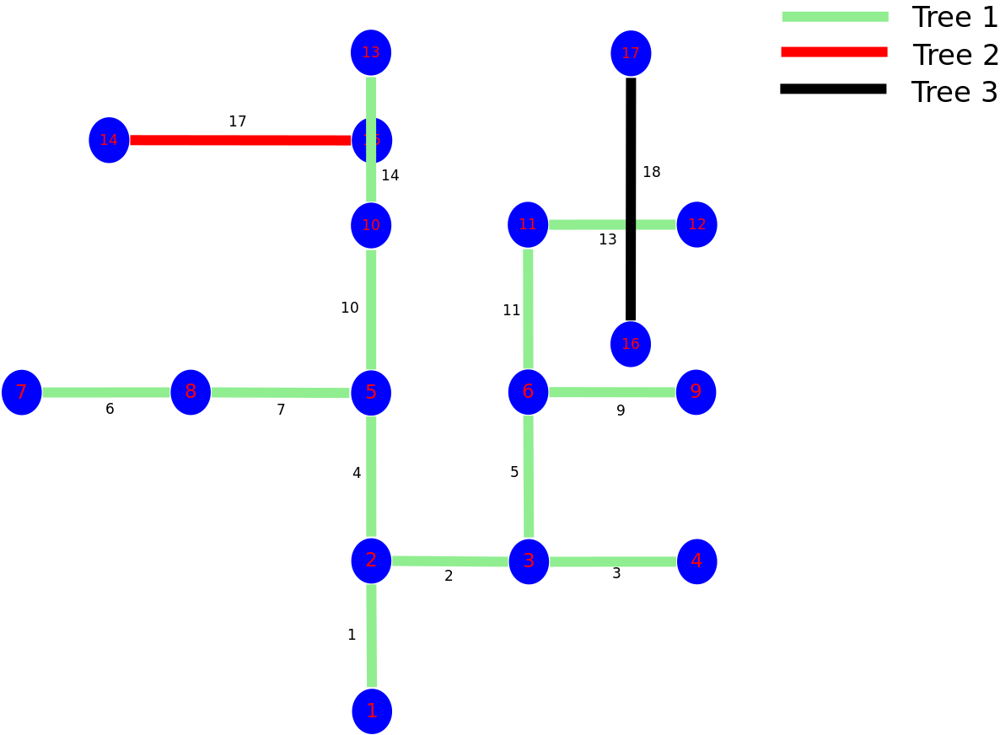

..
   ****************************************************************************
    pgRouting Manual
    Copyright(c) pgRouting Contributors

    This documentation is licensed under a Creative Commons Attribution-Share
    Alike 3.0 License: http://creativecommons.org/licenses/by-sa/3.0/
   ****************************************************************************

.. _pgr_prim:

pgr_prim
===============================================================================

``pgr_prim`` — Returns the minimum spanning forest of graph using Prim algorithm.
In particular, the Prim algorithm implemented by Boost.Graph.

.. figure:: images/boost-inside.jpeg
   :target: https://www.boost.org/doc/libs/1_64_0/libs/graph/doc/prim_minimum_spanning_tree.html

   Boost Graph Inside

Synopsis
-------------------------------------------------------------------------------

The prim algorithm was developed in 1930 by Czech mathematician Vojtěch Jarník.
It is a greedy algorithm that finds a minimum spanning tree for a weighted 
undirected graph. This means it finds a subset of the edges that forms a tree 
that includes every vertex, where the total weight of all the edges in the tree 
is minimized. The algorithm operates by building this tree one vertex at a time, 
from an arbitrary starting vertex, at each step adding the cheapest possible 
connection from the tree to another vertex.

This algorithms find the minimum spanning forest in a possibly disconnected 
graph; in contrast, the most basic form of Prim's algorithm only finds minimum 
spanning trees in connected graphs. However, running Prim's algorithm separately 
for each connected component of the graph, then it is called minimum spanning 
forest.

Characteristics
-------------------------------------------------------------------------------

The main Characteristics are:

  - Process is done only on edges with positive costs.
  - It's implementation is on only undirected graph.
  - It individually deal with all connected graph in disconnected graph.
  - One node will be root vertex from where the span start for each tree.
  - Any node can be root vertex the result will be same.
  - Values are returned when there is a minimum spanning tree.

    - When there is no edge in graph then `agg_cost` is `0`.
  
  - Running time: :math:`O(|No. of unconnected graph| * (E*log V))`

Signatures
-------------------------------------------------------------------------------

.. index::
    single: prim

.. code-block:: none

    pgr_prim(edges_sql)

    RETURNS SET OF (seq, prim_tree, start_node, end_node, edge, cost, agg_cost) 
       or EMPTY SET

The signature is for a **undirected** graph.

:Example:

.. literalinclude:: doc-pgr_prim.queries
   :start-after: -- q1
   :end-before: -- q2

:Example: Additional exapmle

.. literalinclude:: doc-pgr_prim.queries
   :start-after: -- q2
   :end-before: -- q3

Description of the edges_sql query for prim functions
...............................................................................

:edges_sql: an SQL query, which should return a set of rows with the following columns:

================= =================== ======== =================================================
Column            Type                 Default  Description
================= =================== ======== =================================================
**id**            ``ANY-INTEGER``                Identifier of the edge.
**source**        ``ANY-INTEGER``                Identifier of the first end point vertex of the edge.
**target**        ``ANY-INTEGER``                Identifier of the second end point vertex of the edge.
**cost**          ``ANY-NUMERICAL``              Weight of the edge  `(source, target)`

                                                 - When negative: edge `(source, target)` does not exist, therefore it's not part of the graph.

**reverse_cost**  ``ANY-NUMERICAL``       -1     Weight of the edge `(target, source)`,

                                                 - When negative: edge `(target, source)` does not exist, therefore it's not part of the graph.

================= =================== ======== =================================================

Where:

:ANY-INTEGER: SMALLINT, INTEGER, BIGINT
:ANY-NUMERICAL: SMALLINT, INTEGER, BIGINT, REAL, FLOAT

Description of the parameters of the signatures
...............................................................................

=================== ====================== ========= =========================================
Parameter           Type                   Default   Description
=================== ====================== ========= =========================================
**edges_sql**       ``TEXT``                         SQL query as described above.
=================== ====================== ========= =========================================

Description of the return values for prim algorithms
.............................................................................................................................

Returns set of ``(seq, prim_tree, start_node, end_node, edge, cost, agg_cost)``

============== =========== =================================================
Column         Type        Description
============== =========== =================================================
**seq**        ``INT``     Sequential value starting from **1**.
**prim_tree**  ``BIGINT``  It represent the number of minimun spanning tree in unconnected graph.
**start_node** ``BIGINT``  Identifier of the starting vertex of edge.
**end_node**   ``BIGINT``  Identifier of the ending vertex of edge and predecessor of start_node. -1 for the root vertex.
**edge**       ``BIGINT``  Identifier of the edge used to go from start_node to end_node or vice-versa. -1 when start_node is root vertex.
**cost**       ``FLOAT``   Cost to traverse from start_node using edge to the end_node.
**agg_cost**   ``FLOAT``   Aggregate cost of edges that is covered in sapnning.

============== =========== =================================================

Important
------------------------------------------------------------------------------
Order of start_node depend upon ascending identifier of edges **for each tree**.
OR we can say ascending of vertex_id.
 
:Example:
Edges

Example of additional example for tree 1.   
 
.. code-block:: none
   
   edge_id | source | target  
   --------+--------+-------
         1 |      6 |     11 
         2 |     10 |     11 
         3 |     11 |     12 
         4 |     10 |     13 
         5 |      9 |     12 
         6 |      4 |      9
 
Then the order will be
 
.. code-block:: none
   
   edge_id | order of start_node  
   --------+-------------------
         1 |      6, 11 
         2 |         10 
         3 |         12
         4 |         13
         5 |          9
         6 |          4  

So, the order of start_node is 6, 11, 12, 13, 9, 4.

Where:
6 will be root vertex.
 
See Also
-------------------------------------------------------------------------------

* https://en.wikipedia.org/wiki/Prim%27s_algorithm
* The queries use the :ref:`sampledata` network.

.. rubric:: Indices and tables

* :ref:`genindex`
* :ref:`search`

