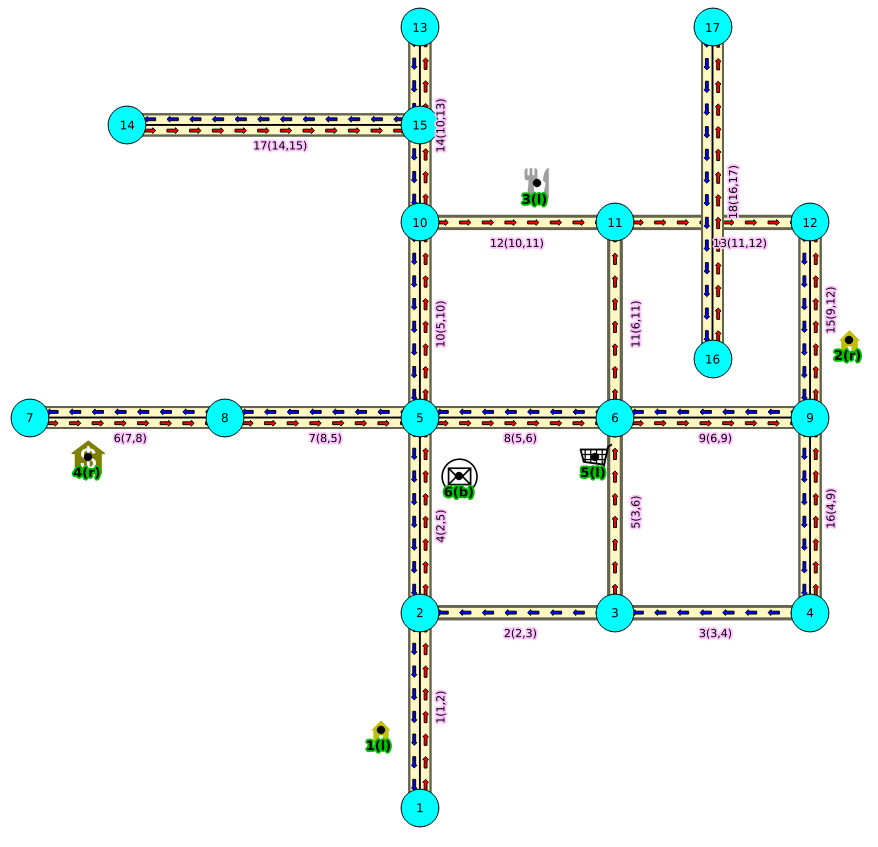

..
   ****************************************************************************
    pgRouting Manual
    Copyright(c) pgRouting Contributors

    This documentation is licensed under a Creative Commons Attribution-Share
    Alike 3.0 License: http://creativecommons.org/licenses/by-sa/3.0/
   ****************************************************************************

.. _sampledata:

Sample Data
===============================================================================

The documentation provides very simple example queries based on a small sample network.
To be able to execute the sample queries, run the following SQL commands to create a table with a small network data set.

.. rubric:: Create table

.. literalinclude:: ../sampledata/sampledata.sql
   :start-after: --EDGE TABLE CREATE
   :end-before: --EDGE TABLE ADD DATA

.. rubric:: Insert data

.. literalinclude:: ../sampledata/sampledata.sql
   :start-after: --EDGE TABLE ADD DATA
   :end-before: --EDGE TABLE TOPOLOGY

Before you test a routing function use this query to fill the source and target columns.

.. literalinclude:: ../sampledata/sampledata.sql
   :start-after: --EDGE TABLE TOPOLOGY
   :end-before: --POINTS CREATE

.. rubric:: Points of interest

When points outside of the graph

.. literalinclude:: ../sampledata/sampledata.sql
   :start-after: --POINTS CREATE
   :end-before: --RESTRICTIONS CREATE

.. rubric:: Restrictions

.. literalinclude:: ../sampledata/sampledata.sql
   :start-after: --RESTRICTIONS CREATE
   :end-before: --RESTRICTIONS END

Images
------

* Red arrows correspond when ``cost`` > 0 in the edge table.
* Blue arrows correspond when ``reverse_cost`` > 0 in the edge table.
* Points are outside the graph.
* Click on the graph to enlarge.

.. note:: On all graphs, 

.. rubric:: Network for queries marked as ``directed`` and ``cost`` and ``reverse_cost`` columns are used:

When working with city networks, this is recommended for point of view of vehicles.

.. _fig1:

   **Graph 1: Directed, with cost and reverse cost**

.. rubric:: Network for queries marked as ``undirected`` and ``cost`` and ``reverse_cost`` columns are used:

When working with city networks, this is recommended for point of view of pedestrians.

.. _fig2:

.. figure:: images/Fig6-undirected.png
   :scale: 50%

   **Graph 2: Undirected, with cost and reverse cost**

.. rubric:: Network for queries marked as ``directed`` and only ``cost`` column is used:

.. _fig3:

.. figure:: images/Fig2-cost.png
   :scale: 20%

   **Graph 3: Directed, with cost**

.. rubric:: Network for queries marked as ``undirected`` and only ``cost`` column is used:

.. _fig4:

.. figure:: images/Fig4-costUndirected.png
   :scale: 20%
   
   **Graph 4: Undirected, with cost**

