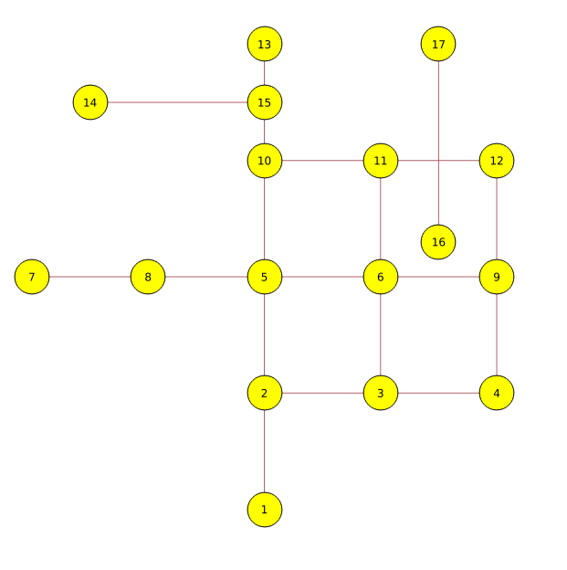

.. 
   ****************************************************************************
    pgRouting Manual
    Copyright(c) pgRouting Contributors

    This documentation is licensed under a Creative Commons Attribution-Share  
    Alike 3.0 License: http://creativecommons.org/licenses/by-sa/3.0/
   ****************************************************************************

.. _sampledata:

Sample Data
===============================================================================

The documentation provides very simple example queries based on a small sample network.
To be able to execute the sample queries, run the following SQL commands to create a table with a small network data set.

.. rubric:: Create table

.. code-block:: sql

	CREATE TABLE edge_table (
	    id serial,
	    dir character varying,
	    source integer,
	    target integer,
	    cost double precision,
	    reverse_cost double precision,
	    x1 double precision,
	    y1 double precision,
	    x2 double precision,
	    y2 double precision,
	    the_geom geometry
	);

.. rubric:: Insert network data

.. code-block:: sql

        INSERT INTO edge_table (cost,reverse_cost,x1,y1,x2,y2) VALUES ( 1, 1,  2,0,   2,1);
        INSERT INTO edge_table (cost,reverse_cost,x1,y1,x2,y2) VALUES (-1, 1,  2,1,   3,1);
        INSERT INTO edge_table (cost,reverse_cost,x1,y1,x2,y2) VALUES (-1, 1,  3,1,   4,1);
        INSERT INTO edge_table (cost,reverse_cost,x1,y1,x2,y2) VALUES ( 1, 1,  2,1,   2,2);
        INSERT INTO edge_table (cost,reverse_cost,x1,y1,x2,y2) VALUES ( 1,-1,  3,1,   3,2);
        INSERT INTO edge_table (cost,reverse_cost,x1,y1,x2,y2) VALUES ( 1, 1,  0,2,   1,2);
        INSERT INTO edge_table (cost,reverse_cost,x1,y1,x2,y2) VALUES ( 1, 1,  1,2,   2,2);
        INSERT INTO edge_table (cost,reverse_cost,x1,y1,x2,y2) VALUES ( 1, 1,  2,2,   3,2);
        INSERT INTO edge_table (cost,reverse_cost,x1,y1,x2,y2) VALUES ( 1, 1,  3,2,   4,2);
        INSERT INTO edge_table (cost,reverse_cost,x1,y1,x2,y2) VALUES ( 1, 1,  2,2,   2,3);
        INSERT INTO edge_table (cost,reverse_cost,x1,y1,x2,y2) VALUES ( 1,-1,  3,2,   3,3);
        INSERT INTO edge_table (cost,reverse_cost,x1,y1,x2,y2) VALUES ( 1,-1,  2,3,   3,3);
        INSERT INTO edge_table (cost,reverse_cost,x1,y1,x2,y2) VALUES ( 1,-1,  3,3,   4,3);
        INSERT INTO edge_table (cost,reverse_cost,x1,y1,x2,y2) VALUES ( 1, 1,  2,3,   2,4);
        INSERT INTO edge_table (cost,reverse_cost,x1,y1,x2,y2) VALUES ( 1, 1,  4,2,   4,3);
        INSERT INTO edge_table (cost,reverse_cost,x1,y1,x2,y2) VALUES ( 1, 1,  4,1,   4,2);
        INSERT INTO edge_table (cost,reverse_cost,x1,y1,x2,y2) VALUES ( 1, 1,  0.5,3.5,  1.999999999999,3.5);
        INSERT INTO edge_table (cost,reverse_cost,x1,y1,x2,y2) VALUES ( 1, 1,  3.5,2.3,  3.5,4);

        UPDATE edge_table SET the_geom = st_makeline(st_point(x1,y1),st_point(x2,y2)),
                              dir = CASE WHEN (cost>0 and reverse_cost>0) THEN 'B'   -- both ways
                                         WHEN (cost>0 and reverse_cost<0) THEN 'FT'  -- direction of the LINESSTRING
                                         WHEN (cost<0 and reverse_cost>0) THEN 'TF'  -- reverse direction of the LINESTRING
                                         ELSE '' END;                                -- unknown  

Before you test a routing function use this query to fill the source and target columns.

.. code-block:: sql

    SELECT pgr_createTopology('edge_table',0.001);

This table is used in some of our examples

.. code-block:: sql

	CREATE TABLE vertex_table (
	    id serial,
	    x double precision,
	    y double precision
	);

.. code-block:: sql

	INSERT INTO vertex_table VALUES 
		(1,2,0), (2,2,1), (3,3,1), (4,4,1), (5,0,2), (6,1,2), (7,2,2),
		(8,3,2), (9,4,2), (10,2,3), (11,3,3), (12,4,3), (13,2,4);

.. rubric:: Network for queries marked as ``directed`` and ``cost`` and ``reverse_cost`` columns are used:

.. _fig1-direct-Cost-Reverse:

.. figure:: ../../../src/common/doc/functions/images/Fig1-originalData.png

    Network for queries marked as ``directed`` and ``cost`` and ``reverse_cost`` columns are used

.. rubric:: Network for queries marked as ``undirected`` and ``cost`` and ``reverse_cost`` columns are used:

.. _fig2-undirect-Cost-Reverse:

   Network for queries marked as ``undirected`` and ``cost`` and ``reverse_cost`` columns are used

.. rubric:: Network for queries marked as ``directed`` and only ``cost`` column is used:

.. _fig3-direct-Cost:

.. figure:: ../../../src/common/doc/functions/images/Fig2-cost.png

   Network for queries marked as ``directed`` and only ``cost`` column is used

.. rubric:: Network for queries marked as ``undirected`` and only ``cost`` column is used:

.. _fig4-undirect-Cost:

.. figure:: ../../../src/common/doc/functions/images/Fig4-costUndirected.png

   Network for queries marked as ``undirected`` and only ``cost`` column is used

