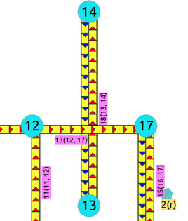
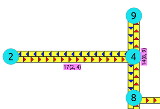

..
   ****************************************************************************
    pgRouting Manual
    Copyright(c) pgRouting Contributors

    This documentation is licensed under a Creative Commons Attribution-Share
    Alike 3.0 License: https://creativecommons.org/licenses/by-sa/3.0/
   ****************************************************************************

|

pgRouting Concepts
===============================================================================

This is a simple guide that go through some of the steps for getting started
with pgRouting. This guide covers:

.. contents::
    :local:
    :depth: 2

Graphs
-------------------------------------------------------------------------------

.. contents::
    :local:

Graph definition
...............................................................................

A graph is an ordered pair :math:`G = (V ,E)` where:

* :math:`V` is a set of vertices, also called nodes.
* :math:`E \subseteq \{( u, v ) \mid u , v \in V \}`

There are different kinds of graphs:

* Undirected graph

  * :math:`E \subseteq \{( u, v ) \mid u , v \in V\}`

* Undirected simple graph

  * :math:`E \subseteq \{( u, v ) \mid u , v \in V, u \neq v\}`

* Directed graph

  * :math:`E \subseteq \{( u, v ) \mid (u , v) \in (V X V) \}`

* Directed simple graph

  * :math:`E \subseteq \{( u, v ) \mid (u , v) \in (V X V), u \neq v\}`

Graphs:

* Do not have geometries.
* Some graph theory problems require graphs to have weights, called **cost** in
  pgRouting.

In pgRouting there are several ways to represent a graph on the database:

* With ``cost``

  * (``id``, ``source``, ``target``, ``cost``)

* With ``cost`` and ``reverse_cost``

  * (``id``, ``source``, ``target``, ``cost``, ``reverse_cost``)

Where:

.. list-table::
   :width: 81
   :widths: auto
   :header-rows: 1

   * - Column
     - Description
   * - ``id``
     - Identifier of the edge. Requirement to use the database in a consistent.
       manner.
   * - ``source``
     - Identifier of a vertex.
   * - ``target``
     - Identifier of a vertex.
   * - ``cost``
     - Weight of the edge (``source``, ``target``):

       * When negative the edge (``source``, ``target``) do not exist on the
         graph.
       * ``cost`` must exist in the query.
   * - ``reverse_cost``
     - Weight of the edge (``target``, ``source``)

       * When negative the edge (``target``, ``source``) do not exist on the
         graph.

The decision of the graph to be **directed** or **undirected** is done when
executing a pgRouting algorithm.

Graph with ``cost``
...............................................................................

The weighted directed graph, :math:`G_d(V,E)`:

* Graph data is obtained with a query

  ``SELECT id, source, target, cost FROM edges``

* the set of edges :math:`E`

  * :math:`E = \{(source_{id}, target_{id}, cost_{id}) \text{ when } cost_{id}
    \ge 0 \}`
  * Edges where ``cost`` is non negative are part of the graph.

* the set of vertices :math:`V`

  * :math:`V = \{source_{id} \cup target_{id}\}`
  * All vertices in ``source`` and ``target`` are part of the graph.

.. rubric:: Directed graph

In a directed graph the edge :math:`(source_{id}, target_{id}, cost_{id})` has
directionality: :math:`source_{id} \rightarrow target_{id}`

For the following data:

.. literalinclude:: concepts.queries
   :start-after: -- g1
   :end-before: -- g2

Edge :math:`2` (:math:`1 \rightarrow 3`) is not part of the graph.

The data is representing the following graph:

.. graphviz::

   digraph G {
    1 -> 2 [label="1(5)"];
    3;
   }

.. rubric:: Undirected graph

In an undirected graph the edge :math:`(source_{id}, target_{id}, cost_{id})`
does not have directionality: :math:`source_{id} \frac{\;\;\;\;\;}{}
target_{id}`

* In terms of a directed graph is like having two edges: :math:`source_{id}
  \leftrightarrow target_{id}`

For the following data:

.. literalinclude:: concepts.queries
   :start-after: -- g1
   :end-before: -- g2

Edge :math:`2` (:math:`1 \frac{\;\;\;\;\;}{} 3`) is not part of the graph.

The data is representing the following graph:

.. graphviz::

   graph G {
    1 -- 2 [label="1(5)"];
    3;
   }

Graph with ``cost`` and ``reverse_cost``
...............................................................................

The weighted directed graph, :math:`G_d(V,E)`, is defined by:

* Graph data is obtained with a query

  ``SELECT id, source, target, cost, reverse_cost FROM edges``

* The set of edges :math:`E`:

  * :math:`E = \begin{split} \begin{align}
    & {\{(source_{id}, target_{id}, cost_{id}) \text{ when } cost_{id} >=0 \}} \\
    & \cup \\
    & {\{(target_{id}, source_{id}, reverse\_cost_{id}) \text{ when } reverse\_cost_{id} >=0 \}}
    \end{align} \end{split}`
  * Edges :math:`(source \rightarrow target)` where ``cost`` is non negative are
    part of the graph.
  * Edges :math:`(target \rightarrow source)` where ``reverse_cost`` is non
    negative are part of the graph.

* The set of vertices :math:`V`:

  * :math:`V = \{source_{id} \cup target_{id}\}`
  * All vertices in ``source`` and ``target`` are part of the graph.

.. rubric:: Directed graph

In a directed graph both edges have directionality

* edge :math:`(source_{id}, target_{id}, cost_{id})` has directionality: :math:`source_{id}
  \rightarrow target_{id}`
* edge :math:`(target_{id}, source_{id}, reverse\_cost_{id})` has directionality:
  :math:`target_{id} \rightarrow source_{id}`

For the following data:

.. literalinclude:: concepts.queries
   :start-after: -- g2
   :end-before: -- g3

Edges not part of the graph:

* :math:`2` (:math:`1 \rightarrow 3`)
* :math:`3` (:math:`3 \rightarrow 2`)

The data is representing the following graph:

.. graphviz::

   digraph G {
    1 -> 2 [label="1(5)"];
    2 -> 1 [label="1(2)"];
    3 -> 1 [label="2(4)"];
    2 -> 3 [label="3(7)"];
   }

.. rubric:: Undirected graph

In a directed graph both edges do not have directionality

* Edge :math:`(source_{id}, target_{id}, cost_{id})` is :math:`source_{id}
  \frac{\;\;\;\;\;}{} target_{id}`
* Edge :math:`(target_{id}, source_{id}, reverse\_cost_{id})` is
  :math:`target_{id} \frac{\;\;\;\;\;}{} source_{id}`
* In terms of a directed graph is like having four edges:

  * :math:`source_i \leftrightarrow target_i`
  * :math:`target_i \leftrightarrow source_i`

For the following data:

.. literalinclude:: concepts.queries
   :start-after: -- g2
   :end-before: -- g3

Edges not part of the graph:

* :math:`2` (:math:`1 \frac{\;\;\;\;\;}{} 3`)
* :math:`3` (:math:`3 \frac{\;\;\;\;\;}{} 2`)

The data is representing the following graph:

.. graphviz::

   graph G {
    1 -- 2 [label="1(5)"];
    2 -- 1 [label="1(2)"];
    3 -- 1 [label="2(4)"];
    2 -- 3 [label="3(7)"];
   }

Graphs without geometries
-------------------------------------------------------------------------------

Personal relationships, genealogy, file dependency problems can be solved
using pgRouting. Those problems, normally, do not come with geometries associated
with the graph.

.. contents::
    :local:

Wiki example
...............................................................................

Solve the example problem taken from `wikipedia
<https://en.wikipedia.org/wiki/Dijkstra%27s_algorithm>`__):

.. figure:: images/Dijkstra_Animation.gif

Where:

* Problem is to find the shortest path from :math:`1` to :math:`5`.
* Is an undirected graph.
* Although visually looks like to have geometries, the drawing is not to scale.

  * No geometries associated to the vertices or edges

* Has 6 vertices :math:`\{1,2,3,4,5,6\}`
* Has 9 edges:

  :math:`\begin{split} \begin{align}
  E = & \{(1,2,7), (1,3,9), (1,6,14), \\
  & (2,3,10), (2,4,13), \\
  & (3,4,11), (3,6,2), \\
  & (4,5,6), \\
  & (5,6,9) \}
  \end{align} \end{split}`

* The graph can be represented in many ways for example:

.. graphviz::

   graph G {
    rankdir="LR";
    1 [color="red"];
    5 [color="green"];
    1 -- 2 [label="(7)"];
    5 -- 6 [label="(9)"];
    1 -- 3 [label="(9)"];
    1 -- 6 [label="(14)"];
    2 -- 3 [label="(10)"];
    2 -- 4 [label="(13)"];
    3 -- 4 [label="(11)"];
    3 -- 6 [label="(2)"];
    4 -- 5 [label="(6)"];
   }

Prepare the database
+++++++++++++++++++++++++++++++++++++++++++++++++++++++++++++++++++++++++++++++

Create a database for the example, access the database and install pgRouting: ::

   $ createdb wiki
   $ psql wiki
   wiki =# CREATE EXTENSION pgRouting CASCADE;

Create a table
+++++++++++++++++++++++++++++++++++++++++++++++++++++++++++++++++++++++++++++++

The basic elements needed to perform basic routing on an undirected graph are:

.. list-table::
   :width: 81
   :widths: auto
   :header-rows: 1

   * - Column
     - Type
     - Description
   * - ``id``
     - **ANY-INTEGER**
     - Identifier of the edge.
   * - ``source``
     - **ANY-INTEGER**
     - Identifier of the first end point vertex of the edge.
   * - ``target``
     - **ANY-INTEGER**
     - Identifier of the second end point vertex of the edge.
   * - ``cost``
     - **ANY-NUMERICAL**
     - Weight of the edge (``source``, ``target``)

Where:

:ANY-INTEGER: SMALLINT, INTEGER, BIGINT
:ANY-NUMERICAL: SMALLINT, INTEGER, BIGINT, REAL, FLOAT

.. no_geometry_start

Using this table design for this example:

.. literalinclude:: concepts.queries
   :start-after: -- q1
   :end-before: -- q2

Insert the data
+++++++++++++++++++++++++++++++++++++++++++++++++++++++++++++++++++++++++++++++

.. literalinclude:: concepts.queries
   :start-after: -- q2
   :end-before: -- q3

Find the shortest path
+++++++++++++++++++++++++++++++++++++++++++++++++++++++++++++++++++++++++++++++

To solve this example :doc:`pgr_dijkstra` is used:

.. literalinclude:: concepts.queries
   :start-after: -- q3
   :end-before: -- q4

To go from :math:`1` to :math:`5` the path goes thru the following vertices:
:math:`1 \rightarrow 3 \rightarrow 6 \rightarrow 5`

.. graphviz::

   graph G {
    rankdir="LR";
    1 [color="red"];
    5 [color="green"];
    1 -- 2 [label="(7)"];
    5 -- 6 [label="(9)", color="blue"];
    1 -- 3 [label="(9)", color="blue"];
    1 -- 6 [label="(14)"];
    2 -- 3 [label="(10)"];
    2 -- 4 [label="(13)"];
    3 -- 4 [label="(11)"];
    3 -- 6 [label="(2)", color="blue"];
    4 -- 5 [label="(6)"];
   }

Vertex information
+++++++++++++++++++++++++++++++++++++++++++++++++++++++++++++++++++++++++++++++

To obtain the vertices information, use :doc:`pgr_extractVertices`

.. literalinclude:: concepts.queries
   :start-after: -- q4
   :end-before: -- q5

.. no_geometry_end

Graphs with geometries
-------------------------------------------------------------------------------

.. contents::
    :local:

Create a routing Database
...............................................................................

The first step is to create a database and load pgRouting in the database.

Typically create a database for each project.

Once having the database to work in, load your data and build the routing
application in that database.

.. parsed-literal::

	createdb sampledata
	psql sampledata -c "CREATE EXTENSION pgrouting CASCADE"

Load Data
...............................................................................

There are several ways to load your data into pgRouting.

* Manually creating a database.

  * `Graphs without geometries`_
  * :doc:`sampledata`: a small graph used in the documentation examples

* Using `osm2pgrouting
  <https://workshop.pgrouting.org/latest/en/basic/data.html>`__

There are various open source tools that can help, like:

:shp2pgsql: - postgresql shapefile loader
:ogr2ogr: - vector data conversion utility
:osm2pgsql: - load OSM data into postgresql

Please note that these tools will **not** import the data in a structure
compatible with pgRouting and when this happens the topology needs to be
adjusted.

* Breakup a segments on each segment-segment intersection
* When missing, add columns and assign values to ``source``, ``target``,
  ``cost``, ``reverse_cost``.
* Connect a disconnected graph.
* Create the complete graph topology
* Create one or more graphs based on the application to be developed.

  * Create a contracted graph for the high speed roads
  * Create graphs per state/country

In few words:

   Prepare the graph

What and how to prepare the graph, will depend on the application and/or on the
quality of the data and/or on how close the information is to have a topology
usable by pgRouting and/or some other factors not mentioned.

The steps to prepare the graph involve geometry operations using `PostGIS
<https://postgis.net/>`__ and some others involve graph operations like
:doc:`pgr_contraction` to contract a graph.

The `workshop <https://workshop.pgrouting.org/latest>`__ has a step by step on
how to prepare a graph using Open Street Map data, for a small application.

The use of indexes on the database design in general:

* Have the geometries indexed.
* Have the identifiers columns indexed.

Please consult the `PostgreSQL <https://www.postgresql.org/docs/>`__
documentation and the `PostGIS <https://postgis.net/>`__ documentation.

.. createTopology_start

Build a routing topology
...............................................................................

The basic information to use the majority of the pgRouting functions ``id,
source, target, cost, [reverse_cost]`` is what in pgRouting is called the
routing topology.

``reverse_cost`` is optional but strongly recommended to have in order to reduce
the size of the database due to the size of the geometry columns.
Having said that, in this documentation ``reverse_cost`` is used in this
documentation.

When the data comes with geometries and there is no routing topology, then this
step is needed.

All the start and end vertices of the geometries need an identifier that is to
be stored in a ``source`` and ``target`` columns of the table of the data.
Likewise, ``cost`` and ``reverse_cost`` need to have the value of traversing the
edge in both directions.

If the columns do not exist they need to be added to the table in question. (see
`ALTER TABLE <https://www.postgresql.org/docs/current/sql-altertable.html>`__)

The function :doc:`pgr_extractVertices` is used to create a vertices table
based on the edge identifier and the geometry of the edge of the graph.

.. literalinclude:: concepts.queries
   :start-after: -- createTopology1
   :end-before: -- createTopology2

Finally using the data stored on the vertices tables the ``source`` and
``target`` are filled up.

.. literalinclude:: concepts.queries
   :start-after: -- createTopology2
   :end-before: -- createTopology3

.. createTopology_end

Data coming from OSM and using `osm2pgrouting
<https://github.com/pgRouting/osm2pgrouting>`__ as an import tool, comes with
the routing topology. See an example of using ``osm2pgrouting`` on the `workshop
<https://workshop.pgrouting.org/latest/en/basic/data.html>`__.

Adjust costs
...............................................................................

For this example the ``cost`` and ``reverse_cost`` values are going to be the
double of the length of the geometry.

Update costs to length of geometry
+++++++++++++++++++++++++++++++++++++++++++++++++++++++++++++++++++++++++++++++

Suppose that ``cost`` and ``reverse_cost`` columns in the sample data represent:

* :math:`1` when the edge exists in the graph
* :math:`-1` when the edge does not exist in the graph

Using that information updating to the length of the geometries:

.. literalinclude:: concepts.queries
   :start-after: -- topo1
   :end-before: -- topo2

Which gives the following results:

.. literalinclude:: concepts.queries
   :start-after: -- topo2
   :end-before: -- topo3

Note that to be able to follow the documentation examples, everything is based
on the original graph.

Returning to the original data:

.. literalinclude:: concepts.queries
   :start-after: -- topo3
   :end-before: -- topo4

Update costs based on codes
+++++++++++++++++++++++++++++++++++++++++++++++++++++++++++++++++++++++++++++++

Other datasets, can have a column with values like

* ``FT`` vehicle flow on the direction of the geometry
* ``TF`` vehicle flow opposite of the direction of the geometry
* ``B`` vehicle flow on both directions

Preparing a code column for the example:

.. literalinclude:: concepts.queries
   :start-after: -- topo4
   :end-before: -- topo5

Adjusting the costs based on the codes:

.. literalinclude:: concepts.queries
   :start-after: -- topo5
   :end-before: -- topo6

Which gives the following results:

.. literalinclude:: concepts.queries
   :start-after: -- topo6
   :end-before: -- topo7

Returning to the original data:

.. literalinclude:: concepts.queries
   :start-after: -- topo7
   :end-before: -- topo8

Check the Routing Topology
-------------------------------------------------------------------------------

.. contents::
    :local:

There are lots of possible problems in a graph.

* The data used may not have been designed with routing in mind.
* A graph has some very specific requirements.
* The graph is disconnected.
* There are unwanted intersections.
* The graph is too large and needs to be contracted.
* A sub graph is needed for the application.
* and many other problems that the pgRouting user, that is the application
  developer might encounter.

Crossing edges
...............................................................................

To get the crossing edges:

.. literalinclude:: concepts.queries
   :start-after: -- cross1
   :end-before: -- cross2

That information is correct, for example, when in terms of vehicles, is it a
tunnel or bridge crossing over another road.

It might be incorrect, for example:

1. When it is actually an intersection of roads, where vehicles can make turns.
2. When in terms of electrical lines, the electrical line is able to switch
   roads even on a tunnel or bridge.

When it is incorrect, it needs fixing:

1. For vehicles and pedestrians

   * If the data comes from OSM and was imported to the database using
     ``osm2pgrouting``, the fix needs to be done in the `OSM portal
     <https://www.openstreetmap.org>`__ and the data imported again.
   * In general when the data comes from a supplier that has the data prepared
     for routing vehicles, and there is a problem, the data is to be fixed from
     the supplier

2. For very specific applications

   * The data is correct when from the point of view of routing vehicles or
     pedestrians.
   * The data needs a local fix for the specific application.

Once analyzed one by one the crossings, for the ones that need a local fix,
the edges need to be `split <https://postgis.net/docs/ST_Split.html>`__.

The new edges need to be added to the edges table, the rest of the attributes
need to be updated in the new edges, the old edges need to be
removed and the routing topology needs to be updated.

.. include:: pgr_separateCrossing.rst
   :start-after: fix_intersection_start
   :end-before: fix_intersection_end

Touching edges
...............................................................................

Visually the edges seem to be connected, but internally they are not.

.. literalinclude:: concepts.queries
   :start-after: -- touch1
   :end-before: -- touch2

The validity of the information is application dependent.

- Maybe there is a small barrier for vehicles but not for pedestrians.

Once analyzed one by one the touchings, for the ones that need a local fix,
the edges need to be `split <https://postgis.net/docs/ST_Split.html>`__.

The new edges need to be added to the edges table, the rest of the attributes
need to be updated in the new edges, the old edges need to be
removed and the routing topology needs to be updated.

.. include:: pgr_separateTouching.rst
   :start-after: fix_gap-start
   :end-before: fix_gap-end

Connecting components
...............................................................................

.. connecting_graph_start

To get the graph connectivity:

.. literalinclude:: concepts.queries
   :start-after: -- connect2
   :end-before: -- connect3

There are three basic ways to connect components:

* From the vertex to the starting point of the edge
* From the vertex to the ending point of the edge
* From the vertex to the closest vertex on the edge

  * This solution requires the edge to be split.

In this example :doc:`pgr_separateCrossing` and :doc:`pgr_separateTouching` will
be used.

.. rubric:: Get the connectivity

.. literalinclude:: concepts.queries
   :start-after: -- connect2
   :end-before: -- connect3

.. rubric:: Prepare tables

In this example: the edges table will need an additional column and the vertex
table will be rebuilt completely.

.. literalinclude:: concepts.queries
   :start-after: -- connect3
   :end-before: -- connect4

.. rubric:: Insert new edges

Using :doc:`pgr_separateCrossing` and :doc:`pgr_separateTouching` insert the
results into the edges table.

.. literalinclude:: concepts.queries
   :start-after: -- connect4
   :end-before: -- connect5

.. rubric:: Create the vertices table

Using :doc:`pgr_extractVertices` create the table.

.. literalinclude:: concepts.queries
   :start-after: -- connect5
   :end-before: -- connect6

.. rubric:: Update the topology

.. literalinclude:: concepts.queries
   :start-after: -- connect6
   :end-before: -- connect7

.. rubric:: Update other values

In this example only ``cost`` and ``reverse_cost`` are updated, where they are
based on the length of the geometry and the directionality is kept using the
``sign`` function.

.. literalinclude:: concepts.queries
   :start-after: -- connect7
   :end-before: -- connect8

.. literalinclude:: concepts.queries
   :start-after: -- connect8
   :end-before: -- connect9

.. connecting_graph_end

Contraction of a graph
...............................................................................

The graph can be reduced in size using :doc:`contraction-family`

When to contract will depend on the size of the graph, processing times,
correctness of the data, on the final application, or any other factor not
mentioned.

A fairly good method of finding out if contraction can be useful is because of
the number of dead ends and/or the number of linear edges.

A complete method on how to contract and how to use the contracted graph is
described on :doc:`contraction-family`

Dead ends
+++++++++++++++++++++++++++++++++++++++++++++++++++++++++++++++++++++++++++++++

.. degree_from_table_start

To get the dead ends:

.. literalinclude:: concepts.queries
   :start-after: -- contract1
   :end-before: -- contract2

A dead end happens when

- The vertex is the limit of a cul-de-sac, a no-through road or a no-exit
  road.
- The vertex is on the limit of the imported graph.

  - If a larger graph is imported then the vertex might not be a dead end

Node :math:`4`, is a dead end on the query, even that it visually looks like an
end point of 3 edges.

.. image:: images/Fig1-originalData.png
   :scale: 20%

.. rubric:: Is node :math:`4` a dead end or not?

.. graphviz::

   graph G {
     1,2,4,5,9,13,14 [shape=circle;style=filled;color=lightgreen;fontsize=8;width=0.3;fixedsize=true];
     3,6,7,8,10,11,12,15,16,17 [shape=circle;style=filled;color=cyan;fontsize=8;width=0.3;fixedsize=true];

     5 -- 6 [label="1",fontsize=8];     6 -- 10 [label="2",fontsize=8];
     10 -- 15 [label="3",fontsize=8];   6 -- 7 [label="4",fontsize=8];
     10 -- 11 [label="5",fontsize=8];   1 -- 3 [label="6",fontsize=8];
     3 -- 7 [label="7",fontsize=8];     7 -- 11 [label="8",fontsize=8];
     11 -- 16 [label="9",fontsize=8];   7 -- 8 [label="10",fontsize=8];
     11 -- 12 [label="11",fontsize=8];  8 -- 12 [label="12",fontsize=8];
     12 -- 17 [label="13",fontsize=8];  8 -- 9 [label="",fontsize=8];
     16 -- 17 [label="15",fontsize=8]; 15 -- 16 [label="16",fontsize=8];
     2 -- 4 [label="17",fontsize=8];   13 -- 14 [label="18",fontsize=8];

     1 [pos="0,2!"];       2 [pos="0.5,3.5!"];
     3 [pos="1,2!"];       4 [pos="2,3.5!"];
     5 [pos="2,0!"];       6 [pos="2,1!"];
     7 [pos="2,2!"];       8 [pos="2,3!"];
     9 [pos="2,4!"];      10 [pos="3,1!"];
     11 [pos="3,2!"];     12 [pos="3,3!"];
     13 [pos="3.5,2.3!"]; 14 [pos="3.5,4!"];
     15 [pos="4,1!"];     16 [pos="4,2!"];
     17 [pos="4,3!"];
   }

The answer to that question will depend on the application.

* Is there such a small curb:

  * That does not allow a vehicle to use that visual intersection?
  * Is the application for pedestrians and therefore the pedestrian can easily
    walk on the small curb?
  * Is the application for the electricity and the electrical lines than can
    easily be extended on top of the small curb?

* Is there a big cliff and from eagles view look like the dead end is close to
  the segment?

Depending on the answer, modification of the data might be needed.

When there are many dead ends, to speed up processing, the :doc:`contraction-family`
functions can be used to contract the graph.

.. degree_from_table_end

Linear edges
+++++++++++++++++++++++++++++++++++++++++++++++++++++++++++++++++++++++++++++++

.. linear_degree_from_table_start

To get the linear edges:

.. literalinclude:: concepts.queries
   :start-after: -- contract2
   :end-before: -- contract3

.. graphviz::

   graph G {
     3,15,17 [shape=circle;style=filled;color=lightgreen;fontsize=8;width=0.3;fixedsize=true];
     1,2,4,5,6,7,8,9,10,11,12,13,14,16 [shape=circle;style=filled;color=cyan;fontsize=8;width=0.3;fixedsize=true];

     5 -- 6 [label="1",fontsize=8];     6 -- 10 [label="2",fontsize=8];
     10 -- 15 [label="3",fontsize=8];   6 -- 7 [label="4",fontsize=8];
     10 -- 11 [label="5",fontsize=8];   1 -- 3 [label="6",fontsize=8];
     3 -- 7 [label="7",fontsize=8];     7 -- 11 [label="8",fontsize=8];
     11 -- 16 [label="9",fontsize=8];   7 -- 8 [label="10",fontsize=8];
     11 -- 12 [label="11",fontsize=8];  8 -- 12 [label="12",fontsize=8];
     12 -- 17 [label="13",fontsize=8];  8 -- 9 [label="",fontsize=8];
     16 -- 17 [label="15",fontsize=8]; 15 -- 16 [label="16",fontsize=8];
     2 -- 4 [label="17",fontsize=8];   13 -- 14 [label="18",fontsize=8];

     1 [pos="0,2!"];       2 [pos="0.5,3.5!"];
     3 [pos="1,2!"];       4 [pos="2,3.5!"];
     5 [pos="2,0!"];       6 [pos="2,1!"];
     7 [pos="2,2!"];       8 [pos="2,3!"];
     9 [pos="2,4!"];      10 [pos="3,1!"];
     11 [pos="3,2!"];     12 [pos="3,3!"];
     13 [pos="3.5,2.3!"]; 14 [pos="3.5,4!"];
     15 [pos="4,1!"];     16 [pos="4,2!"];
     17 [pos="4,3!"];
   }

These linear vertices are correct, for example, when those the vertices are speed
bumps, stop signals and the application is taking them into account.

When there are many linear vertices, that need not to be taken into account, to
speed up the processing, the :doc:`contraction-family` functions can be used to
contract the problem.

.. linear_degree_from_table_end

Function's structure
-------------------------------------------------------------------------------

Once the graph preparation work has been done above, it is time to use a

The general form of a pgRouting function call is:

.. admonition:: \ \
   :class: signatures

   pgr_<name>(`Inner queries`_, **parameters**, [ ``Optional parameters``)

Where:

* `Inner queries`_: Are compulsory parameters that are ``TEXT`` strings
  containing SQL queries.
* **parameters**: Additional compulsory parameters needed by the function.
* ``Optional parameters``: Are non compulsory **named** parameters that have a
  default value when omitted.

The compulsory parameters are positional parameters, the optional parameters are
named parameters.

For example, for this :doc:`pgr_dijkstra` signature:

.. admonition:: \ \
   :class: signatures

   pgr_dijkstra(`Edges SQL`_, **start vids**, **end vids**, [``directed``])

* `Edges SQL`_:

  * Is the first parameter.
  * It is compulsory.
  * It is an inner query.
  * It has no name, so **Edges SQL** gives an idea of what kind of inner query
    needs to be used

* **start vid**:

  * Is the second parameter.
  * It is compulsory.
  * It has no name, so **start vid** gives an idea of what the second
    parameter's value should contain.

* **end vid**

  * Is the third parameter.
  * It is compulsory.
  * It has no name, so **end vid** gives an idea of what the third
    parameter's value should contain

* ``directed``

  * Is the fourth parameter.
  * It is optional.
  * It has a name.

The full description of the parameters are found on the `Parameters`_ section of
each function.

Function's overloads
-------------------------------------------------------------------------------

A function might have different overloads. The most common are called:

* `One to One`_
* `One to Many`_
* `Many to One`_
* `Many to Many`_
* `Combinations`_

Depending on the overload the parameters types change.

* **One**: **ANY-INTEGER**
* **Many**: ``ARRAY`` [**ANY-INTEGER**]

Depending of the function the overloads may vary. But the concept of parameter
type change remains the same.

One to One
...............................................................................

When routing from:

* From **one** starting vertex
* to **one** ending vertex

One to Many
...............................................................................

When routing from:

* From **one** starting vertex
* to **many** ending vertices

Many to One
...............................................................................

When routing from:

* From **many** starting vertices
* to **one** ending vertex

Many to Many
...............................................................................

When routing from:

* From **many** starting vertices
* to **many** ending vertices

Combinations
...............................................................................

When routing from:

* From **many** different starting vertices
* to **many** different ending vertices
* Every tuple specifies a pair of a start vertex and an end vertex
* Users can define the combinations as desired.
* Needs a `Combinations SQL`_

Inner Queries
-------------------------------------------------------------------------------

.. contents::
    :local:

There are several kinds of valid inner queries and also the columns returned are
depending of the function.
Which kind of inner query will depend on the function's requirements.
To simplify the variety of types, **ANY-INTEGER** and **ANY-NUMERICAL** is used.

.. where_definition_starts

Where:

:ANY-INTEGER: SMALLINT, INTEGER, BIGINT
:ANY-NUMERICAL: SMALLINT, INTEGER, BIGINT, REAL, FLOAT

.. where_definition_ends

Edges SQL
...............................................................................

General
+++++++++++++++++++++++++++++++++++++++++++++++++++++++++++++++++++++++++++++++

.. rubric:: Edges SQL for

* :doc:`dijkstra-family`
* :doc:`withPoints-family`
* :doc:`bdDijkstra-family`
* :doc:`components-family`
* :doc:`kruskal-family`
* :doc:`prim-family`
* Some uncategorised functions

.. basic_edges_sql_start

.. list-table::
   :width: 81
   :widths: 14 14 7 44
   :header-rows: 1

   * - Column
     - Type
     - Default
     - Description
   * - ``id``
     - **ANY-INTEGER**
     -
     - Identifier of the edge.
   * - ``source``
     - **ANY-INTEGER**
     -
     - Identifier of the first end point vertex of the edge.
   * - ``target``
     - **ANY-INTEGER**
     -
     - Identifier of the second end point vertex of the edge.
   * - ``cost``
     - **ANY-NUMERICAL**
     -
     - Weight of the edge (``source``, ``target``)
   * - ``reverse_cost``
     - **ANY-NUMERICAL**
     - -1
     - Weight of the edge (``target``, ``source``)

       - When negative: edge (``target``, ``source``) does not exist, therefore
         it's not part of the graph.

Where:

:ANY-INTEGER: ``SMALLINT``, ``INTEGER``, ``BIGINT``
:ANY-NUMERICAL: ``SMALLINT``, ``INTEGER``, ``BIGINT``, ``REAL``, ``FLOAT``

.. basic_edges_sql_end

General without ``id``
+++++++++++++++++++++++++++++++++++++++++++++++++++++++++++++++++++++++++++++++

.. rubric:: Edges SQL for

* :doc:`allpairs-family`

.. no_id_edges_sql_start

.. list-table::
   :width: 81
   :widths: 14 14 7 44
   :header-rows: 1

   * - Column
     - Type
     - Default
     - Description
   * - ``source``
     - **ANY-INTEGER**
     -
     - Identifier of the first end point vertex of the edge.
   * - ``target``
     - **ANY-INTEGER**
     -
     - Identifier of the second end point vertex of the edge.
   * - ``cost``
     - **ANY-NUMERICAL**
     -
     - Weight of the edge (``source``, ``target``)
   * - ``reverse_cost``
     - **ANY-NUMERICAL**
     - -1
     - Weight of the edge (``target``, ``source``)

       - When negative: edge (``target``, ``source``) does not exist, therefore
         it's not part of the graph.

Where:

:ANY-INTEGER: ``SMALLINT``, ``INTEGER``, ``BIGINT``
:ANY-NUMERICAL: ``SMALLINT``, ``INTEGER``, ``BIGINT``, ``REAL``, ``FLOAT``

.. no_id_edges_sql_end

General with (X,Y)
+++++++++++++++++++++++++++++++++++++++++++++++++++++++++++++++++++++++++++++++

.. rubric:: Edges SQL for

* :doc:`aStar-family`
* :doc:`bdAstar-family`

.. xy_edges_sql_start

.. list-table::
   :width: 81
   :widths: 12 14 7 44
   :header-rows: 1

   * - Parameter
     - Type
     - Default
     - Description
   * - ``id``
     - **ANY-INTEGER**
     -
     - Identifier of the edge.
   * - ``source``
     - **ANY-INTEGER**
     -
     - Identifier of the first end point vertex of the edge.
   * - ``target``
     - **ANY-INTEGER**
     -
     - Identifier of the second end point vertex of the edge.
   * - ``cost``
     - **ANY-NUMERICAL**
     -
     - Weight of the edge (``source``, ``target``)

       * When negative: edge (``source``, ``target``) does not exist, therefore
         it's not part of the graph.
   * - ``reverse_cost``
     - **ANY-NUMERICAL**
     - -1
     - Weight of the edge (``target``, ``source``),

       * When negative: edge (``target``, ``source``) does not exist, therefore
         it's not part of the graph.
   * - ``x1``
     - **ANY-NUMERICAL**
     -
     - X coordinate of ``source`` vertex.
   * - ``y1``
     - **ANY-NUMERICAL**
     -
     - Y coordinate of ``source`` vertex.
   * - ``x2``
     - **ANY-NUMERICAL**
     -
     - X coordinate of ``target`` vertex.
   * - ``y2``
     - **ANY-NUMERICAL**
     -
     - Y coordinate of ``target`` vertex.

Where:

:ANY-INTEGER: ``SMALLINT``, ``INTEGER``, ``BIGINT``
:ANY-NUMERICAL: ``SMALLINT``, ``INTEGER``, ``BIGINT``, ``REAL``, ``FLOAT``

.. xy_edges_sql_end

Flow
+++++++++++++++++++++++++++++++++++++++++++++++++++++++++++++++++++++++++++++++

.. rubric:: Edges SQL for :doc:`flow-family`

.. rubric:: Edges SQL for

* :doc:`pgr_pushRelabel`
* :doc:`pgr_edmondsKarp`
* :doc:`pgr_boykovKolmogorov`

.. flow_edges_sql_start

.. list-table::
   :width: 81
   :widths: 14 14 7 44
   :header-rows: 1

   * - Column
     - Type
     - Default
     - Description
   * - ``id``
     - **ANY-INTEGER**
     -
     - Identifier of the edge.
   * - ``source``
     - **ANY-INTEGER**
     -
     - Identifier of the first end point vertex of the edge.
   * - ``target``
     - **ANY-INTEGER**
     -
     - Identifier of the second end point vertex of the edge.
   * - ``capacity``
     - **ANY-INTEGER**
     -
     - Weight of the edge (``source``, ``target``)
   * - ``reverse_capacity``
     - **ANY-INTEGER**
     - -1
     - Weight of the edge (``target``, ``source``)

       - When negative: edge (``target``, ``source``) does not exist, therefore
         it's not part of the graph.

Where:

:ANY-INTEGER: ``SMALLINT``, ``INTEGER``, ``BIGINT``
:ANY-NUMERICAL: ``SMALLINT``, ``INTEGER``, ``BIGINT``, ``REAL``, ``FLOAT``

.. flow_edges_sql_end

.. rubric:: Edges SQL for the following functions of :doc:`flow-family`

* :doc:`pgr_maxFlowMinCost`
* :doc:`pgr_maxFlowMinCost_Cost`

.. costFlow_edges_sql_start

.. list-table::
   :width: 81
   :widths: 14 14 7 44
   :header-rows: 1

   * - Column
     - Type
     - Default
     - Description
   * - ``id``
     - **ANY-INTEGER**
     -
     - Identifier of the edge.
   * - ``source``
     - **ANY-INTEGER**
     -
     - Identifier of the first end point vertex of the edge.
   * - ``target``
     - **ANY-INTEGER**
     -
     - Identifier of the second end point vertex of the edge.
   * - ``capacity``
     - **ANY-INTEGER**
     -
     - Capacity of the edge (``source``, ``target``)

       - When negative: edge (``target``, ``source``) does not exist, therefore
         it's not part of the graph.
   * - ``reverse_capacity``
     - **ANY-INTEGER**
     - -1
     - Capacity of the edge (``target``, ``source``)

       - When negative: edge (``target``, ``source``) does not exist, therefore
         it's not part of the graph.
   * - ``cost``
     - **ANY-NUMERICAL**
     -
     - Weight of the edge (``source``, ``target``) if it exist
   * - ``reverse_cost``
     - **ANY-NUMERICAL**
     - :math:`-1`
     - Weight of the edge (``target``, ``source``) if it exist

Where:

:ANY-INTEGER: ``SMALLINT``, ``INTEGER``, ``BIGINT``
:ANY-NUMERICAL: ``SMALLINT``, ``INTEGER``, ``BIGINT``, ``REAL``, ``FLOAT``

.. costFlow_edges_sql_end

Combinations SQL
...............................................................................

.. rubric:: Used in combination signatures

.. basic_combinations_sql_start

.. list-table::
   :width: 81
   :widths: 12 14 60
   :header-rows: 1

   * - Parameter
     - Type
     - Description
   * - ``source``
     - **ANY-INTEGER**
     - Identifier of the departure vertex.
   * - ``target``
     - **ANY-INTEGER**
     - Identifier of the arrival vertex.

Where:

:ANY-INTEGER: ``SMALLINT``, ``INTEGER``, ``BIGINT``

.. basic_combinations_sql_end

Restrictions SQL
...............................................................................

.. restrictions_columns_start

.. list-table::
   :width: 81
   :widths: 7 17 44
   :header-rows: 1

   * - Column
     - Type
     - Description
   * - ``path``
     - ``ARRAY`` [**ANY-INTEGER**]
     - Sequence of edge identifiers that form a path that is not allowed to be
       taken.
       - Empty arrays or ``NULL`` arrays are ignored.
       - Arrays that have a ``NULL`` element will raise an exception.
   * - ``Cost``
     - **ANY-NUMERICAL**
     - Cost of taking the forbidden path.

Where:

:ANY-INTEGER: ``SMALLINT``, ``INTEGER``, ``BIGINT``
:ANY-NUMERICAL: ``SMALLINT``, ``INTEGER``, ``BIGINT``, ``REAL``, ``FLOAT``

.. restrictions_columns_end

Points SQL
...............................................................................

.. rubric:: Points SQL for

* :doc:`withPoints-family`

.. include:: withPoints-category.rst
   :start-after: points_sql_start
   :end-before: points_sql_end

Parameters
-------------------------------------------------------------------------------

The main parameter of the majority of the pgRouting functions is a query that
selects the edges of the graph.

.. only_edge_param_start

.. list-table::
   :width: 81
   :widths: auto
   :header-rows: 1

   * - Parameter
     - Type
     - Description
   * - `Edges SQL`_
     - ``TEXT``
     - `Edges SQL`_ as described below.

.. only_edge_param_end

Depending on the family or category of a function it will have additional
parameters, some of them are compulsory and some are optional.

The compulsory parameters are nameless and must be given in the required order.
The optional parameters are named parameters and will have a default value.

Parameters for the Via functions
...............................................................................

* :doc:`pgr_dijkstraVia`

.. pgr_dijkstra_via_parameters_start

.. list-table::
   :width: 81
   :widths: 14 20 7 40
   :header-rows: 1

   * - Parameter
     - Type
     - Default
     - Description
   * - `Edges SQL`_
     - ``TEXT``
     -
     - SQL query as described.
   * - **via vertices**
     - ``ARRAY`` [**ANY-INTEGER**]
     -
     - Array of ordered vertices identifiers that are going to be visited.
   * - ``directed``
     - ``BOOLEAN``
     - ``true``
     - - When ``true`` Graph is considered `Directed`
       - When ``false`` the graph is considered as Undirected.
   * - ``strict``
     - ``BOOLEAN``
     - ``false``
     - * When ``true`` if a path is missing stops and returns **EMPTY SET**
       * When ``false`` ignores missing paths returning all paths found
   * - ``U_turn_on_edge``
     - ``BOOLEAN``
     - ``true``
     - * When ``true`` departing from a visited vertex will not try to avoid
         using the edge used to reach it. In other words, U turn using the edge
         with same identifier is allowed.
       * When ``false`` when a departing from a visited vertex tries to avoid
         using the edge used to reach it. In other words, U turn using the edge
         with same identifier is used when no other path is found.

.. pgr_dijkstra_via_parameters_end

For the TRSP functions
...............................................................................

* :doc:`pgr_trsp`

.. restriction_parameters_start

.. list-table::
   :width: 81
   :widths: 17 22 44
   :header-rows: 1

   * - Column
     - Type
     - Description
   * - `Edges SQL`_
     - ``TEXT``
     - SQL query as described.
   * - `Restrictions SQL`_
     - ``TEXT``
     - SQL query as described.
   * - `Combinations SQL`_
     - ``TEXT``
     - `Combinations SQL`_ as described below
   * - **start vid**
     - **ANY-INTEGER**
     - Identifier of the departure vertex.
   * - **start vids**
     - ``ARRAY`` [**ANY-INTEGER**]
     - Array of identifiers of destination vertices.
   * - **end vid**
     - **ANY-INTEGER**
     - Identifier of the departure vertex.
   * - **end vids**
     - ``ARRAY`` [**ANY-INTEGER**]
     - Array of identifiers of destination vertices.

Where:

:ANY-INTEGER: ``SMALLINT``, ``INTEGER``, ``BIGINT``

.. restriction_parameters_end

Result columns
-------------------------------------------------------------------------------

.. contents::
    :local:

There are several kinds of columns returned are depending of the function.

Result columns for a path
...............................................................................

.. rubric:: Used in functions that return one path solution

.. return_path_short_start

Returns set of |old-generic-result|

.. list-table::
   :width: 81
   :widths: 12 14 60
   :header-rows: 1

   * - Column
     - Type
     - Description
   * - ``seq``
     - ``INTEGER``
     - Sequential value starting from **1**.
   * - ``path_seq``
     - ``INTEGER``
     - Relative position in the path. Has value **1** for the beginning of a
       path.
   * - ``start_vid``
     - ``BIGINT``
     - Identifier of the starting vertex.
       Returned when multiple starting vetrices are in the query.

       * `Many to One`_
       * `Many to Many`_
   * - ``end_vid``
     - ``BIGINT``
     - Identifier of the ending vertex.
       Returned when multiple ending vertices are in the query.

       * `One to Many`_
       * `Many to Many`_
   * - ``node``
     - ``BIGINT``
     - Identifier of the node in the path from ``start_vid`` to ``end_vid``.
   * - ``edge``
     - ``BIGINT``
     - Identifier of the edge used to go from ``node`` to the next node in the
       path sequence. **-1** for the last node of the path.
   * - ``cost``
     - ``FLOAT``
     - Cost to traverse from ``node`` using ``edge`` to the next node in the
       path sequence.
   * - ``agg_cost``
     - ``FLOAT``
     - Aggregate cost from ``start_vid`` to ``node``.

.. return_path_short_end

.. rubric:: Used in functions the following:

* :doc:`pgr_dijkstra`
* :doc:`pgr_dijkstraNear`
* :doc:`pgr_binaryBreadthFirstSearch`
* :doc:`pgr_trsp`
* :doc:`pgr_trsp_withPoints`
* :doc:`pgr_withPoints`

.. return_path_complete_start

Returns |short-generic-result|

.. list-table::
   :width: 81
   :widths: 12 14 60
   :header-rows: 1

   * - Column
     - Type
     - Description
   * - ``seq``
     - ``INTEGER``
     - Sequential value starting from **1**.
   * - ``path_seq``
     - ``INTEGER``
     - Relative position in the path. Has value **1** for the beginning of a
       path.
   * - ``start_vid``
     - ``BIGINT``
     - Identifier of the starting vertex of the current path.
   * - ``end_vid``
     - ``BIGINT``
     - Identifier of the ending vertex of the current path.
   * - ``node``
     - ``BIGINT``
     - Identifier of the node in the path from ``start_vid`` to ``end_vid``.
   * - ``edge``
     - ``BIGINT``
     - Identifier of the edge used to go from ``node`` to the next node in the
       path sequence. **-1** for the last node of the path.
   * - ``cost``
     - ``FLOAT``
     - Cost to traverse from ``node`` using ``edge`` to the next node in the
       path sequence.
   * - ``agg_cost``
     - ``FLOAT``
     - Aggregate cost from ``start_vid`` to ``node``.

.. return_path_complete_end

Multiple paths
...............................................................................

Selective for multiple paths.
+++++++++++++++++++++++++++++++++++++++++++++++++++++++++++++++++++++++++++++++

The columns depend on the function call.

.. return_path_start

Set of |result-disjoint|

.. list-table::
   :width: 81
   :widths: 12 14 60
   :header-rows: 1

   * - Column
     - Type
     - Description
   * - ``seq``
     - ``INTEGER``
     - Sequential value starting from **1**.
   * - ``path_id``
     - ``INTEGER``
     - Path identifier.

       * Has value **1** for the first of a path from ``start_vid`` to
         ``end_vid``.
   * - ``path_seq``
     - ``INTEGER``
     - Relative position in the path. Has value **1** for the beginning of a
       path.
   * - ``start_vid``
     - ``BIGINT``
     - Identifier of the starting vertex.
       Returned when multiple starting vetrices are in the query.

       * `Many to One`_
       * `Many to Many`_
       * `Combinations`_
   * - ``end_vid``
     - ``BIGINT``
     - Identifier of the ending vertex.
       Returned when multiple ending vertices are in the query.

       * `One to Many`_
       * `Many to Many`_
       * `Combinations`_
   * - ``node``
     - ``BIGINT``
     - Identifier of the node in the path from ``start_vid`` to ``end_vid``.
   * - ``edge``
     - ``BIGINT``
     - Identifier of the edge used to go from ``node`` to the next node in the
       path sequence. **-1** for the last node of the path.
   * - ``cost``
     - ``FLOAT``
     - Cost to traverse from ``node`` using ``edge`` to the next node in the
       path sequence.
   * - ``agg_cost``
     - ``FLOAT``
     - Aggregate cost from ``start_vid`` to ``node``.

.. return_path_end

Non selective for multiple paths
+++++++++++++++++++++++++++++++++++++++++++++++++++++++++++++++++++++++++++++++

Regardless of the call, al the columns are returned.

* :doc:`pgr_trsp`

.. return_path_all_columns_start

Returns set of |generic-result|

.. list-table::
   :width: 81
   :widths: 12 14 60
   :header-rows: 1

   * - Column
     - Type
     - Description
   * - ``seq``
     - ``INTEGER``
     - Sequential value starting from **1**.
   * - ``path_id``
     - ``INTEGER``
     - Path identifier.

       * Has value **1** for the first of a path from ``start_vid`` to
         ``end_vid``.
   * - ``path_seq``
     - ``INTEGER``
     - Relative position in the path. Has value **1** for the beginning of a
       path.
   * - ``start_vid``
     - ``BIGINT``
     - Identifier of the starting vertex.
   * - ``end_vid``
     - ``BIGINT``
     - Identifier of the ending vertex.
   * - ``node``
     - ``BIGINT``
     - Identifier of the node in the path from ``start_vid`` to ``end_vid``.
   * - ``edge``
     - ``BIGINT``
     - Identifier of the edge used to go from ``node`` to the next node in the
       path sequence. **-1** for the last node of the path.
   * - ``cost``
     - ``FLOAT``
     - Cost to traverse from ``node`` using ``edge`` to the next node in the
       path sequence.
   * - ``agg_cost``
     - ``FLOAT``
     - Aggregate cost from ``start_vid`` to ``node``.

.. return_path_all_columns_end

Result columns for cost functions
...............................................................................

.. rubric:: Used in the following

* :doc:`cost-category`
* :doc:`costMatrix-category`
* :doc:`allpairs-family`

.. return_cost_start

Set of |matrix-result|

.. list-table::
   :width: 81
   :widths: 12 14 60
   :header-rows: 1

   * - Column
     - Type
     - Description
   * - ``start_vid``
     - ``BIGINT``
     - Identifier of the starting vertex.
   * - ``end_vid``
     - ``BIGINT``
     - Identifier of the ending vertex.
   * - ``agg_cost``
     - ``FLOAT``
     - Aggregate cost from ``start_vid`` to ``end_vid``.

.. return_cost_end

.. return_cost_withPoints_start

.. Note::
   When start_vid or end_vid columns have negative values, the identifier is for
   a Point.

.. return_cost_withPoints_end

Result columns for flow functions
...............................................................................

.. rubric:: Edges SQL for the following

* :doc:`flow-family`

.. include:: flow-family.rst
    :start-after: result_flow_start
    :end-before: result_flow_end

.. rubric:: Edges SQL for the following functions of :doc:`flow-family`

* :doc:`pgr_maxFlowMinCost`

.. include:: flow-family.rst
    :start-after: result_costFlow_start
    :end-before: result_costFlow_end

Result columns for spanning tree functions
...............................................................................

.. rubric:: Edges SQL for the following

* :doc:`pgr_prim`
* :doc:`pgr_kruskal`

.. r-edge-cost-start

Returns set of ``(edge, cost)``

.. list-table::
   :width: 81
   :widths: auto
   :header-rows: 1

   * - Column
     - Type
     - Description
   * - ``edge``
     - ``BIGINT``
     - Identifier of the edge.
   * - ``cost``
     - ``FLOAT``
     - Cost to traverse the edge.

.. r-edge-cost-end

Performance Tips
-------------------------------------------------------------------------------

.. contents::
    :local:

For the Routing functions
...............................................................................

To get faster results bound the queries to an area of interest of routing.

In this example Use an inner query SQL that does not include some edges in the
routing function and is within the area of the results.

Given this area:

.. literalinclude:: concepts.queries
   :start-after: -- performance1
   :end-before: -- performance2

Calculate a route:

.. literalinclude:: concepts.queries
   :start-after: -- performance2
   :end-before: -- performance3

How to contribute
-------------------------------------------------------------------------------

.. rubric:: Wiki

* Edit an existing `pgRouting Wiki
  <https://github.com/pgRouting/pgrouting/wiki>`__ page.
* Or create a new Wiki page

  * Create a page on the `pgRouting Wiki
    <https://github.com/pgRouting/pgrouting/wiki>`__
  * Give the title an appropriate name

* `Example
  <https://github.com/pgRouting/pgrouting/wiki/How-to:-Handle-parallel-edges-(KSP)>`__

.. rubric:: Adding Functionality to pgRouting

Consult the `developer's documentation
<https://docs.pgrouting.org/doxy/2.4/index.html>`__

.. rubric:: Indices and tables

* :ref:`genindex`
* :ref:`search`

