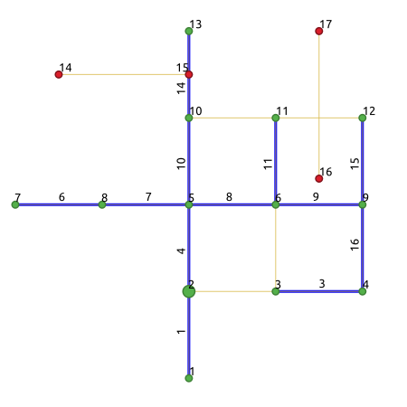
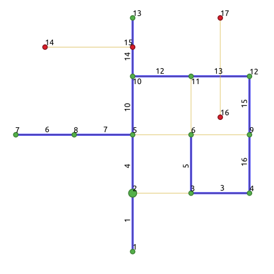

..
   ****************************************************************************
    pgRouting Manual
    Copyright(c) pgRouting Contributors

    This documentation is licensed under a Creative Commons Attribution-Share
    Alike 3.0 License: https://creativecommons.org/licenses/by-sa/3.0/
   ****************************************************************************

|

* **Supported versions:**
  `Latest <https://docs.pgrouting.org/latest/en/pgr_depthFirstSearch.html>`__
  (`3.5 <https://docs.pgrouting.org/3.5/en/pgr_depthFirstSearch.html>`__)
  `3.4 <https://docs.pgrouting.org/3.4/en/pgr_depthFirstSearch.html>`__
  `3.3 <https://docs.pgrouting.org/3.3/en/pgr_depthFirstSearch.html>`__
  `3.2 <https://docs.pgrouting.org/3.2/en/pgr_depthFirstSearch.html>`__

``pgr_depthFirstSearch`` - Proposed
===============================================================================

``pgr_depthFirstSearch`` — Returns a depth first search traversal of the graph.
The graph can be directed or undirected.

.. figure:: images/boost-inside.jpeg
   :target: https://www.boost.org/libs/graph/doc/depth_first_search.html

   Boost Graph Inside

.. include:: proposed.rst
   :start-after: stable-begin-warning
   :end-before: stable-end-warning

.. rubric:: Availability

* Version 3.3.0

  * Promoted to **proposed** function

* Version 3.2.0

  * New **experimental** signatures:

    * ``pgr_depthFirstSearch`` (`Single Vertex`_)
    * ``pgr_depthFirstSearch`` (`Multiple Vertices`_)

Description
-------------------------------------------------------------------------------

Depth First Search algorithm is a traversal algorithm which starts from a root
vertex, goes as deep as possible, and backtracks once a vertex is reached with
no adjacent vertices or with all visited adjacent vertices. The traversal
continues until all the vertices reachable from the root vertex are visited.

**The main Characteristics are:**

- The implementation works for both **directed** and **undirected** graphs.
- Provides the Depth First Search traversal order from a root vertex or from a
  set of root vertices.
- An optional non-negative maximum depth parameter to limit the results up to
  a particular depth.
- For optimization purposes, any duplicated values in the `Root vids` are
  ignored.
- It does not produce the shortest path from a root vertex to a target vertex.
- The aggregate cost of traversal is not guaranteed to be minimal.
- The returned values are ordered in ascending order of `start_vid`.
- Depth First Search Running time: :math:`O(E + V)`

Signatures
-------------------------------------------------------------------------------

.. rubric:: Summary

.. admonition:: \ \
   :class: signatures

   | pgr_depthFirstSearch(`Edges SQL`_, **root vid**, [**options**])
   | pgr_depthFirstSearch(`Edges SQL`_, **root vids**, [**options**])
   | **options:** ``[directed, max_depth]``

   | RETURNS SET OF |result-bfs|

.. index::
    single: depthFirstSearch(Single vertex) - Proposed on v3.3

Single vertex
...............................................................................

.. admonition:: \ \
   :class: signatures

   | pgr_depthFirstSearch(`Edges SQL`_, **root vid**, [**options**])
   | **options:** ``[directed, max_depth]``

   | RETURNS SET OF |result-bfs|

:Example: From root vertex :math:`6` on a **directed** graph with edges in
          ascending order of ``id``

.. literalinclude:: doc-pgr_depthFirstSearch.queries
   :start-after: -- q1
   :end-before: -- q2

.. index::
    single: depthFirstSearch(Multiple vertices) - Proposed on v3.3

Multiple vertices
...............................................................................

.. admonition:: \ \
   :class: signatures

   | pgr_depthFirstSearch(`Edges SQL`_, **root vids**, [**options**])
   | **options:** ``[directed, max_depth]``

   | RETURNS SET OF |result-bfs|

:Example: From root vertices :math:`\{12, 6\}` on an **undirected** graph with
          **depth** :math:`<= 2` and edges in ascending order of ``id``

.. literalinclude:: doc-pgr_depthFirstSearch.queries
   :start-after: -- q2
   :end-before: -- q3

Parameters
-------------------------------------------------------------------------------

.. include:: BFS-category.rst
   :start-after: mst-bfs-dfs-params_start
   :end-before: mst-bfs-dfs-params_end

Optional parameters
...............................................................................

.. include:: dijkstra-family.rst
    :start-after: dijkstra_optionals_start
    :end-before: dijkstra_optionals_end

DFS optional parameters
...............................................................................

.. include:: BFS-category.rst
   :start-after: max-depth-optional-start
   :end-before: max-depth-optional-end

Inner Queries
-------------------------------------------------------------------------------

Edges SQL
...............................................................................

.. include:: pgRouting-concepts.rst
   :start-after: basic_edges_sql_start
   :end-before: basic_edges_sql_end

Return columns
-------------------------------------------------------------------------------

.. include:: BFS-category.rst
   :start-after: mst-bfs-dfs-dd-result-columns-start
   :end-before: mst-bfs-dfs-dd-result-columns-end

Additional Examples
-------------------------------------------------------------------------------

:Example: Same as `Single vertex`_ but with edges in descending order of ``id``.

.. literalinclude:: doc-pgr_depthFirstSearch.queries
   :start-after: -- q3
   :end-before: -- q4

The resulting traversal is different.

The left image shows the result with ascending order of ids and the right image
shows with descending order of the edge identifiers.

|ascending| |descending|

.. TODO fix the images

See Also
-------------------------------------------------------------------------------

* :doc:`DFS-category`
* :doc:`sampledata`
* `Boost: Depth First Search algorithm documentation
  <https://www.boost.org/libs/graph/doc/depth_first_search.html>`__
* `Boost: Undirected DFS algorithm documentation
  <https://www.boost.org/libs/graph/doc/undirected_dfs.html>`__
* `Wikipedia: Depth First Search algorithm
  <https://en.wikipedia.org/wiki/Depth-first_search>`__

.. rubric:: Indices and tables

* :ref:`genindex`
* :ref:`search`
