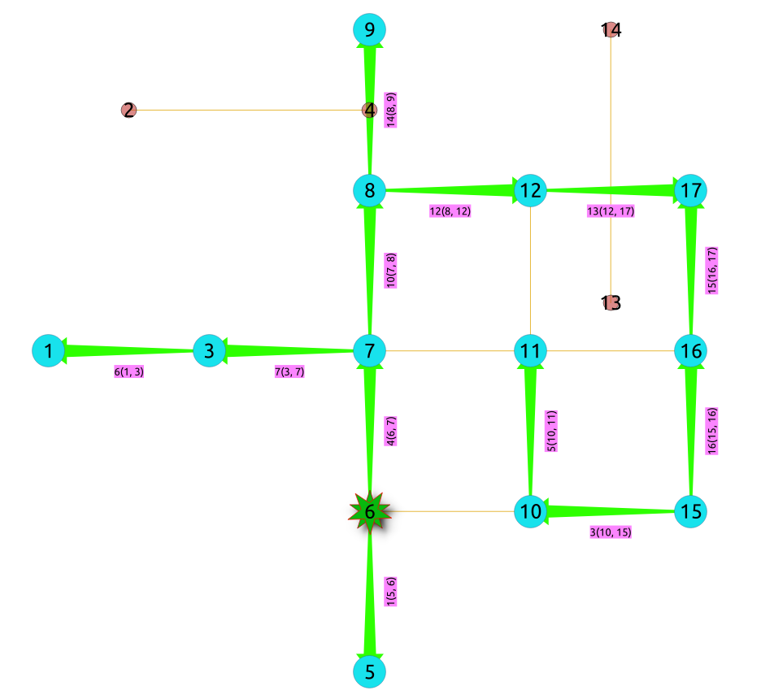

..
   ****************************************************************************
    pgRouting Manual
    Copyright(c) pgRouting Contributors

    This documentation is licensed under a Creative Commons Attribution-Share
    Alike 3.0 License: https://creativecommons.org/licenses/by-sa/3.0/
   ****************************************************************************

pgr_depthFirstSearch - Experimental
===============================================================================

``pgr_depthFirstSearch`` — Returns a depth first search traversal of the graph.
The graph can be directed or undirected.

.. figure:: images/boost-inside.jpeg
   :target: https://www.boost.org/libs/graph/doc/depth_first_search.html

   Boost Graph Inside

.. include:: experimental.rst
   :start-after: begin-warn-expr
   :end-before: end-warn-exp

.. rubric:: Availability

* Version 3.2.0

  * New **experimental** function

.. rubric:: Support

* **Supported versions:**
  current(`3.2 <https://docs.pgrouting.org/3.2/en/pgr_depthFirstSearch.html>`__)

Description
-------------------------------------------------------------------------------

Depth First Search algorithm is a traversal algorithm which starts from a root vertex,
goes as deep as possible, and backtracks once a vertex is reached with no adjacent vertices
or with all visited adjacent vertices. The traversal continues until all the vertices
reachable from the root vertex are visited.

**The main Characteristics are:**

- The implementation works for both **directed** and **undirected** graphs.
- Provides the Depth First Search traversal order from a root vertex or from a
  set of root vertices.
- An optional non-negative maximum depth parameter to limit the results up to
  a particular depth.
- For optimization purposes, any duplicated values in the `Root vids` are
  ignored.
- It does not produce the shortest path from a root vertex to a target vertex.
- The aggregate cost of traversal is not guaranteed to be minimal.
- The returned values are ordered in ascending order of `start_vid`.
- Depth First Search Running time: :math:`O(E + V)`

Signatures
-------------------------------------------------------------------------------

.. rubric:: Summary

.. code-block:: none

    pgr_depthFirstSearch(Edges SQL, Root vid [, directed] [, max_depth]) -- Experimental on v3.2
    pgr_depthFirstSearch(Edges SQL, Root vids [, directed] [, max_depth]) -- Experimental on v3.2

    RETURNS SET OF (seq, depth, start_vid, node, edge, cost, agg_cost)

.. rubric:: Using defaults

:Example: From root vertex :math:`2` on a **directed** graph

.. literalinclude:: doc-pgr_depthFirstSearch.queries
   :start-after: -- q1
   :end-before: -- q2

.. index::
    single: depthFirstSearch(Single vertex) -- Experimental on v3.2

Single vertex
...............................................................................

.. code-block:: none

    pgr_depthFirstSearch(Edges SQL, Root vid [, directed] [, max_depth])

    RETURNS SET OF (seq, depth, start_vid, node, edge, cost, agg_cost)

:Example: From root vertex :math:`2` on an **undirected** graph,
          with :math:`depth <= 2`

.. literalinclude:: doc-pgr_depthFirstSearch.queries
   :start-after: -- q2
   :end-before: -- q3

.. index::
    single: depthFirstSearch(Multiple vertices) -- Experimental on v3.2

Multiple vertices
...............................................................................

.. code-block:: none

    pgr_depthFirstSearch(Edges SQL, Root vids [, directed] [, max_depth])

    RETURNS SET OF (seq, depth, start_vid, node, edge, cost, agg_cost)

:Example: From root vertices :math:`\{11, 2\}` on an **undirected** graph
          with :math:`depth <= 2`

.. literalinclude:: doc-pgr_depthFirstSearch.queries
   :start-after: -- q3
   :end-before: -- q4

.. Parameters, Inner query & result columns

Parameters
-------------------------------------------------------------------------------

=================== ====================== =================================================
Parameter           Type                   Description
=================== ====================== =================================================
**Edges SQL**       ``TEXT``               SQL query described in `Inner query`_.
**Root vid**        ``BIGINT``             Identifier of the root vertex of the tree.

                                           - Used on `Single Vertex`_.

**Root vids**       ``ARRAY[ANY-INTEGER]`` Array of identifiers of the root vertices.

                                           - Used on `Multiple Vertices`_.
                                           - For optimization purposes, any duplicated value is ignored.
=================== ====================== =================================================

Optional Parameters
...............................................................................

=================== =========== =========================== =================================================
Parameter           Type        Default                     Description
=================== =========== =========================== =================================================
**directed**        ``BOOLEAN`` ``true``                    - When ``true`` Graph is `Directed`
                                                            - When ``false`` the graph is `Undirected`.

**max_depth**       ``BIGINT``  :math:`9223372036854775807` Upper limit for the depth of traversal

                                                            - When value is ``Negative`` then **throws error**
=================== =========== =========================== =================================================

Inner query
-------------------------------------------------------------------------------

.. rubric:: Edges SQL

.. include:: traversal-family.rst
   :start-after: edges_sql_start
   :end-before: edges_sql_end

Result Columns
-------------------------------------------------------------------------------

.. include:: pgr_kruskalDD.rst
   :start-after: result columns start
   :end-before: result columns end

Additional Examples
-------------------------------------------------------------------------------

The examples of this section are based on the :doc:`sampledata` network.

**Example: No internal ordering on traversal**

In the following query, the inner query of the example: "Using defaults" is modified
so that the data is entered into the algorithm is given in the reverse ordering of the id.

.. literalinclude:: doc-pgr_depthFirstSearch.queries
   :start-after: -- q4
   :end-before: -- q5

The resulting traversal is different.

The left image shows the result with ascending order of ids and the right image shows
with descending order of ids:

|ascending| |descending|

.. |ascending| image:: images/Fig1-AscendingOrder.png
   :scale: 50%

See Also
-------------------------------------------------------------------------------

* The queries use the :doc:`sampledata` network.

.. see also start

* `Boost: Depth First Search algorithm documentation <https://www.boost.org/libs/graph/doc/depth_first_search.html>`__
* `Boost: Undirected DFS algorithm documentation <https://www.boost.org/libs/graph/doc/undirected_dfs.html>`__
* `Wikipedia: Depth First Search algorithm <https://en.wikipedia.org/wiki/Depth-first_search>`__

.. see also end

.. rubric:: Indices and tables

* :ref:`genindex`
* :ref:`search`
