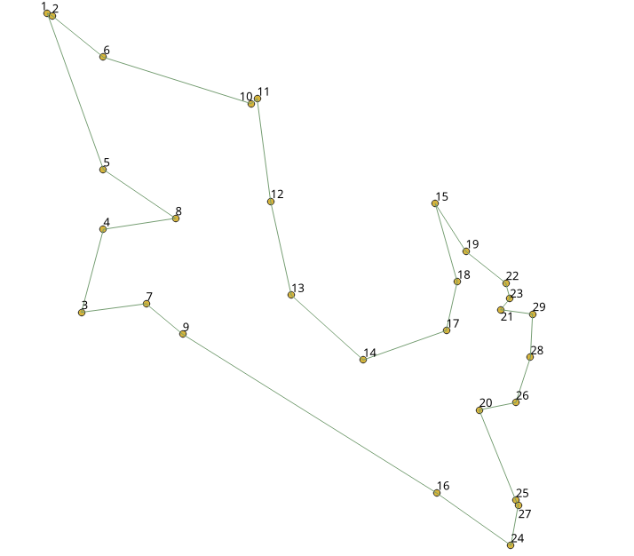

..
   ****************************************************************************
    pgRouting Manual
    Copyright(c) pgRouting Contributors

    This documentation is licensed under a Creative Commons Attribution-Share
    Alike 3.0 License: https://creativecommons.org/licenses/by-sa/3.0/
   ****************************************************************************

.. index::
   single: Traveling Sales Person Family ; pgr_TSPeuclidean
   single: pgr_TSPeuclidean

|

``pgr_TSPeuclidean``
=============================================================================

* ``pgr_TSPeuclidean`` - Approximation using *metric* algorithm.

.. rubric:: Availability:

.. rubric:: Version 4.0.0

* Simulated Annealing signature removed
* Results change depending on input order

.. rubric:: Version 3.2.1

* Using `Boost: metric TSP approx
  <https://www.boost.org/libs/graph/doc/metric_tsp_approx.html>`__
* Simulated Annealing Algorithm no longer supported

  * The Simulated Annealing Algorithm related parameters are ignored:
    `max_processing_time`, `tries_per_temperature`,
    `max_changes_per_temperature`, `max_consecutive_non_changes`,
    `initial_temperature`, `final_temperature`, `cooling_factor`, `randomize`

.. rubric:: Version 3.0.0

* Name change from pgr_eucledianTSP

.. rubric:: Version 2.3.0

* New official function.

Description
-------------------------------------------------------------------------------

.. include:: TSP-family.rst
   :start-after: tsp problem definition start
   :end-before: tsp problem definition end

.. include:: TSP-family.rst
   :start-after: tsp characteristics start
   :end-before: tsp characteristics end

- Results change depending on input order of the `Coordinates SQL`_
- Any duplicated identifier will be ignored. The coordinates that will be kept
  is arbitrarily.

  - The coordinates are quite similar for the same identifier, for example
    ::

      1, 3.5, 1
      1, 3.499999999999 0.9999999

  - The coordinates are quite different for the same identifier, for example
    ::

      2, 3.5, 1.0
      2, 3.6, 1.1

|Boost| Boost Graph Inside

Signatures
-------------------------------------------------------------------------------

.. rubric:: Summary

.. index::
    single: TSPeuclidean

.. admonition:: \ \
   :class: signatures

   | pgr_TSPeuclidean(`Coordinates SQL`_, ``[start_id, end_id]``)

   | Returns set of |tsp-result|
   | OR EMPTY SET

:Example: With default values

.. literalinclude:: TSPeuclidean.queries
   :start-after: -- q1
   :end-before: -- q2

Parameters
-------------------------------------------------------------------------------

=================== ===========  ======================================
Parameter           Type         Description
=================== ===========  ======================================
`Coordinates SQL`_  ``TEXT``      `Coordinates SQL`_ as described below
=================== ===========  ======================================

TSP optional parameters
...............................................................................

.. include:: TSP-family.rst
   :start-after: tsp_optionals_start
   :end-before: tsp_optionals_end

Inner Queries
-------------------------------------------------------------------------------

Coordinates SQL
...............................................................................

.. Coordinates SQL definition start

========= ================= =================================================
Column        Type               Description
========= ================= =================================================
``id``    ``ANY-INTEGER``    Identifier of the starting vertex.
``x``     ``ANY-NUMERICAL``  X value of the coordinate.
``y``     ``ANY-NUMERICAL``  Y value of the coordinate.
========= ================= =================================================

.. Coordinates SQL definition end

Result columns
-------------------------------------------------------------------------------

.. include:: ../../include/c_types/tsp_tour_rt.h
   :start-after: TSP tour return type begin
   :end-before: TSP tour return type end

Additional Examples
-------------------------------------------------------------------------------

.. contents::
   :local:

Test 29 cities of Western Sahara
...............................................................................

This example shows how to make performance tests using University of Waterloo's
`example data <https://www.math.uwaterloo.ca/tsp/world/countries.html>`__ using
the 29 cities of `Western Sahara dataset
<https://www.math.uwaterloo.ca/tsp/world/wi29.tsp>`__

Creating a table for the data and storing the data
+++++++++++++++++++++++++++++++++++++++++++++++++++++++++++++++++++++++++++++++

.. literalinclude:: wi29.queries
   :start-after: -- data start
   :end-before: -- data end

Adding a geometry (for visual purposes)
+++++++++++++++++++++++++++++++++++++++++++++++++++++++++++++++++++++++++++++++

.. literalinclude:: wi29.queries
   :start-after: -- data end

Total tour cost
+++++++++++++++++++++++++++++++++++++++++++++++++++++++++++++++++++++++++++++++
Getting a total cost of the tour, compare the value with the length of an
optimal tour is 27603, given on the dataset

.. literalinclude:: TSPeuclidean.queries
   :start-after: -- q2
   :end-before: -- q3

Getting a geometry of the tour
+++++++++++++++++++++++++++++++++++++++++++++++++++++++++++++++++++++++++++++++

.. literalinclude:: TSPeuclidean.queries
   :start-after: -- q3
   :end-before: -- q4

Visual results
+++++++++++++++++++++++++++++++++++++++++++++++++++++++++++++++++++++++++++++++
Visually, The first image is the `optimal solution
<https://www.math.uwaterloo.ca/tsp/world/witour.html>`__ and the second image
is the solution obtained with ``pgr_TSPeuclidean``.

.. image:: images/wi29optimal.png
   :scale: 50%

See Also
-------------------------------------------------------------------------------

* :doc:`TSP-family`
* :doc:`sampledata`
* `Boost: metric TSP approx
  <https://www.boost.org/libs/graph/doc/metric_tsp_approx.html>`__
* `University of Waterloo TSP <https://www.math.uwaterloo.ca/tsp/>`__
* `Wikipedia: Traveling Salesman Problem
  <https://en.wikipedia.org/wiki/Traveling_salesman_problem>`__

.. rubric:: Indices and tables

* :ref:`genindex`
* :ref:`search`
