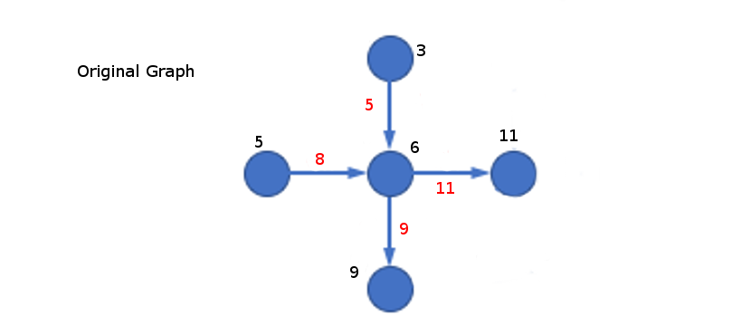
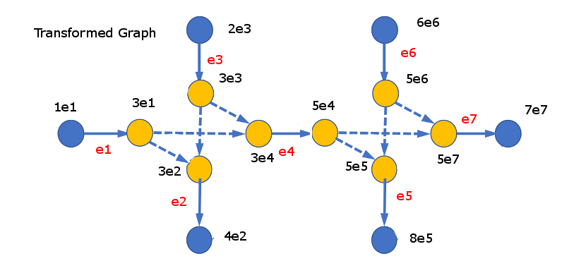
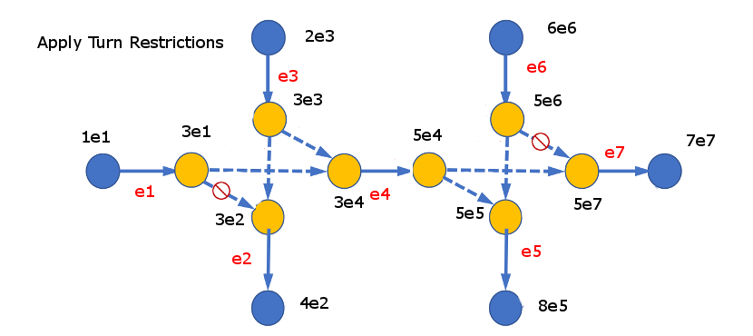
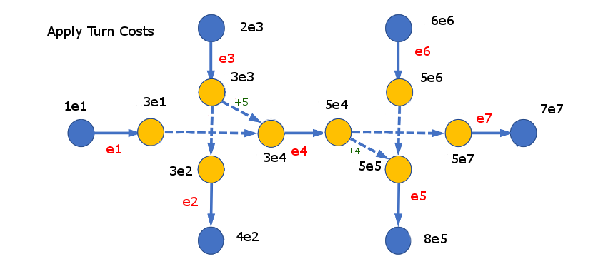
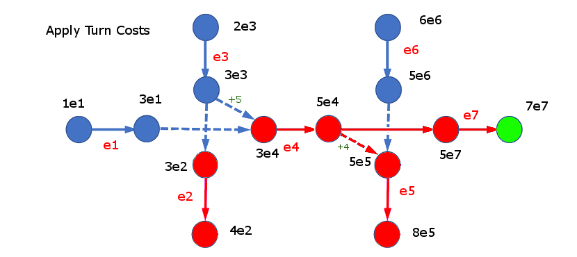

..
   ****************************************************************************
    pgRouting Manual
    Copyright(c) pgRouting Contributors

    This documentation is licensed under a Creative Commons Attribution-Share
    Alike 3.0 License: http://creativecommons.org/licenses/by-sa/3.0/
   ****************************************************************************

.. _pgr_turnpenaltygraph:

pgr_turnPenaltyGraph
===============================================================================

.. index::
        single: pgr_turnPenaltyGraph(text)

Name
------------------------------------------------------------------------------

''pgr_turnPenaltyGraph'' - Utility function for transforming a given graph into a form that supports shortest path searches with turn penalties and restrictions.

Synopsis
-------------------------------------------------------------------------------

This graph transformation algorithm generates a new graph that has an edge for every edge in the original graph, and an additional edge for each possible turn that can be made by a path through the graph. Because of this, these new edges can then be removed from the graph in order to apply turn restrictions, or the cost of these edges can be modified to apply turn penalties.

Characteristics
-------------------------------------------------------------------------------

  - This only works on directed graphs and does not use reverse edge costs.

Signature Summary
-----------------

.. code-block:: none 

    pgr_turnPenaltyGraph(edges_sql)

    RETURNS SET OF (seq, 
                    source, 
                    vertex, 
                    cost, 
                    original_source_vertex, 
                    original_source_edge, 
                    original_target_vertex,  
                    original_target_edge) OR EMPTY SET

Example Usage
-------------------------------------------------------------------------------

Here is an example that goes through the steps of using this function to transform a graph, apply turn penalties and restrictions, then run a shortest path search.

| |first|

1. Transform the graph and store the results in a new table:

.. code-block:: none 

    CREATE TABLE turn_table AS SELECT * FROM pgr_turnPenaltyGraph('SELECT id, source, target, cost FROM original_graph);

| |second|

2. Apply turn restrictions by removing the edges in the turn_table that represent the turns you want to restrict. A two edge turn represents a move from one edge to another connected edge. Deleting a turn in the turn_table requires identifing which two edge in the original graph represent that turn, then deleting them:

.. code-block:: none 

   DELETE FROM turn_table WHERE original_source_edge = e6 AND original_target_edge = e7;
   DELETE FROM turn_table WHERE original_source_edge = e1 AND original_target_edge = e2;

| |third|

3. Apply turn penalties by modifying the cost of the edges in the turn_table that represent turns you want to apply penatlies to.

.. code-block:: none 

   UPDATE turn_table SET cost = 5 WHERE original_source_edge = e3 AND original_target_edge = e4;
   UPDATE turn_table SET cost = 4 WHERE original_source_edge = e4 AND original_target_edge = e5; 

| |fourth|

4. Run dijkstra on the turn_table by setting the source vertices to each of the vertices in the turn_table that represent outgoing edges of the vertex in the original graph that you want to start the search from. Then set the target vertices so each of the vertices in the turn_table that represent incoming edges of the vertex in the original graph that you want to end the search on. The returned result that has the lowest cost contain the shortest path, taking into account the turn penalties and restrictions that you applied:

.. code-block:: none 

   source_arr := array_to_string(array(select source from turn_penalty_table where original_source_vertex = 3), ',');
   target_arr := array_to_string(array(select target from turn_penalty_table where original_target_vertex = 7),',');

   SELECT * FROM pgr_dijkstraCost('SELECT seq as id, source, target, cost from turn_table', ARRAY[source_arr], ARRAY[target_arr])
     ORDER BY cost DESC LIMIT 1;

| |fifth|

This can also be applied to one to many, many to one, and many to many implementations aswell, but the results will have to be grouped by the source and target vertices.

Sample Data Results
-------------------------------------------------------------------------------

.. literalinclude:: doc-pgr_turnPenaltyGraph.queries
   :start-after: -- q1
   :end-before: -- q2

.. rubric:: Indices and tables

* :ref:`genindex`
* :ref:`search`

