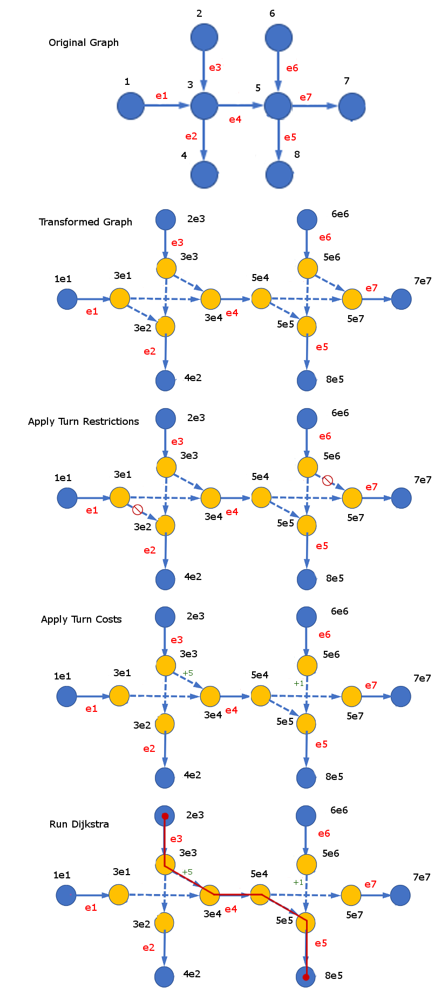

..
   ****************************************************************************
    pgRouting Manual
    Copyright(c) pgRouting Contributors

    This documentation is licensed under a Creative Commons Attribution-Share
    Alike 3.0 License: http://creativecommons.org/licenses/by-sa/3.0/
   ****************************************************************************

.. _pgr_turnPenaltyGraph:

pgr_turnPenaltyGraph - 
===============================================================================

``pgr_turnPenaltyGraph`` — Returns a transformed version of a given graph where each vertex is split up into multiple vertices in order to add a new edge to the graph for every possible turn that can be made. This makes a shortest path search with turn penalties and restrictions possible.

Synopsis
-------------------------------------------------------------------------------

This graph transformation algorithm generates a new graph that has an edge for every edge in the original graph, and an additional edge for each possible turn that can be made by a path through the graph. Because of this, these new edges can then be removed from the graph in order to apply turn restrictions, or the cost of these edges can be modified to apply turn penalties.

| |first|

Characteristics
-------------------------------------------------------------------------------

The main Characteristics are:

  - This only works on directed graphs and does not use reverse edge costs.

Signature Summary
-----------------

.. code-block:: guess 

    pgr_turnPenaltyGraph(edges_sql)

    RETURNS SET OF (seq, source, vertex, cost, original_source_vertex, original_source_edge, original_target_vertex, original_target_edge) OR EMPTY SET

Signatures
-------------------------------------------------------------------------------

.. index::
    single: turnPenaltyGraph(Minimal Use)

Complete Signature
.......................................

.. code-block:: guess

    pgr_turnPenaltyGraph(edges_sql)
    RETURNS SET OF (seq, source, vertex, cost, original_source_vertex, original_source_edge, original_target_vertex, original_target_edge) OR EMPTY SET

:Example:

.. literalinclude:: doc-pgr_turnPenaltyGraph.queries
   :start-after: -- q1
   :end-before: -- q2

.. index::
    single: turnPenaltyGraph(Complete signature)

.. rubric:: Indices and tables

* :ref:`genindex`
* :ref:`search`

