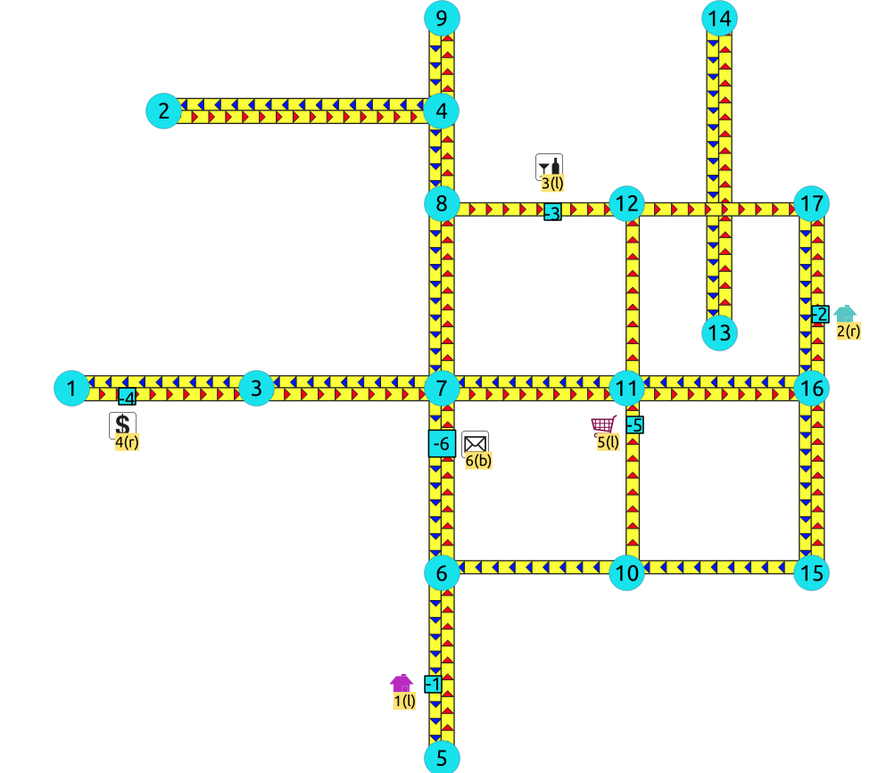
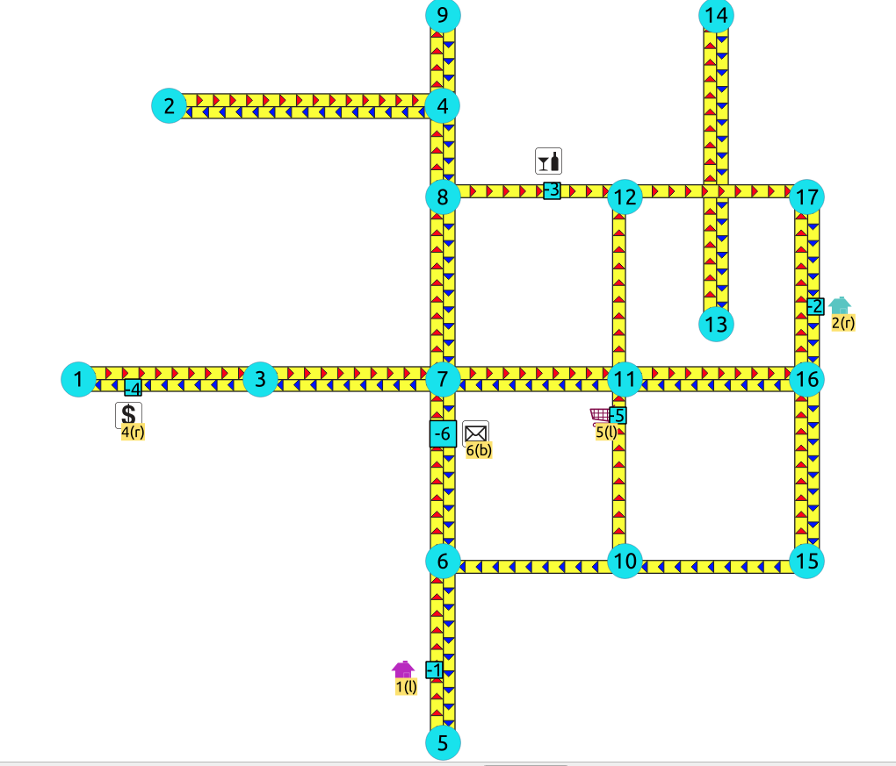
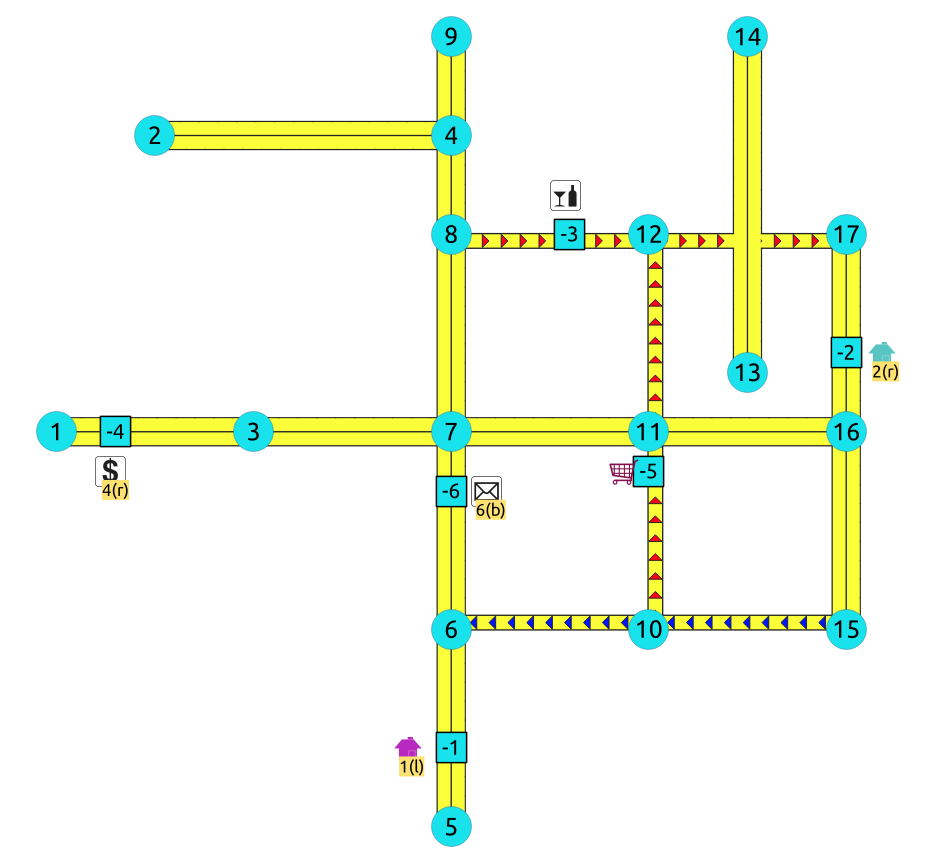

..
   ****************************************************************************
    pgRouting Manual
    Copyright(c) pgRouting Contributors

    This documentation is licensed under a Creative Commons Attribution-Share
    Alike 3.0 License: https://creativecommons.org/licenses/by-sa/3.0/
   ****************************************************************************

withPoints - Family of functions
===============================================================================

When points are also given as input:

.. include:: proposed.rst
   :start-after: begin-warning
   :end-before: end-warning

.. index proposed from here

- :doc:`pgr_withPoints` - Route from/to points anywhere on the graph.
- :doc:`pgr_withPointsCost` - Costs of the shortest paths.
- :doc:`pgr_withPointsCostMatrix` - Costs of the shortest paths.
- :doc:`pgr_withPointsKSP` - K shortest paths.
- :doc:`pgr_withPointsDD` - Driving distance.

.. index proposed to here

.. toctree::
    :hidden:

    pgr_withPoints
    pgr_withPointsCost
    pgr_withPointsCostMatrix
    pgr_withPointsKSP
    pgr_withPointsDD

.. rubric:: Previous versions of this page

* **Supported versions:**
  current(`3.1 <https://docs.pgrouting.org/3.1/en/withPoints-family.html>`__)
  `3.0 <https://docs.pgrouting.org/3.0/en/withPoints-family.html>`__
  `2.6 <https://docs.pgrouting.org/2.6/en/withPoints-family.html>`__

* **Unsupported versions:**
  `2.5 <https://docs.pgrouting.org/2.5/en/withPoints-family.html>`__
  `2.4 <https://docs.pgrouting.org/2.4/en/withPoints-family.html>`__
  `2.3 <https://docs.pgrouting.org/2.3/en/src/withPoints/doc/withPoints.html>`__
  `2.2 <https://docs.pgrouting.org/2.2/en/src/withPoints/doc/withPoints.html>`__

Images
--------------

The squared vertices are the temporary vertices, The temporary vertices are added according to the
driving side, The following images visually show the differences on how depending on the driving side the data is interpreted.

.. rubric:: Right driving side

.. rubric:: Left driving side

.. rubric:: doesn't matter the driving side

Introduction
--------------

This family of functions was thought for routing vehicles, but might as well work
for some other application that we can not think of.

The with points family of function give you the ability to route between
arbitrary points located outside the original graph.

When given a point identified with a `pid` that its being mapped to and edge with
an identifier `edge_id`, with a `fraction` along
that edge (from the source to the target of the edge) and some additional
information about which `side` of the edge the point is on, then routing
from arbitrary points more accurately reflect routing vehicles in road networks,

I talk about a family of functions because it includes different functionalities.
  - pgr_withPoints is pgr_dijkstra based
  - pgr_withPointsCost is pgr_dijkstraCost based
  - pgr_withPointsKSP is pgr_ksp based
  - pgr_withPointsDD is pgr_drivingDistance based

In all this functions we have to take care of as many aspects as possible:

- Must work for routing:

  - Cars (directed graph)
  - Pedestrians (undirected graph)

- Arriving at the point:

  - In either side of the street.
  - Compulsory arrival on the side of the street where the point is located.

- Countries with:

  - Right side driving
  - Left side driving

- Some points are:

  - Permanent, for example the set of points of clients stored in a table in the data base
  - Temporal, for example points given through a web application

- The numbering of the points are handled with negative sign.

  - Original point identifiers are to be positive.
  - Transformation to negative is done internally.
  - For results for involving vertices identifiers

    - positive sign is a vertex of the original graph
    - negative sign is a point of the temporary points

The reason for doing this is to avoid confusion when there is a vertex with the same number as identifier as the points identifier.

Graph & edges
----------------

- Let :math:`G_d(V,E)` where :math:`V` is the set of vertices and :math:`E` is the set of edges be the original directed graph.

  - An edge of the original `edges_sql` is :math:`(id, source, target, cost, reverse\_cost)` will generate internally

    - :math:`(id, source, target, cost)`
    - :math:`(id, target, source, reverse\_cost)`

Point Definition
----------------

- A point is defined by the quadruplet: :math:`(pid, eid, fraction, side)`

  - **pid** is the point identifier
  - **eid** is an edge id of the `edges_sql`
  - **fraction** represents where the edge `eid` will be cut.
  - **side** Indicates the side of the edge where the point is located.

Creating Temporary Vertices in the Graph
----------------------------------------

For edge (15,  9,12  10, 20), & lets insert point (2, 12, 0.3, r)

.. rubric:: On a right hand side driving network

From first image above:

- We can arrive to the point only via vertex 9.
- It only affects the edge (15, 9,12, 10) so that edge is removed.
- Edge (15, 12,9, 20) is kept.
- Create new edges:

  - (15, 9,-1, 3) edge from vertex 9 to point 1 has cost 3
  - (15, -1,12, 7) edge from point 1 to vertex 12 has cost 7

.. rubric:: On a left hand side driving network

From second image above:

- We can arrive to the point only via vertex 12.
- It only affects the edge (15, 12,9 20) so that edge is removed.
- Edge (15, 9,12, 10) is kept.
- Create new edges:

  - (15, 12,-1, 14) edge from vertex 12 to point 1 has cost 14
  - (15, -1,9, 6) edge from point 1 to vertex 9 has cost 6

:Remember: that fraction is from vertex 9 to vertex 12

.. rubric:: When driving side does not matter

From third image above:

- We can arrive to the point either via vertex 12 or via vertex 9
- Edge (15, 12,9 20) is removed.
- Edge (15, 9,12, 10) is removed.
- Create new edges:

  - (15, 12,-1, 14) edge from vertex 12 to point 1 has cost 14
  - (15, -1,9, 6) edge from point 1 to vertex 9 has cost 6
  - (15, 9,-1, 3) edge from vertex 9 to point 1 has cost 3
  - (15, -1,12, 7) edge from point 1 to vertex 12 has cost 7

See Also
-------------------------------------------------------------------------------

.. rubric:: Indices and tables

* :ref:`genindex`
* :ref:`search`
