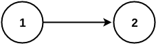
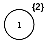
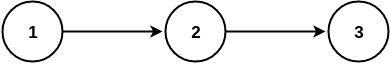
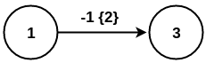
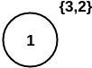

.. _contraction:

Contraction
===============================================================================

Contracting a graph becomes a crucial operation when taking about big graphs like
the graphs involved in routing in cities, countries, continents or the whole world.

The contraction level, and contraction operations can become very complex, as the complexity
of the graphs grows.

For this proposal, we are making our contraction algorithm simple as possible so that
more contraction operations can be added in the future.

We are not aiming with this work to implement all the possible contraction operations
but to give a framework such that adding a contraction operation can be easily achieved

For this contraaction proposal I am only making 2 operations:

 - 1) dead end contraction: vertices have one incoming edge
 - 2) linear contraction: vertices have one incomming and one outgoing edge
   

And with the additional characteristics:

  - the user can forbid to contract a particular set of nodes or edges.
  - the user can decide how many times the cycle can be done.
  - If possible, the user can decide the order of the operations on a cycle.

.. note:: Work on progress in contraction branch

The contraction skeleton
-------------------------------------------------------------------------------

In general we have an initial set up that may involve analizing the graph given as input and setting the
non contractionable nodes or edges. We have a cycle that will go and perform a contraction operation
until while possible, and then move to the next contraction operation.
Adding a new operation then becomes an "easy" task; more things might be involved, because the
charachteristics of the graph change each time its contracted, so some interaction between contractions
has to be implemented also.

Procedure
---------

* For contracting, we are going to cycle as follows

.. code-block:: none

    input: G(V,E);
    removed_vertices = {};

    <initial set up>
    do N times {

        while ( <conditions for 1> ) {
            < contraction operation 1 >
        }
       
        while ( <conditions for 2> ) {
            < contraction operation 2>
        }
        .....
    }

    output: G'(V',E'), removed_vertices

Contraction operations for this implementation
-------------------------------------------------------------------------------

Dead end contraction
+++++++++++++++++++++

Characteristics:

  - :math:`V1`: set of vertices with 1 incoming edge in increasing order of id:

    - Edges with the same identifier are considered the same edge
      and if it has the `reverse_cost` valid the outgoing edge is ignored

.. code-block:: none

    while ( V_1 is not empty ) {

        delete vertex of V_1
        the deleted vertex add it to removed_vertices
        vertex that leads to removed vertex, inherits the removed vertex

        <adjust any conditions that might affect other contraction operation>
    }

Linear contraction
+++++++++++++++++++++

Characteristics:

  - :math:`V_2`: vertex with 1 incoming edge and 1 outgoing edge:

    - The outgoing edge must have different identifier of the incomming edge

.. code-block:: none

    while ( V_2 is not empty ) {

        delete vertex of V_2
        create edge (shortcut)
        the deleted vertex add it to removed_vertices
        inewly created edge, inherits the removed vertex

        <adjust any conditions that might affect other contraction operations>
    }

Notation
++++++++++

* V: is the set of vertices
* E: is the set of edges
* G: is the graph
* :math:`V1`: is the set of *dead end* vertices 
* :math:`V2`: is the set of *linear* vertices
* removed_vertices: is the set of removed vertices

The contracted graph will be represented with two parameters, the modified Graph, and the removed_vertices set.

removed_vertices = {(v,1):{2}, (e,-1):{3}}.

The above notation indicates:
  - Vertex 2 is removed, and belongs to vertex 1 subgraph
  - Vertex 3 is removed, and belongs to edge -1 subgraph

Examples
-------------------------------------------------------------------------------

For simplicity all the edges in the examples have unit weight.

Dead End
+++++++++++++++++

* Perform dead end contraction coperation first and then linear contraction
* 1 cycle of contraction.

:Input:  G = {V:{1, 2}, E:{(1, 2)}}

:initial set up:

.. code-block:: none

    removed_vertices={}
    V1 = {2}
    V2 = {}

:procedure:

.. code-block:: none

    V1 is not empty

        V1 = {}
        V2 = {}
        G = {V:{1}, E:{}}
        removed_vertices = {(v, 1):{2}}.

    V1 is empty

Since L1 is empty we go on to the next contraction operation
    
.. code-block:: none

    V2 is empty
    

So we do not perform any linear contraction operation.

:Results:

.. code-block:: none

    G = {V:{1}, E:{}}
    removed_vertices = {(v, 1):{2}}

Visualy the results are
    

Linear contraction
++++++++++++++++++++

* Perform linear contraction coperation first and then dead end contraction
* 1 cycle of contraction.

:Input: G = {V:{1, 2, 3}, E:{(1, 2), (2, 3)}}

:initial set up:

.. code-block:: none

    removed_vertices={}
    V1 = {3}
    V2 = {2}

:procedure:

.. code-block:: none

    L2 is not empty

        V1 = {3}
        removed_vertices = {(e, -1):{2}}
        V2 = {}
        G = {V:{1, 3}, E:{-1(1,3)}}

    L2 is empty

Since L2 is empty we go on to the next contraction operation
    
.. code-block:: none

    L1 is not empty

        V1 = {}
        V2 = {}
        removed_vertices = {(v, 1):{3, 2}}.
        G = {V:{1}, E:{}}

    L1 is empty

:Results:

.. code-block:: none

    removed_vertices = {(v, 1):{3, 2}}.
    G = {V:{1}, E:{}}

Visualy the results are
    

 

Sample Data
++++++++++++++++++++++++

.. image:: images/sampledataGraph2.png

Before we start we havent't removed any vertices so, removed_vertices = {}

:math:`V_1 = {1,7,13,14,15,16,17}`

:math:`V_2 = {4,8,12}`

For this example we will cycle only once
    
    Cycle 1:

        Level 1:

            :math:`V_1` is not empty,therefore on *dead end* contraction, vertices 1,7,8,13,14,16 gets deleted in the order.

            After the *dead end* contraction the sets change as follows
            :math:`V_1 = \{\}`
            :math:`V_2 = \{2,4,10,12\}`
            removed_vertices = {(v, 1):{2}, (v,5):{7,8}, (v,10):{13}, (v,15):{14}, (v,17):{16}}

            Since :math:`V_1` is empty we stop *dead end* contraction in Cycle 1.

        Level 2:

            :math:`V_2` is not empty, therefore on *linear* contraction, vertices 2,4,10,12 gets deleted in the order, and adds edges(shortcut) with ids -1,-2,-3,-4 respectively with each of the added edge having a cost = 2

            After the *linear* contraction the sets change as follows
            :math:`V_1 = \{\}`
            :math:`V_2 = \{\}`
            removed_vertices = {(e, -1):{1,2}, (e,-2):{4}, (e,-3):{10,13}, (e,-4):{12}, (v,5):{7,8}, (v,15):{14}, (v,17):{16}}

            Since :math:`V_2` is empty we stop *level 2* contraction in Cycle 1.

    Since both of the above sets are empty, we cannot contract further and the contraction ends after Cycle 1.

Refrences
++++++++++++++++++++++++++

* http://www.cs.cmu.edu/afs/cs/academic/class/15210-f12/www/lectures/lecture16.pdf
* http://algo2.iti.kit.edu/documents/routeplanning/geisberger_dipl.pdf
