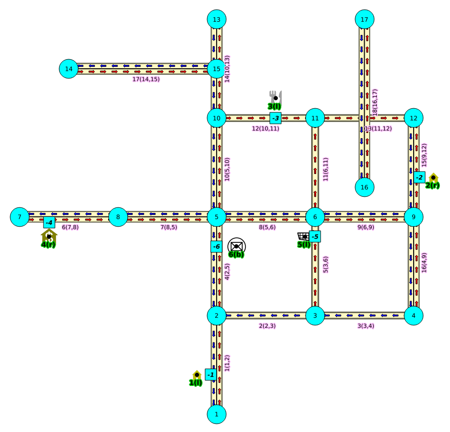
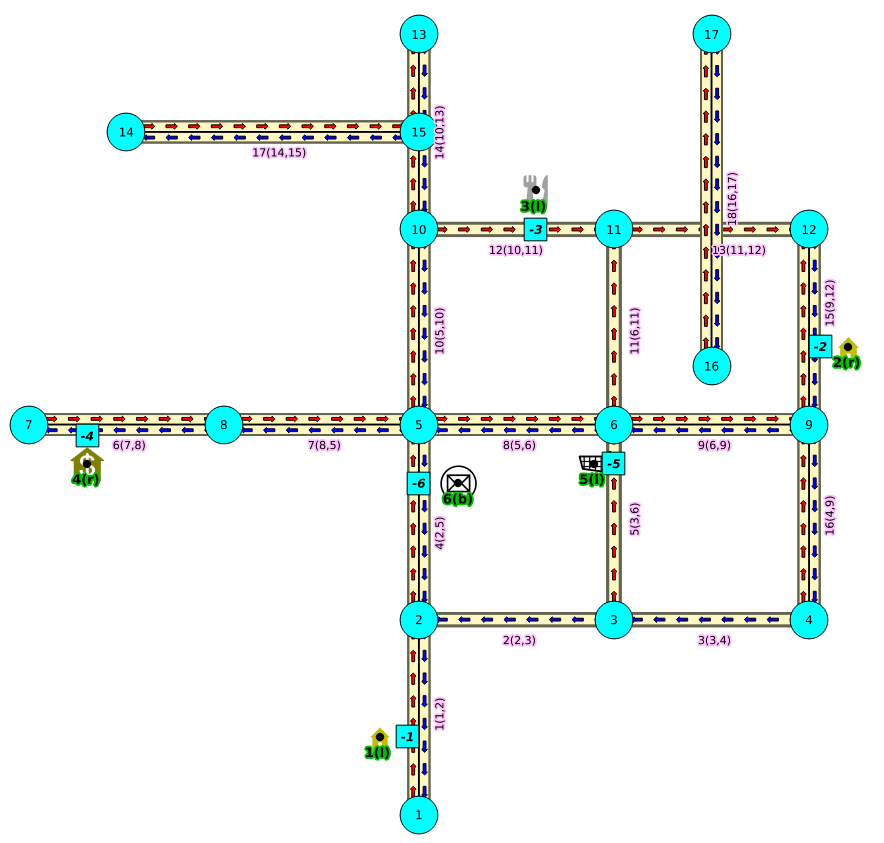
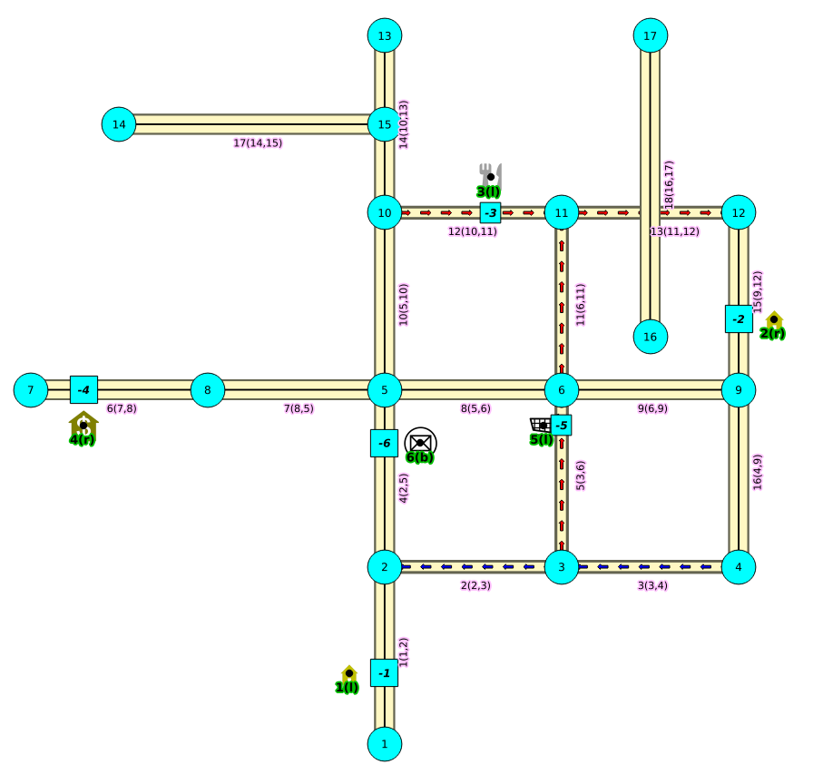

.. 
   ****************************************************************************
    pgRouting Manual
    Copyright(c) pgRouting Contributors

    This documentation is licensed under a Creative Commons Attribution-Share
    Alike 3.0 License: http://creativecommons.org/licenses/by-sa/3.0/
   ****************************************************************************

.. _withPoints:

withPoints - Family of functions
===============================================================================

When points are also given as input:

    - :ref:`pgr_withPoints` - Route from/to points anywhere on the graph.
    - :ref:`pgr_withPointsCost` - Costs of the shortest paths.
    - :ref:`pgr_withPointsKSP` - K shortest paths.
    - :ref:`pgr_withPointsDD` - Driving distance.

Images
--------------

The squared vertices are the temporary vertices, you can visually see how depending on the driving side the data is interpreted.

.. rubric:: Right driving side

.. rubric:: Left driving side

.. rubric:: doesn't matter the driving side

Introduction
--------------

Points are considered outside the graph topology.i
The graph :math:`G(V,E)` where :math:`V` is the set of vertices and :math:`E` is the set of edges,
for example, when representing a city topology, the vertices are intersections or dead ends,
and the edges are the roads.
Routing can be done when routing from :math:`v1 in V` to :math:`v2 in V`, but some applications might need 
a more precise routing like:

    - from a point located in the middle of a segment and/or
    - to a point located in the middle of another segment.

This is when this family of functions can be used.

To achive routing using points external to the :math:`V` the topology has to be modified in such a way
that it includes the points, as part of :math:`V`, then a Dijkstra can be performed.

General Characteristics
----------------------------------------

This is the crucial part of this family of functions, and it has to take care of as many aspects as possible.

- Must work for routing:

    - Cars (directed graph)
    - Pedestrians (undirected graph)

- Arriving at the point:

    - In either side of the street.
    - Compulsory arrival on the side of the street where the point is located.

- Countries with:

    - Right side driving
    - Left side driving

- Some points are:

  - permanent, for example the set of pints of clients
  - temporal, for example points given thru a web application

 
Point Definition
----------------

Creating Temporary Vertices in the Graph
----------------------------------------

.. toctree::
        :hidden: 

        ./pgr_withPoints
        ./pgr_withPointsCost
        ./pgr_withPointsKSP
        ./pgr_withPointsDD
